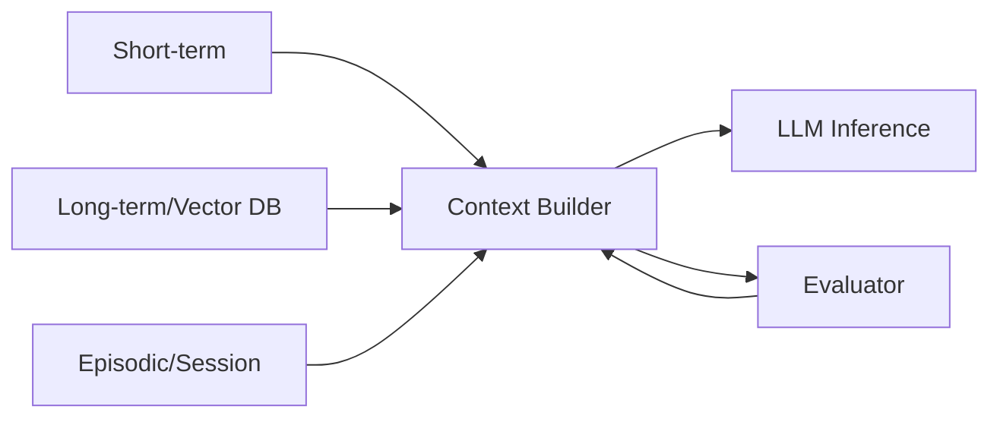

# 메모리 아키텍처

## 1. 핵심 개념 (Core Concept)

에이전트는 단기(작업 메모리), 장기(지식), 일화(세션) 메모리를 조합하고, 필요 시 RAG로 외부 지식을 주입해 추론 품질을 높입니다. 핵심은 “무엇을 저장하고, 언제 검색하며, 어떻게 컨텍스트로 구성할지”를 명확히 하는 것입니다.

- **핵심 비유(Analogy)**: 사람의 기억 방식을 시스템으로 구현하는 것과 같습니다. **단기 메모리**는 방금 들은 전화번호처럼 잠시 기억하는 '작업 기억'이고, **장기 메모리**는 이름이나 지식처럼 오래 기억하는 '영구 기억'이며, **일화 메모리**는 '어제 친구와 나눈 대화'처럼 특정 사건의 흐름을 기억하는 것입니다.

---

## 2. 상세 설명 (Detailed Explanation)

### 2.1 단기 vs 장기 vs 일화 메모리
- 단기(Short-term): 현재 대화/작업 창의 최신 턴과 임시 요약. 토큰 예산 내에서 Sliding Window + 요약으로 유지.
- 장기(Long-term): 사용자/프로젝트 별 지속 지식, 문서 지식베이스, 엔티티·팩트 저장. 보통 Vector DB/문서 스토리지 사용.
- 일화(Episodic/Session): 실행 궤적(툴 호출, 관찰, 결정)을 시간 순서로 저장. 디버깅/재현/학습 데이터로 재활용.

### 2.2 Retrieval-Augmented Memory 구조
- 인덱싱: 장기·일화 메모리를 임베딩 후 Vector DB에 저장(메타데이터: user_id, session_id, 태그).
- 검색: 질의(또는 계획 단계에서 추출한 키워드/질문)로 관련 청크 k개 검색, 필요 시 BM25와 하이브리드.
- 컨텍스트 구성: 검색 결과를 길이 제한에 맞게 요약/재서식하여 LLM 컨텍스트에 삽입.

### 2.3 메모리-컨텍스트 상호작용
- 컨텍스트 빌더가 단기·장기·일화 메모리에서 후보를 수집→스코어링→리랭킹→요약→삽입.
- 삽입 전 스키마 검증(JSON/Markdown 템플릿)과 인용(출처/ID)을 포함해 근거성을 높임.



---

## 3. 예시 (Example)

- 첫 세션: 요구사항 파악 → 요약(Summary v1) + 키 팩트 추출 → 장기 저장.
- 다음 세션: 질의에서 키워드 추출 → 장기 메모리 검색 → 관련 팩트만 요약 삽입.
- 세션 종료: 일화 로그(툴 호출·관찰) 압축 저장 → 디버깅/학습 재사용.

---

## 4. 예상 면접 질문 (Potential Interview Questions)

- 일화 메모리와 장기 메모리의 차이는?
- 언제 장기에 저장하지 않고 폐기(또는 요약)해야 하는가?
- 검색 결과의 근거성을 어떻게 보장하는가?

---

## 5. 더 읽어보기 (Further Reading)

- docs/references/anthropic/effective-context-engineering-for-ai-agents.md
- docs/references/anthropic/building-effective-agents.md

---

## 6. 설계 체크리스트 & 스키마 예시

- 저장 기준: 중요도(LLM 점수), 재사용 가능성, 민감도(PII), 크기
- 검색 기준: 유사도 임계값, k, 하이브리드 여부, 리랭커 사용
- 삽입 기준: 토큰 예산, 인용(출처/ID), 오류 시 폴백 요약

```json
{
  "id": "mem_01H...",
  "type": "long_term|episodic|short_term",
  "owner": {"user_id": "u_123", "project_id": "p_456"},
  "session_id": "s_789",
  "ts": "2025-10-29T09:00:00Z",
  "text": "요약 또는 원문 청크",
  "embedding_ref": "vec_...",
  "metadata": {"tags": ["req","api"], "source": "doc://...", "importance": 0.82}
}
```

---

## 7. 지표 & 함정

- 지표: Retrieval Precision@k, Context Injection Rate, Token Cost/Turn, 시간당 성공률
- 함정: 과도 저장(노이즈), 중복(해시/ID 중복 제거 필요), 민감정보 미스필터, 구버전 지식 주입

---

## 8. 이미지(참고)

- Anthropic: Effective Context Engineering 개요
  - docs/references/anthropic/images/effective-context-engineering-1.webp
  - docs/references/anthropic/images/effective-context-engineering-2.webp

---

## 9. See also

- 컨텍스트 압축: 5-2 → [context-compression-management](./context-compression-management.md)
- RAG 파이프라인: 5-4 → [basic-rag-pipeline](../5-4-retrieval-augmented-generation-rag/basic-rag-pipeline.md)
- 인프라/자동화: 5-8 → [infra-and-tooling](../5-8-데이터-and-인프라/infra-and-tooling.md)
