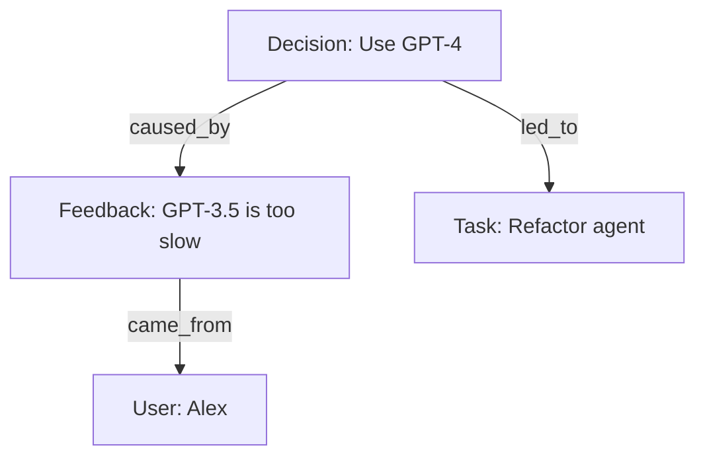

# 메모리 구현 기술

## 1. 핵심 개념 (Core Concept)

확장 가능한 에이전트 메모리는 **Vector DB**를 핵심 저장소로 사용하고, 한정된 리소스를 효율적으로 관리하기 위한 **축출(Eviction) 및 요약(Summarization) 전략**을 결합하여 구축합니다. 더 나아가, 정보 간의 관계를 표현하는 **계층적 메모리 그래프(Hierarchical Memory Graph)** 를 도입하면 단순한 사실 검색을 넘어선, 깊이 있는 추론이 가능해집니다.

- **핵심 비유(Analogy)**: 에이전트의 기억을 관리하는 '디지털 도서관'을 짓는 것과 같습니다. **Vector DB**는 책의 내용을 기반으로 유사한 책을 빠르게 찾는 '스마트 검색 시스템'이고, **축출(Eviction) 전략**은 오래되거나 중요하지 않은 책을 서고에서 빼내 공간을 확보하는 '장서 관리 규칙'이며, **메모리 그래프**는 책들 사이의 인용 관계를 추적하여 특정 주장의 근원을 찾는 '지식 지도'와 같습니다.

*Note: 아래 다이어그램을 위한 이미지를 `docs/images/agent-memory-implementation.png` 에 추가해주세요.*

______________________________________________________________________

## 2. Vector DB 선택 가이드

어떤 Vector DB를 선택하는지는 프로젝트의 규모와 운영 능력에 따라 달라집니다.

| Vector DB               | 아키텍처            | 주요 사용 사례                                                        | 핵심 고려사항                                                                                               |
| :---------------------- | :------------------ | :-------------------------------------------------------------------- | :---------------------------------------------------------------------------------------------------------- |
| **FAISS / Chroma**      | 라이브러리 / 내장형 | 빠른 PoC, 로컬 개발, 소규모 애플리케이션                              | 시작은 쉽지만, 확장/관리는 직접 해야 함. Chroma가 순수 라이브러리인 FAISS보다 더 많은 기능을 제공.          |
| **Milvus / Weaviate**   | 분산형 서비스       | 대규모 데이터와 높은 트래픽을 처리하는 프로덕션 시스템                | 확장성과 안정성이 높지만, 초기 설치 및 운영이 복잡함. 메타데이터 필터링, 하이브리드 검색 등 고급 기능 제공. |
| **Postgres + pgvector** | 데이터베이스 확장   | 기존 PostgreSQL 기반 애플리케이션에 벡터 검색 기능을 통합할 때        | 기술 스택을 단순화할 수 있으나, 대규모 환경에서는 전문 Vector DB보다 성능이 떨어질 수 있음.                 |
| **Elasticsearch + ANN** | 검색 엔진 플러그인  | 이미 Elasticsearch를 사용 중인 팀이 의미 기반 검색을 추가하고 싶을 때 | 기존 인프라와 전문성을 활용하여 텍스트 검색과 벡터 검색을 자연스럽게 결합 가능.                             |

## 3. 메모리 축출(Eviction) 및 요약 전략

메모리가 무한정 커지는 것을 방지하고 비용을 관리하기 위해, 오래되거나 덜 중요한 정보는 제거(축출)하거나 요약해야 합니다.

- **단기 기억**: 최근 N개의 대화만 원본으로 유지하고, 그 이전의 대화는 LLM을 통해 요약본으로 만들어 압축합니다. (Sliding Window + Summarization)
- **장기 기억**: 어떤 정보를 축출할지 결정하기 위해 여러 전략을 조합합니다.
  - **LRU (Least Recently Used)**: 가장 오랫동안 사용되지 않은 정보부터 제거합니다.
  - **LFU (Least Frequently Used)**: 가장 적게 사용된 정보부터 제거합니다.
  - **Importance-based**: LLM을 이용해 정보의 '중요도 점수'를 매기고, 점수가 낮은 정보부터 제거합니다. 가장 정교하지만 비용이 많이 듭니다.
- **일화 기억**: 작업의 전체 로그(궤적)는 비용이 크므로, 작업 성공/실패 여부와 최종 결과 등 핵심적인 내용만 요약하여 저장하고, 원본 로그는 압축하여 저렴한 콜드 스토리지로 옮깁니다.

## 4. 계층적 메모리 그래프 (Hierarchical Memory Graph)

단순히 정보 조각을 저장하는 것을 넘어, 정보 간의 관계를 '그래프'로 표현하면 더 깊이 있는 추론이 가능해집니다.

- **구성 요소**:
  - **노드(Nodes)**: 개별 정보 조각 (예: 사용자, 결정 사항, 작업, 문서).
  - **엣지(Edges)**: 정보 간의 관계 (예: `is_related_to`, `causes`, `is_part_of`).
- **장점**: "왜 이 결정이 내려졌지?" 와 같은 인과 관계 질문에 답할 수 있습니다. 특정 결정(노드)에서 시작하여, 그 결정의 근거가 된 다른 정보(연결된 노드)들을 그래프 탐색을 통해 찾아낼 수 있기 때문입니다.

______________________________________________________________________

## 5. 예상 면접 질문 및 모범 답안

### Q1. Vector DB를 선택하는 기준을 성능, 운영, 비용 관점에서 설명해주세요.

**A.** **성능** 측면에서는 인덱싱 속도와 검색 지연 시간, **운영** 측면에서는 배포 용이성과 확장성, **비용** 측면에서는 총 소유 비용(TCO)을 종합적으로 고려해야 합니다. 프로젝트 초기에는 운영이 쉬운 경량 DB로 시작하고, 규모가 커짐에 따라 분산형 전문 DB로 마이그레이션하는 전략이 일반적입니다.

**\[추가 설명\]**

1. **성능 (Performance)**:
   - **인덱싱 속도**: 새로운 정보가 얼마나 빨리 검색 가능해지는가? (실시간성이 중요한 서비스에 필수)
   - **검색 지연 시간 및 처리량**: 단일 검색이 얼마나 빠른가(Latency), 초당 몇 개의 검색을 처리할 수 있는가(Throughput)?
   - **필터링 능력**: 벡터 검색 전후에 메타데이터로 필터링하는 기능이 효율적인가?
1. **운영 (Operations)**:
   - **배포 모델**: 라이브러리(FAISS), 내장형(Chroma), 분산 서비스(Milvus), DB 확장(pgvector) 중 우리 팀의 역량에 맞는 모델은 무엇인가?
   - **확장성**: 데이터와 트래픽이 증가할 때 자동으로 확장(sharding, replication)이 가능한가?
   - **생태계**: 클라이언트 라이브러리, 모니터링 도구 연동, 문서 및 커뮤니티 지원이 잘 되어 있는가?
1. **비용 (Total Cost of Ownership)**:
   - **직접 호스팅 vs. 관리형 서비스**: 직접 운영하면 초기 비용은 낮지만 유지보수 인력이 필요하고, 관리형 서비스(Pinecone 등)는 비싸지만 운영 부담이 적습니다.
   - **라이선스**: 오픈소스인지, 상용 지원이 필요한 엔터프라이즈 버전이 있는지 확인해야 합니다.

### Q2. 메모리의 '중요도 점수'는 어떻게 산출하고 검증할 수 있나요?

**A.** 중요도 점수는 주로 **LLM을 평가자(Judge)로 사용**하여 산출합니다. 대화가 끝난 후, 새로 얻은 정보가 미래에 얼마나 유용할지를 LLM이 1~10점 척도로 평가하도록 합니다. 이 점수는 **과거 데이터 분석을 통해 검증**하는데, 실제로 중요도 점수가 높은 정보가 나중에 더 자주 검색되고 활용되는지를 확인하여 평가 모델의 정확성을 판단합니다.

**\[추가 설명\]**

- **산출 방법 (LLM-as-a-Judge)**:
  1. 세션 종료 후, 기억할 만한 정보 조각들을 추출합니다.
  1. 각 정보 조각에 대해 LLM에게 다음과 같이 질문합니다: `"이 정보가 미래의 상호작용을 위해 얼마나 중요한지 1~10점으로 평가해줘. 1점은 인사말처럼 사소한 것이고, 10점은 사용자의 핵심 선호도처럼 매우 중요한 정보야."`
  1. LLM이 반환한 점수를 해당 정보의 메타데이터에 저장합니다.
- **검증 방법**:
  - **오프라인 분석**: 에이전트 로그를 분석하여, 중요도 점수와 실제 검색 빈도 사이에 양의 상관관계가 있는지 통계적으로 확인합니다. 만약 점수가 낮은 정보가 자주 검색된다면, 점수 평가 프롬프트나 모델에 문제가 있음을 의미합니다.
  - **A/B 테스트**: 서로 다른 점수 평가 프롬프트(A/B)를 적용한 뒤, 어떤 프롬프트가 더 유용한 정보를 검색하게 하여 최종적으로 에이전트의 작업 성공률을 높이는지 비교합니다.

### Q3. 그래프 검색과 벡터 검색을 결합할 때의 이점은 무엇인가요?

**A.** 벡터 검색이 **'무엇(What)'** 에 대한 질문에 답한다면, 그래프 검색은 **'왜(Why)'** 와 **'어떻게(How)'** 에 대한 질문에 답할 수 있게 해줍니다. 즉, 벡터 검색으로 관련성 높은 정보(노드)들을 찾고, 그래프 검색으로 그 정보들 사이의 관계(엣지)를 탐색하여, 단순한 사실 제시를 넘어선 **인과 관계 추론과 설명 가능한 AI**를 구현할 수 있습니다.

**\[추가 설명\]**

- **벡터 검색 (노드 찾기)**: "에이전트 성능 이슈"라는 질문에 대해 `[결정: GPT-3.5 사용]`, `[관찰: 작업 실패]`, `[피드백: 응답이 느림]` 등 관련성 높은 정보 조각(노드)들을 찾아줍니다.
- **그래프 검색 (경로 찾기)**: 벡터 검색이 찾아낸 노드들 사이를 연결하는 관계(엣지)를 탐색합니다. 이를 통해 `[피드백: 응답이 느림]`은 `[관찰: 작업 실패]` 때문에 발생했고, 이는 `[결정: GPT-3.5 사용]` 이후에 일어났다는 인과 관계의 '경로'를 발견할 수 있습니다.
- **결합의 이점**:
  1. **향상된 설명 가능성**: "작업이 실패했습니다"가 아니라, "GPT-3.5를 사용하기로 한 결정 이후 응답이 느리다는 피드백이 있었고, 이것이 작업 실패의 원인입니다" 와 같이 근거를 들어 설명할 수 있습니다.
  1. **복잡한 질문에 대한 답변**: "지난주에 발생한 부정적인 사용자 피드백의 근본 원인이 된 결정은 무엇이었나?" 와 같이 여러 정보를 연결해야만 답할 수 있는 질문에 답할 수 있습니다.
  1. **더 풍부한 컨텍스트 제공**: 특정 정보 노드를 검색할 때, 그와 연결된 주변 노드들(원인, 결과 등)을 함께 검색하여 LLM에게 훨씬 풍부하고 구조화된 컨텍스트를 제공할 수 있습니다.

______________________________________________________________________

## 6. See also

- [메모리 아키텍처](./memory-architecture.md)
- [컨텍스트 압축 및 관리](./context-compression-management.md)
- [기본 RAG 파이프라인](../5-4-retrieval-augmented-generation-rag/basic-rag-pipeline.md)
