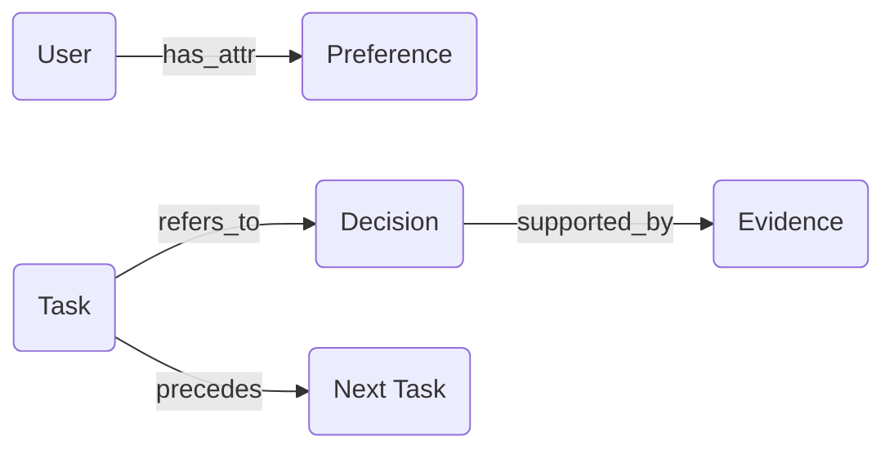

# 메모리 구현 기술

## 1. 핵심 개념 (Core Concept)

벡터 DB(FAISS/Milvus/Chroma/pgvector)와 요약·축출(Eviction) 전략을 조합해 확장 가능한 에이전트 메모리를 구축합니다. 핵심은 스키마·인덱싱·검색·요약·보안·운영 자동화를 일관된 계약으로 묶는 것입니다.

- **핵심 비유(Analogy)**: 에이전트의 기억을 관리하는 '디지털 도서관'을 짓는 것과 같습니다. **Vector DB**는 책의 내용을 기반으로 유사한 책을 빠르게 찾을 수 있는 '스마트 검색 시스템'이고, **축출(Eviction) 전략**은 오래되거나 중요하지 않은 책을 서고에서 빼내 공간을 확보하는 '장서 관리 규칙'입니다.

---

## 2. 상세 설명 (Detailed Explanation)

### 2.1 Vector DB 선택과 스키마 설계
- 선택 가이드(간단):
  - **FAISS/Chroma**: 경량이며, 로컬 환경 또는 PoC(Proof of Concept)에 적합합니다.
  - **Milvus/Weaviate**: 분산 환경에서 대규모 데이터를 다루는 운영(Production) 시스템에 적합합니다.
  - **Postgres + pgvector**: 기존에 사용하던 PostgreSQL 데이터베이스와 통합이 중요할 때 유리합니다.
  - **Elasticsearch + ANN**: 기존 검색 엔진 인프라를 활용하면서 벡터 검색 기능을 추가하고 싶을 때 좋은 선택입니다.
- 스키마(권장 필드): `id, owner(user/project), session_id, ts, text, embedding, metadata(tags, source, importance, pii_masked)`
- 임베딩: 동일 모델/차원 유지, 주기적 재임베딩 계획 수립(모델 교체 시)

### 2.2 Memory Eviction & Summarization 전략
- 단기: 최근 n턴 유지 + 과거 턴 요약 스냅샷(중간/최종)
- 장기: LRU/Recency-Frequency-Importance 혼합, 중요도는 LLM로 스코어링
- 일화: 롤업 요약(툴 호출 로그→결정 근거 중심), 원본은 압축 저장/콜드 스토리지로 이동
- 비용 보호: 토큰/시간/스토리지 상한 초과 시 자동 축출 정책(알림 포함)

### 2.3 Hierarchical Memory Graph 설계
- 노드: 엔티티(사람/제품), 팩트, 태스크, 결정, 증거(문서/URL)
- 엣지: 참조(refers_to), 원인(causes), 속성(has_attr), 시간선(precedes)
- 질의: 그래프 Walk로 후보 수집 → 벡터 스코어/룰 결합 리랭킹 → 컨텍스트 삽입



---

## 3. 예시 (Example)

- 장기 메모리 요약 스냅샷을 주기적으로 생성·저장.
- pgvector 스키마 예시(개념):

```sql
CREATE TABLE memory (
  id TEXT PRIMARY KEY,
  user_id TEXT,
  project_id TEXT,
  session_id TEXT,
  ts TIMESTAMPTZ,
  text TEXT,
  embedding VECTOR(1536),
  metadata JSONB
);
CREATE INDEX ON memory USING ivfflat (embedding vector_cosine_ops);
```

```python
def retrieve(query, k=8):
    cand = vector_search(query, k=32)
    cand = bm25_merge(query, cand)
    reranked = cross_encoder_rerank(query, cand)[:k]
    return summarize_to_budget(reranked)
```

---

## 4. 예상 면접 질문 (Potential Interview Questions)

- Vector DB 선택 기준(성능/운영/비용)을 설명하라.
- 중요도 점수는 어떻게 산출·검증하는가?
- 그래프와 벡터 검색을 결합할 때의 이점은?

---

## 5. 더 읽어보기 (Further Reading)

- docs/references/anthropic/effective-context-engineering-for-ai-agents.md

---

## 6. 운영·보안 팁

- 중복 제거: 콘텐츠 해시/MinHash, Near-dup 탐지로 저장비용 절감
- 리텐션: TTL/보존정책, PII 마스킹·접근제어(프로젝트/사용자 스코프)
- 트레이싱: 저장/검색/삽입 이벤트를 로깅하여 재현성 확보
- 회귀 테스트: 검색·삽입 파이프라인에 테스트셋/골든셋 적용

---

## 7. See also

- 메모리 아키텍처: 5-2 → [memory-architecture](./memory-architecture.md)
- 컨텍스트 압축: 5-2 → [context-compression-management](./context-compression-management.md)
- RAG 구성: 5-4 → [basic-rag-pipeline](../5-4-retrieval-augmented-generation-rag/basic-rag-pipeline.md)
