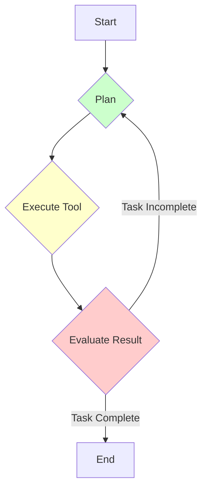

# LangChain & LangGraph

## 1. 핵심 개념 (Core Concept)

**LangChain**은 LLM을 활용한 애플리케이션, 특히 에이전트를 쉽게 개발할 수 있도록 다양한 구성 요소를 모아놓은 오픈소스 프레임워크임. **LangGraph**는 LangChain의 확장 라이브러리로, 에이전트의 순환적인(cyclic) 작업 흐름을 상태 그래프(State Graph) 형태로 구현하여 더 복잡하고 제어 가능한 멀티-에이전트 시스템을 구축할 수 있게 함. 이 둘을 통해 개발자는 LLM, 툴, 메모리 등을 유기적으로 결합하여 정교한 에이전트를 만들 수 있음.

---

## 2. 상세 설명 (Detailed Explanation)

### 2.1 LangChain: 에이전트 개발의 스위스 아미 나이프

LangChain은 LLM 애플리케이션 개발에 필요한 거의 모든 기능을 모듈화하여 제공함. 핵심적인 추상화 개념은 **체인(Chain)**으로, LLM 호출, 툴 사용, 데이터 처리 등의 단계를 파이프라인처럼 연결함.

*   **주요 구성 요소**:
    *   **Models**: GPT, Claude 등 다양한 LLM 모델과의 연동 인터페이스.
    *   **Prompts**: 동적으로 프롬프트를 생성하고 관리하는 템플릿 기능.
    *   **Tools**: 검색, 계산기, API 호출 등 에이전트가 사용할 수 있는 도구 모음.
    *   **Agents**: LLM이 툴을 사용하여 스스로 추론하고 행동하는 실행 로직.
    *   **Memory**: 대화 기록이나 작업 내용을 기억하는 메모리 모듈.

Anthropic의 가이드에서 언급된 것처럼, LangChain과 같은 프레임워크는 에이전트 개발을 시작할 때 유용하지만, 내부적인 추상화가 높아 디버깅이 어려울 수 있음. 따라서 프레임워크 사용 시 그 내부 동작 원리를 이해하는 것이 중요함.

### 2.2 LangGraph: 순환 그래프로 에이전트 제어하기

기존 LangChain의 에이전트(LCEL)는 대부분 방향성 비순환 그래프(DAG)로 작동하여, 작업이 한 방향으로만 흐름. 하지만 실제 에이전트는 **반성(Reflection)**과 **재계획(Replanning)**을 위해 이전 단계로 돌아가는 순환적인 구조가 필요함.

LangGraph는 상태 머신(State Machine) 개념을 도입하여 이러한 순환을 가능하게 함.

*   **Nodes**: 그래프의 각 노드는 특정 작업을 수행하는 함수나 LLM 체인 (에이전트의 '실행' 단계).
*   **Edges**: 노드와 노드를 연결하며, 조건에 따라 다음 노드를 결정함 (에이전트의 '계획' 및 '반성' 단계).
*   **State**: 전체 그래프가 공유하는 상태 객체. 각 노드는 이 상태를 읽고 업데이트하며 작업 결과를 전달함.

이러한 구조는 Anthropic이 제안한 '평가자-최적화(Evaluator-Optimizer)'나 Google의 '다중 에이전트(Multi-Agent)' 패턴처럼, 여러 에이전트가 서로 협력하고 결과를 평가하며 작업을 진행하는 복잡한 워크플로우를 구현하는 데 매우 효과적임.

---

## 3. 예시 (Example)

### 사용 사례: 리서치 어시스턴트 에이전트 (LangGraph 활용)

*   **목표**: "AI 에이전트의 최신 동향에 대한 보고서를 작성해줘."

1.  **상태(State)**: `{ "topic": "AI Agent Trends", "outline": null, "draft": null, "critique": null, "report": null }`
2.  **노드 1 (Planner)**: 주제를 바탕으로 보고서의 개요를 작성하고 `outline` 상태를 업데이트함.
3.  **노드 2 (Researcher)**: 개요의 각 항목에 대해 웹 검색 툴을 사용하여 정보를 수집하고 `draft` 상태를 업데이트함.
4.  **노드 3 (Writer)**: 수집된 정보를 바탕으로 보고서 초안을 작성하고 `draft` 상태를 업데이트함.
5.  **조건부 엣지 (Conditional Edge)**: 초안이 완성되면, '평가자(Critiquer)' 노드로 라우팅함.
6.  **노드 4 (Critiquer)**: 초안을 비판적으로 검토하고 개선점을 `critique` 상태에 기록함.
7.  **조건부 엣지**: 비판 내용이 있으면, 다시 'Writer' 노드로 돌아가 초안을 수정하게 함. 비판 내용이 없으면, 최종 보고서를 `report` 상태에 저장하고 종료함.

---

## 4. 예상 면접 질문 (Potential Interview Questions)

*   **Q. LangChain과 LangGraph의 가장 큰 차이점은 무엇인가요?**
    *   **A.** LangChain은 주로 단방향 파이프라인(DAG)을 구성하는 데 중점을 두는 반면, LangGraph는 상태 그래프를 도입하여 순환(Cycle)이 가능한, 더 복잡하고 제어 가능한 에이전트 워크플로우를 만들 수 있다는 점이 가장 큰 차이입니다. 이를 통해 에이전트가 스스로 작업을 평가하고 수정하는 반복적인 과정을 구현할 수 있습니다.

*   **Q. 어떤 경우에 LangChain 대신 LangGraph를 사용하는 것이 더 적합한가요?**
    *   **A.** 여러 에이전트가 협력하거나, 작업 결과를 평가하고 피드백에 따라 계획을 수정하는 등 복잡한 제어 로직이 필요할 때 LangGraph가 더 적합합니다. 예를 들어, 하나의 에이전트가 초안을 작성하면 다른 에이전트가 이를 평가하고, 그 평가 결과에 따라 다시 초안을 수정하는 '평가자-최적화' 루프를 구현하는 경우에 이상적입니다.

*   **Q. 에이전트 개발 프레임워크를 사용할 때의 장단점은 무엇이라고 생각하시나요?**
    *   **A.** (Anthropic 문서 참조) 장점은 LLM 호출, 툴 파싱 등 반복적인 작업을 추상화하여 빠르게 프로토타입을 만들 수 있다는 것입니다. 단점은 추상화 때문에 내부 동작을 파악하기 어려워 디버깅이 복잡해질 수 있고, 불필요한 복잡성을 추가하게 될 수 있다는 점입니다. 따라서 프레임워크의 편리함과 내부 동작의 투명성 사이에서 균형을 잡는 것이 중요합니다.

---

## 5. 더 읽어보기 (Further Reading)

*   [LangChain Official Documentation](https://python.langchain.com/)
*   [LangGraph Official Documentation](https://langchain-ai.github.io/langgraph/)
*   [Google Agent Document](https://www.kaggle.com/whitepaper-agent-companion)
*   [Anthropic Agent Document](https://www.anthropic.com/engineering/building-effective-agents)