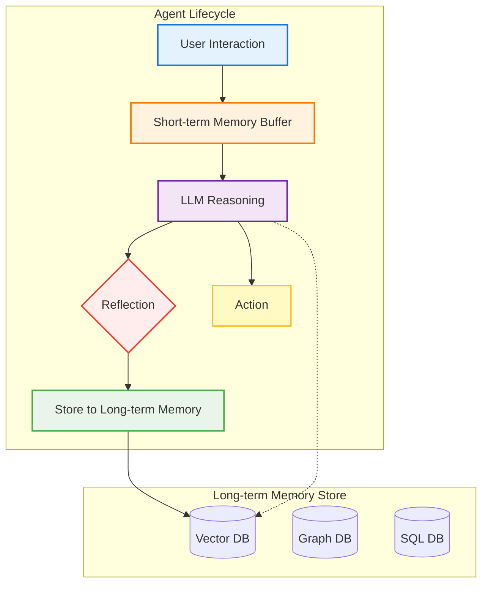

# 메모리 & 장기 컨텍스트 (Memory & Long-Term Context)

## 1. 핵심 개념 (Core Concept)

에이전트의 **메모리**는 과거의 상호작용, 지식, 경험을 저장하고 필요할 때 다시 꺼내어 현재의 의사결정에 활용하는 능력임. 이는 에이전트가 단순한 일회성 작업을 넘어, 연속적인 대화의 맥락을 이해하고, 사용자 선호도를 학습하며, 과거의 실수로부터 배우는 등 진정한 지능을 갖추기 위한 핵심 아키텍처 패턴임. 메모리는 크게 **단기 기억(Short-term Memory)**과 **장기 기억(Long-term Memory)**으로 나뉨.

---

## 2. 상세 설명 (Detailed Explanation)

Google의 "Agents Companions V2" 문서에서 강조하듯, 메모리 관리는 에이전트 아키텍처의 필수적인 구성 요소임.

### 2.1 단기 기억 (Short-term Memory / Working Memory)

단기 기억은 현재 진행 중인 대화나 작업의 맥락을 유지하는 역할을 함. 일반적으로 LLM의 컨텍스트 창(Context Window) 내에 직접 포함되어 관리됨.

*   **구현 방식**:
    *   **대화 버퍼 (Conversation Buffer)**: 전체 대화 기록을 시간 순서대로 저장함. 가장 간단하지만, 대화가 길어지면 컨텍스트 창 제한을 초과할 수 있음.
    *   **요약 버퍼 (Summary Buffer)**: 대화가 길어지면, 이전 대화 내용을 LLM을 사용하여 요약하고, 이 요약본을 메모리에 유지함. 토큰을 절약할 수 있지만 요약 과정에서 정보 손실이 발생할 수 있음.
    *   **토큰 기반 윈도우 (Token-based Window)**: 최근 N개의 토큰만 유지하여 컨텍스트 창 크기를 관리함.

*   **역할**: 사용자가 "그것(it)"이라고 말했을 때 무엇을 가리키는지 이해하는 등, 대화의 일관성과 흐름을 유지함.

### 2.2 장기 기억 (Long-term Memory)

장기 기억은 여러 세션에 걸쳐 영구적으로 보존되어야 하는 정보를 저장함. 이를 통해 에이전트는 개인화된 경험을 제공하고 과거의 경험으로부터 학습할 수 있음.

*   **구현 방식**:
    *   **벡터 데이터베이스 (Vector Database)**: 대화 내용, 사용자 피드백, 성공/실패 경험 등을 텍스트 임베딩으로 변환하여 벡터 DB에 저장함. 새로운 상황이 발생하면, 현재 상황과 의미적으로 가장 유사한 과거의 기억을 검색하여 컨텍스트에 주입함.
    *   **그래프 데이터베이스 (Graph Database)**: 사용자와의 관계, 선호도, 중요한 사실 등 개체(Entity)와 관계(Relationship)를 저장하는 데 유용함.
    *   **전통적인 데이터베이스**: 사용자 프로필과 같은 정형 데이터를 저장함.

*   **반성(Reflection)을 통한 메모리 강화**: Google 문서에서 언급된 것처럼, 에이전트는 주기적으로 자신의 단기 기억(대화 기록)을 **반성**하여, 어떤 정보를 장기 기억으로 승격시킬지 결정해야 함. (예: "사용자가 반복적으로 '간결한 답변'을 선호한다고 언급했으니, 이 선호도를 장기 기억에 저장해야겠다.")

---

## 3. 예시 (Example)

### 사용 사례: 개인화된 학습 보조 에이전트

*   **시나리오**: 한 학생이 양자역학을 공부하기 위해 AI 에이전트를 사용함.

1.  **초기 상호작용 (단기 기억)**:
    *   **학생**: "슈뢰딩거 방정식이 뭐야?"
    *   **에이전트**: (슈뢰딩거 방정식을 설명함)
    *   **학생**: "너무 어려워. 더 쉽게 설명해줄 수 있어? 비유를 들어서."
    *   **에이전트**: (파동 함수를 '가능성의 파도'에 비유하여 더 쉽게 설명함)

2.  **반성 및 장기 기억 저장**:
    *   에이전트는 이 상호작용을 통해 '이 학생은 복잡한 개념에 대해 비유를 통한 설명을 선호한다'는 사실을 **반성**하고, 이 정보를 학생 프로필과 함께 **장기 기억**(벡터 DB 또는 SQL DB)에 저장함.

3.  **이후 상호작용 (장기 기억 활용)**:
    *   **학생**: (며칠 후) "하이젠베르크의 불확정성 원리에 대해 알려줘."
    *   **에이전트**: (장기 기억에서 학생의 선호도를 검색함) "하이젠베르크의 불확정성 원리를 설명해 드릴게요. 이 학생은 비유를 좋아하시니, '풍선 속의 파리' 비유를 사용해서 설명해 보겠습니다..."

---

## 4. 예상 면접 질문 (Potential Interview Questions)

*   **Q. 에이전트에게 메모리가 왜 중요한가요? 단기 기억과 장기 기억의 차이점은 무엇인가요?**
    *   **A.** 메모리는 에이전트가 과거의 경험과 정보를 바탕으로 현재의 결정을 내리게 하여, 일관성 있고 개인화된 상호작용을 가능하게 하는 핵심 요소입니다. 단기 기억은 현재 대화의 맥락을 유지하는 휘발성 메모리인 반면, 장기 기억은 여러 세션에 걸쳐 유지되는 영구적인 지식 베이스로, 에이전트의 학습과 개인화의 기반이 됩니다.

*   **Q. 장기 기억을 구현하기 위한 기술적인 방법에는 어떤 것들이 있나요?**
    *   **A.** 주로 벡터 데이터베이스를 사용합니다. 과거의 대화나 경험을 텍스트 임베딩으로 변환하여 저장하고, 현재 상황과 의미적으로 유사한 기억을 빠르게 검색하여 활용할 수 있습니다. 또한, 사용자 프로필 같은 정형 데이터는 SQL 데이터베이스에, 개체 간의 관계 정보는 그래프 데이터베이스에 저장하는 등 여러 기술을 혼합하여 사용할 수 있습니다.

*   **Q. 에이전트가 언제, 무엇을 장기 기억에 저장해야 할지 어떻게 결정할 수 있을까요?**
    *   **A.** '반성(Reflection)' 메커니즘을 통해 결정할 수 있습니다. 에이전트는 주기적으로 자신의 단기 기억(최근 대화 기록)을 검토하여, 반복적으로 나타나는 사용자 선호도, 중요한 사실, 성공적인 문제 해결 전략 등 일반화할 수 있는 중요한 정보를 식별하고 이를 장기 기억으로 옮기도록 설계할 수 있습니다. 이 과정은 LLM 자체를 사용하여 자동화할 수 있습니다.

---

## 5. 더 읽어보기 (Further Reading)

*   [LLM Powered Autonomous Agents - Part II: Memory (Lilian Weng)](https://lilianweng.github.io/posts/2023-06-23-agent/#memory)
*   [LangChain Memory Documentation](https://python.langchain.com/docs/modules/memory/)
*   [Google Agent Document](/docs/assets/files/agentic-ai/google_agent.md)
*   [Anthropic Agent Document](/docs/assets/files/agentic-ai/anthropic_building_effective_ai_agents.md)