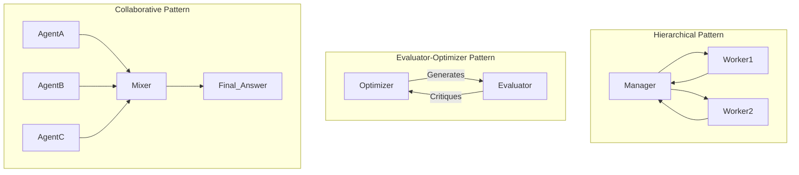

# 멀티 에이전트 협업 (Multi-Agent Collaboration)

## 1. 핵심 개념 (Core Concept)

멀티 에이전트 협업은 단일 에이전트가 모든 것을 처리하는 대신, 각자 특정 역할과 전문성을 가진 여러 에이전트들이 팀을 이루어 공동의 목표를 달성하는 아키텍처 패턴임. 이 접근 방식은 복잡한 문제를 더 작고 관리 가능한 하위 작업으로 분해하여, 시스템 전체의 정확성, 효율성, 확장성을 높이는 것을 목표로 함. 에이전트 간의 상호작용 방식에 따라 계층적, 협력적 등 다양한 패턴으로 구현될 수 있음.

---

## 2. 상세 설명 (Detailed Explanation)

Google과 Anthropic의 문서에서 공통적으로 강조하는 것처럼, 복잡한 문제를 해결하기 위해 여러 LLM 호출을 조합하는 것은 매우 효과적인 전략임. 멀티 에이전트 시스템은 이러한 철학을 구조화한 것임.

### 2.1 왜 멀티 에이전트인가?

*   **모듈성 및 전문성**: 각 에이전트는 특정 작업(예: 리서치, 코딩, 글쓰기, 비평)에만 집중하므로, 더 높은 품질의 결과물을 생성할 수 있음.
*   **효율성**: 여러 에이전트가 병렬로 작업을 수행하여 전체 처리 시간을 단축할 수 있음.
*   **확장성**: 새로운 기능이 필요할 때, 해당 기능을 전문으로 하는 새로운 에이전트를 추가하기만 하면 되므로 시스템 확장이 용이함.
*   **견고성**: 하나의 에이전트가 실패하더라도 다른 에이전트가 작업을 이어받거나 보완할 수 있어 시스템의 안정성이 향상됨.

### 2.2 주요 협업 패턴

Anthropic과 Google의 문서에서는 다음과 같은 다양한 협업 패턴을 제시함.

1.  **라우팅 (Routing)**: 중앙의 '라우터' 에이전트가 사용자의 요청을 분석하여 가장 적합한 전문 에이전트에게 작업을 전달하는 방식. (예: 고객 지원 쿼리를 '환불', '기술 지원', '일반 문의' 담당 에이전트로 분류)

2.  **오케스트레이터-워커 (Orchestrator-Workers) / 계층적 패턴 (Hierarchical)**: '매니저' 또는 '오케스트레이터' 에이전트가 상위 목표를 하위 작업으로 분해하고, 이를 여러 '워커' 에이전트에게 동적으로 위임한 뒤, 결과를 종합하여 최종 결과물을 만듦.

3.  **평가자-최적화 (Evaluator-Optimizer)**: 하나의 에이전트가 초안을 생성하면(Optimizer), 다른 에이전트가 명확한 기준에 따라 그 결과물을 평가하고 피드백을 제공함(Evaluator). 이 과정을 반복하며 결과물의 품질을 점진적으로 개선함.

4.  **협력적 패턴 (Collaborative)**: 여러 에이전트가 동등한 위치에서 각자의 관점으로 결과물을 생성하면, '믹서(Mixer)' 에이전트가 이 결과물들을 종합하여 가장 완전한 답변을 만들어내는 방식. (예: 자동차 사고 대처법에 대해 '메뉴얼 에이전트', '운전 팁 에이전트', '일반 상식 에이전트'의 답변을 종합)

---

## 3. 예시 (Example)

### 사용 사례: 신제품 출시 마케팅 캠페인 기획 (CrewAI 스타일)

*   **목표**: 새로운 AI 기반 생산성 앱의 출시를 위한 마케팅 캠페인 전략 수립.

1.  **팀 구성 (에이전트 정의)**:
    *   `Market_Researcher`: 타겟 고객과 경쟁 제품을 분석하는 에이전트.
    *   `Creative_Strategist`: 분석 결과를 바탕으로 핵심 메시지와 캠페인 아이디어를 도출하는 에이전트.
    *   `Media_Planner`: 캠페인 아이디어를 실행할 최적의 채널(블로그, SNS, 광고)을 계획하고 예산을 분배하는 에이전트.
    *   `Project_Manager`: 전체 과정을 조율하고 최종 보고서를 작성하는 매니저 에이전트.

2.  **협업 프로세스 (계층적 패턴)**:
    *   `Project_Manager`가 `Market_Researcher`에게 시장 분석을 지시함.
    *   `Market_Researcher`가 보고서를 제출하면, `Project_Manager`는 이를 `Creative_Strategist`에게 전달하여 전략 수립을 지시함.
    *   `Creative_Strategist`의 아이디어를 `Media_Planner`에게 전달하여 구체적인 실행 계획을 수립하게 함.
    *   `Project_Manager`는 각 단계의 결과물을 종합하여 최종 마케팅 캠페인 전략 보고서를 완성함.

---

## 4. 예상 면접 질문 (Potential Interview Questions)

*   **Q. 멀티 에이전트 시스템을 도입하면 어떤 장점이 있나요?**
    *   **A.** 복잡한 문제를 전문화된 역할로 나눌 수 있어 각 작업의 품질이 높아지는 모듈성의 장점이 있습니다. 또한, 여러 작업을 병렬로 처리하여 효율성을 높이고, 새로운 기능이 필요할 때 해당 에이전트만 추가하면 되므로 확장성이 뛰어납니다.

*   **Q. '평가자-최적화' 패턴은 어떤 종류의 작업에 특히 유용한가요?**
    *   **A.** 결과물에 대한 명확한 평가 기준이 있고, 반복적인 수정을 통해 품질을 점진적으로 높일 수 있는 작업에 매우 유용합니다. 예를 들어, 코드 생성 후 테스트를 통해 버그를 수정하는 작업, 글 초안을 작성한 후 문법과 논리를 교정하는 작업, 또는 문학 번역처럼 미묘한 뉘앙스를 다듬는 작업에 효과적입니다.

*   **Q. 다중 에이전트 시스템을 설계할 때 발생할 수 있는 어려움은 무엇일까요?**
    *   **A.** (Google 문서 참조) 에이전트 간의 효율적인 작업 분배 및 조율, 여러 에이전트가 생성하는 컨텍스트를 일관성 있게 관리하는 것, 그리고 에이전트 간의 통신 비용으로 인한 지연 시간 및 비용 증가 등이 주요 어려움입니다. 또한, 시스템 전체가 복잡해져 디버깅과 모니터링이 어려워질 수 있습니다.

---

## 5. 더 읽어보기 (Further Reading)

*   [LangGraph: Multi-Agent Workflows](https://blog.langchain.dev/langgraph-multi-agent-workflows/)
*   [CrewAI Documentation](https://docs.crewai.com/)
*   [Google Agent Document](/docs/assets/files/agentic-ai/google_agent.md)
*   [Anthropic Agent Document](/docs/assets/files/agentic-ai/anthropic_building_effective_ai_agents.md)