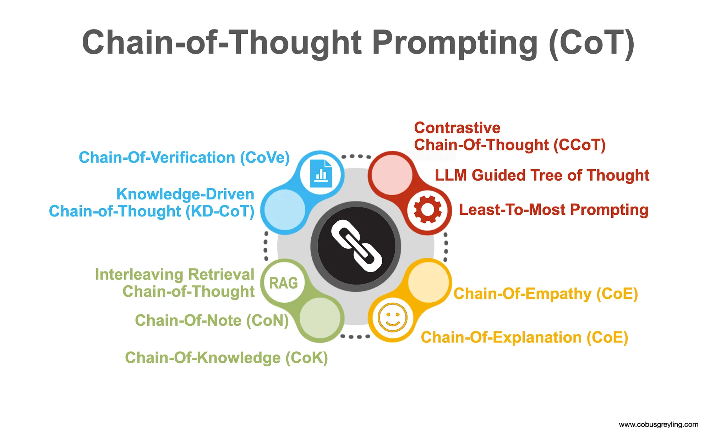

# 생각의 사슬 (Chain-of-Thought, CoT)

## 1. 핵심 개념 (Core Concept)

Chain-of-Thought (CoT)는 LLM에게 최종 답변만 요구하는 대신, **문제 해결을 위한 중간 추론 과정을 단계별로 생각하고 설명하도록 유도**하는 프롬프팅 기법입니다. 복잡한 문제를 작은 단계로 분해함으로써, 모델이 보다 정확하고 논리적인 결론에 도달하게 하며, 답변의 근거를 투명하게 만들어 신뢰도를 높입니다. 이는 마치 사람이 수학 문제를 풀 때 계산 과정을 순서대로 적는 것과 같습니다.



______________________________________________________________________

## 2. 상세 설명 (Detailed Explanation)

### 2.1 Zero-shot CoT vs. Few-shot CoT

CoT는 크게 두 가지 방식으로 구현할 수 있습니다.

- **Zero-shot CoT**: 가장 간단한 방식으로, 프롬프트 끝에 **"Let's think step by step."** (차근차근 생각해 보자.) 와 같은 마법의 문장을 추가하기만 하면 됩니다. 이 지시어 하나만으로도 LLM은 추론 과정을 생성하며 성능이 향상됩니다.

- **Few-shot CoT**: 더 높은 정확도가 필요할 때 사용하며, 프롬프트에 몇 개의 완전한 질의-응답 예시를 포함합니다. 각 예시는 질문뿐만 아니라, 상세한 단계별 추론 과정과 최종 답변까지 포함해야 합니다.

### 2.2 Self-Consistency: 다수결로 견고성 높이기

CoT의 성능을 한 단계 더 끌어올리는 기법입니다. 동일한 질문에 대해 **온도(temperature)를 0보다 높게 설정하여 여러 번(N회) 추론을 생성**하면, 매번 조금씩 다른 추론 경로를 탐색하게 됩니다. 그 후, N개의 결과 중 **가장 많이 나온 답변을 최종 답변으로 채택(majority vote)** 하는 방식입니다. 이는 단일 추론 과정에서 발생할 수 있는 실수를 보완하고, 특히 정답이 명확한 수학이나 논리 문제에서 매우 효과적입니다.

### 2.3 언제 CoT를 사용해야 하는가?

- **적합한 경우**: 산술, 상식, 상징적 추론 등 여러 단계를 거쳐야 하는 복잡한 문제에 효과적입니다.
- **부적합한 경우**: "프랑스의 수도는?" 와 같이 간단한 사실을 묻는 질문에는 불필요한 비용과 지연만 발생시킵니다. 또한, 정해진 답이 없는 창의적인 글쓰기 작업에는 적합하지 않을 수 있습니다.

______________________________________________________________________

## 3. 예시 (Example)

### 3.1 Zero-shot CoT 예시

**User Prompt:**

```
Q: 한 상자에 사과가 5개, 배가 3개 들어있습니다. 이런 상자가 4개 있다면 총 과일은 몇 개인가요?

A: Let's think step by step.
```

**LLM Output:**

```
1. 먼저 한 상자에 들어있는 총 과일의 수를 계산합니다. 사과 5개 + 배 3개 = 8개의 과일이 있습니다.
2. 이런 상자가 4개 있으므로, 총 과일의 수는 8개/상자 * 4상자 = 32개입니다.

최종 답변: 32
```

### 3.2 Self-Consistency 의사코드

```python
def cot_with_self_consistency(question, n=5):
    answers = []
    # 1. 온도를 높여 N번 추론 생성
    for _ in range(n):
        reasoning_path = llm.generate(question, temperature=0.7)
        final_answer = extract_answer(reasoning_path)
        if final_answer:
            answers.append(final_answer)

    # 2. 가장 많이 나온 답변을 최종 선택
    if not answers:
        return "답변을 찾을 수 없습니다."
    return majority_vote(answers)
```

______________________________________________________________________

## 4. 예상 면접 질문 및 모범 답안

### Q1. CoT가 언제 역효과를 낼 수 있나요?

**A.** CoT는 **간단한 사실 확인 질문**에 사용될 때 불필요한 비용과 지연을 초래하여 역효과를 낼 수 있습니다. 또한, 모델이 **잘못된 추론 과정(생각의 사슬)을 환각**해내면, 오히려 그럴듯하게 틀린 답에 더 강한 확신을 갖게 되어 최종적으로 오답에 이르게 하는 **'그럴듯한 함정'** 에 빠질 수 있습니다.

**\[추가 설명\]**

1. **단순 사실 질문**: "한국의 수도는 어디인가?" 와 같은 질문에 CoT를 적용하면, `1. 한국은 아시아에 있는 나라이다. 2. 수도는 서울이다.` 와 같이 불필요한 과정을 거치며 비용과 시간만 낭비합니다.
1. **창의적/주관적 작업**: "바다에 대한 시를 써줘" 와 같은 작업에 논리적 단계를 강요하면 오히려 창의성을 저해할 수 있습니다.
1. **잘못된 추론의 강화**: CoT의 가장 큰 위험 요소입니다. 만약 모델이 첫 단계에서부터 잘못된 사실이나 계산 실수를 하면, 그 오류가 다음 단계로 계속 이어져 결국 전체 추론이 틀어지게 됩니다. CoT가 없었다면 직관적으로 맞출 수도 있었을 문제를, 잘못된 논리 때문에 더 확신을 갖고 틀리게 되는 것입니다.

### Q2. Self-Consistency 기법의 비용과 지연 시간을 줄이는 방법은 무엇인가요?

**A.** 가장 효과적인 방법은 **'모델 티어링(Model Tiering)'** 입니다. 즉, 여러 개의 추론 경로를 생성할 때는 **작고 빠른 모델(예: Haiku, GPT-3.5-Turbo)을 사용**하고, 다수결로 정해진 최종 답변을 검증할 때만 **크고 성능 좋은 모델(예: Opus, GPT-4)을 사용**하는 것입니다. 또한, API 호출을 병렬로 처리하여 지연 시간을 줄일 수 있습니다.

**\[추가 설명\]**

- **모델 티어링**: '초안 작성'과 '최종 검토' 역할을 분리하는 것과 같습니다. 비용이 저렴한 모델로 여러 개의 초안(추론 경로)을 빠르게 생성하고, 가장 유력한 답변 하나에 대해서만 비싼 모델로 최종 확인을 받아 비용 효율성을 극대화합니다.
- **병렬 처리 (Parallelization)**: N개의 추론 경로를 순차적으로 생성하는 대신, N개의 API를 동시에 호출합니다. 총비용은 같지만, 전체 지연 시간은 단일 호출 시간과 비슷하게 줄어듭니다.
- **적응형 샘플링 (Adaptive Sampling)**: 항상 고정된 N(예: 5개)을 사용하는 대신, 처음 3개의 샘플이 모두 동일한 답변을 내놓으면, 굳이 나머지 2개를 생성하지 않고 조기 종료하여 비용을 절감할 수 있습니다.

### Q3. CoT, ReAct, ToT(Tree of Thoughts)의 선택 기준은 무엇인가요?

**A.** **CoT**는 외부 정보 없이 **순수 추론만으로 해결 가능한 문제**에 사용합니다. **ReAct**는 문제 해결을 위해 **외부 도구(예: 검색, API)를 사용한 정보 수집이 필요할 때** 사용합니다. **ToT**는 단일 추론 경로가 실패할 가능성이 높은 **복잡한 탐색이나 계획 문제에서, 여러 대안 경로를 동시에 탐색하고 평가**할 때 사용합니다.

**\[추가 설명\]**

- **CoT (Chain-of-Thought)**

  - **언제**: 문제 해결에 필요한 모든 정보가 프롬프트 안에 있거나 모델이 이미 알고 있을 때.
  - **비유**: 학생이 종이와 펜만으로 수학 문제를 푸는 것.
  - **예시**: 논리 퀴즈, 수학 응용 문제.

- **ReAct (Reason + Act)**

  - **언제**: 최신 정보 검색, 데이터베이스 조회 등 외부 세계와 상호작용이 필요할 때.
  - **비유**: 형사가 단서를 '생각'하고, 증인을 만나러 '행동'한 뒤, 얻은 정보를 바탕으로 다시 '생각'하는 것.
  - **예시**: "아이폰을 만드는 회사의 현재 CEO는 누구야?" (검색 필요)

- **ToT (Tree of Thoughts)**

  - **언제**: 정답에 이르는 경로가 여러 갈래이거나, 하나의 경로가 막힐 가능성이 높아 다양한 대안을 탐색해야 하는 복잡한 문제.
  - **비유**: 체스 선수가 여러 가능한 수를 두고, 각 수에 대한 다음 몇 수를 미리 내다본 뒤, 가장 유리한 수를 선택하는 것.
  - **예시**: "신제품에 대한 혁신적인 마케팅 전략을 세워봐." (다양한 전략 탐색 및 비교 필요)

______________________________________________________________________

## 5. 더 읽어보기 (Further Reading)

- [Prompt Engineering Guide (Google)](/docs/references/google/Prompt%20Engineering_v7.pdf)
- [A Practical Guide to Building Agents (OpenAI)](/docs/references/openai/a-practical-guide-to-building-agents-3.pdf)
- Image: https://cobusgreyling.medium.com/the-anatomy-of-chain-of-thought-prompting-cot-b7489c925402
