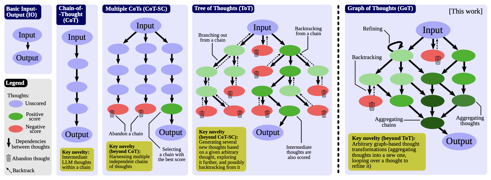

# 생각의 그래프 (Graph-of-Thoughts, GoT)

## 1. 핵심 개념 (Core Concept)

Graph-of-Thoughts (GoT)는 LLM의 추론 과정을 **노드(생각)와 엣지(관계)로 구성된 동적인 그래프**로 모델링하는 가장 발전된 추론 패턴입니다. 선형적인 CoT나 분기만 가능한 ToT와 달리, GoT는 **여러 추론 경로를 하나로 합치거나(Merge/Aggregate), 특정 생각을 다시 방문하여 개선(Cycle/Refine)** 할 수 있습니다. 이 유연한 구조 덕분에 여러 가설을 종합하고, 모순을 해결하며, 점진적으로 생각을 발전시키는 복잡한 문제 해결에 매우 강력합니다.



______________________________________________________________________

## 2. CoT, ToT, GoT 비교

| 패턴    | 구조               | 핵심 아이디어                                                    | 한계                                                             |
| :------ | :----------------- | :--------------------------------------------------------------- | :--------------------------------------------------------------- |
| **CoT** | **선 (Chain)**     | 단일 경로로 생각을 순차적으로 전개                               | 한 번 잘못된 길로 들어서면 되돌릴 수 없음                        |
| **ToT** | **나무 (Tree)**    | 여러 독립적인 경로를 동시에 탐색하고 최선을 선택                 | 각 경로가 고립되어 있어, 서로의 결과를 활용하거나 결합할 수 없음 |
| **GoT** | **그래프 (Graph)** | 여러 경로를 탐색하고, 그 결과를 **병합**하거나 **순환**하여 개선 | 구조가 복잡하고, 연산 비용이 가장 높음                           |

## 3. GoT의 추론 과정

GoT의 추론은 크게 생성, 변환, 검증의 세 가지 핵심 작업으로 이루어집니다.

1. **생성 (Generation)**: 주어진 문제에 대해 여러 개의 초기 생각(노드)을 생성합니다. 이는 CoT나 ToT의 첫 단계와 유사합니다.

1. **변환 (Transformation)**: 그래프 구조를 활용하여 기존 생각들을 변환하고 새로운 생각을 만들어냅니다.

   - **병합 (Aggregation)**: 여러 개의 노드(예: 서로 다른 근거)를 입력받아, 이를 종합하는 새로운 노드(예: 종합 결론)를 생성합니다.
   - **정제 (Refinement)**: 단일 노드를 입력받아, 그 내용을 개선하거나 오류를 수정하는 새로운 노드(예: 수정된 가설)를 생성합니다. 이는 순환(Cycle) 구조를 만들어 점진적인 개선을 가능하게 합니다.

1. **검증 (Validation)**: 생성되거나 변환된 노드의 유효성, 일관성, 품질을 평가합니다. LLM을 '평가자'로 사용하여 각 노드에 점수를 매기거나, 논리적 모순이 있는지 확인합니다.

### 의사코드 예시

```python
def got_reasoning(question):
    graph = Graph()

    # 1. 생성: 여러 초기 가설 생성
    initial_thoughts = llm.propose_initial_thoughts(question, n=5)
    graph.add_nodes(initial_thoughts)

    # 2. 변환 (병합): 가설들을 종합하여 상위 가설 생성
    aggregated_thought = llm.aggregate(graph.get_all_nodes())
    graph.add_node(aggregated_thought)
    graph.add_edges_from(graph.get_all_nodes(), aggregated_thought, type="is_summarized_in")

    # 3. 변환 (정제): 상위 가설을 반복적으로 개선 (순환)
    for _ in range(3): # 3번의 개선 사이클
        critique = llm.critique(aggregated_thought)
        refined_thought = llm.refine(aggregated_thought, critique)
        graph.add_node(refined_thought)
        graph.add_edge(aggregated_thought, refined_thought, type="is_refined_to")
        aggregated_thought = refined_thought

    # 4. 검증: 최종 결과 선택
    final_answer = llm.validate_and_select_best(graph)
    return final_answer
```

______________________________________________________________________

## 4. 예상 면접 질문 및 모범 답안

### Q1. GoT와 ToT의 선택 기준은 무엇인가요?

**A.** **ToT(Tree of Thoughts)** 는 여러 **독립적인** 해결 경로를 탐색하여 그중 최선을 찾는 문제에 적합하고, **GoT(Graph of a Thoughts)** 는 여러 경로의 **결과를 종합하거나, 특정 생각을 반복적으로 개선**해야 하는 문제에 적합합니다. 즉, ToT는 '탐색과 선택'에, GoT는 '종합과 개선'에 더 강점이 있습니다.

**\[추가 설명\]**

- **ToT를 선택하는 경우 (탐색)**:

  - **문제 특성**: 여러 개의 분기점이 있고, 각 분기에서의 선택이 독립적인 경우.
  - **예시**: 게임 플레이(여러 다음 수를 독립적으로 탐색), 경로 찾기(여러 경로 중 최단 경로 탐색).
  - **사고 방식**: 발산적 사고 (Divergent Thinking). 가능한 많은 옵션을 탐색하는 데 중점을 둡니다.

- **GoT를 선택하는 경우 (종합 및 개선)**:

  - **문제 특성**: 여러 출처의 정보를 종합해야 하거나, 하나의 아이디어를 점진적으로 발전시켜야 하는 경우.
  - **예시**: 리서치 보고서 작성(여러 자료를 종합하여 하나의 결론 도출), 복잡한 시스템 설계(초기 설계를 비판하고 반복적으로 개선).
  - **사고 방식**: 수렴적 및 반복적 사고 (Convergent & Iterative Thinking). 흩어진 아이디어를 하나로 모으고, 그 아이디어를 더 완벽하게 다듬는 데 중점을 둡니다.

### Q2. 정합성 검사(Consistency Check)를 어떻게 자동화하고, 오류를 어떻게 그래프에 표시하나요?

**A.** 정합성 검사는 **LLM을 '비평가(Critic)'로 활용**하여 자동화합니다. 그래프 내의 관련 노드들을 LLM 비평가에게 제시하고, 논리적 모순이나 사실 오류를 찾아내도록 지시합니다. 발견된 오류는 **'오류 노드(Error Node)'** 로 그래프에 명시적으로 추가하고, 문제가 된 노드들과 **'반박하다(refutes)'** 와 같은 엣지로 연결하여 표현합니다.

**\[추가 설명\]**

- **자동화 방법 (LLM Critic)**:
  1. 검사할 노드들을 선택합니다. (예: 가설 노드와 그 근거 노드들)
  1. LLM에게 비평가 역할을 부여하는 프롬프트를 보냅니다. (예: `"당신은 논리 검사기입니다. 다음 생각들 사이에 모순이나 사실과 다른 점이 있는지 찾아내고, 문제가 있다면 명확히 설명하세요." `)
- **오류 표현 방법**:
  - 비평가가 오류를 발견하면, 그 오류 내용을 담은 새로운 '오류 노드'를 생성합니다.
  - 이 오류 노드를 원인이 된 노드들과 `refutes` 또는 `is_inconsistent_with` 같은 의미를 가진 엣지로 연결합니다.
  - **예시**: `[가설 A]`와 `[근거 B]`가 모순된다면, `[오류: A와 B는 모순됨]` 이라는 노드를 만들고, 이 노드가 `[가설 A]`와 `[근거 B]`를 각각 `refutes` 하도록 엣지를 추가합니다.
  - 이렇게 오류를 명시적으로 표현하면, 다음 추론 단계에서 이 오류를 해결하려는 새로운 생각을 생성하는 데 활용할 수 있습니다.

### Q3. 그래프에 포함된 증거(Evidence)의 신뢰도를 어떻게 스코어링할 수 있나요?

**A.** 증거의 신뢰도는 **1) 출처의 평판, 2) 정보의 최신성, 3) 교차 검증(합의)** 이라는 세 가지 축을 기준으로 종합적으로 스코어링할 수 있습니다. 이 과정은 휴리스틱(규칙)과 LLM을 활용한 평가를 결합하여 자동화할 수 있습니다.

**\[추가 설명\]**

1. **출처 기반 스코어링 (Source-based)**:
   - **평판**: `{'arxiv.org': 0.9, 'wikipedia.org': 0.7, 'personal-blog.com': 0.3}` 와 같이 신뢰할 수 있는 출처 목록을 미리 정의하고, 증거가 어디에서 왔는지에 따라 점수를 매깁니다.
   - **최신성**: 정보의 생성 또는 발표 시점을 기준으로 점수를 매깁니다. 특히 기술 분야처럼 빠르게 변하는 주제에서는 최신 정보일수록 높은 점수를 받습니다.
1. **내용 기반 스코어링 (Content-based)**:
   - **LLM-as-a-Judge**: 증거의 내용을 LLM에게 보내, `"이 증거가 객관적인 데이터를 포함하고 있는지, 논리적 오류는 없는지 등을 고려하여 신뢰도를 1~10점으로 평가해줘."` 와 같이 요청하여 점수를 매깁니다.
1. **교차 검증 기반 스코어링 (Consensus-based)**:
   - **삼각 측량 원리**: 하나의 주장이 서로 다른 독립적인 여러 출처에서 동일하게 확인될 경우 신뢰도가 높다고 판단합니다.
   - **구현**: 특정 증거를 찾았을 때, 그 증거와 동일한 주장을 하는 다른 출처가 있는지 추가로 검색합니다. 독립적인 출처가 많을수록 신뢰도 점수를 높입니다.

- **최종 점수**: 위 세 가지 방식으로 얻은 점수들을 가중 평균하여 `최종 신뢰도 점수 = (출처 점수 * 0.5) + (내용 점수 * 0.3) + (교차 검증 점수 * 0.2)` 와 같이 최종 점수를 산출하고, 이를 증거 노드의 메타데이터로 저장하여 추론에 활용합니다.

______________________________________________________________________

## 5. 더 읽어보기 (Further Reading)

- [Graph of Thoughts: A New Paradigm for Large Language Model Reasoning](https://arxiv.org/abs/2308.09687)

______________________________________________________________________

## 6. See also

- [Tree-of-Thoughts (ToT)](./tree-of-thoughts-tot.md)
- [ReAct](./react.md)
