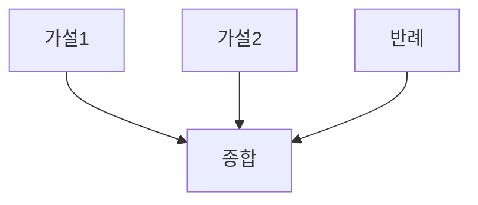

# Graph-of-Thoughts (GoT)

## 1. 핵심 개념 (Core Concept)

생각을 노드, 관계를 엣지로 표현하여 비선형적 추론·통합을 수행합니다. 다수의 가설·근거·반례를 병렬 생성 후, 통합 노드에서 정합성을 평가·병합하는 데 유리합니다.

---

## 2. 상세 설명 (Detailed Explanation)

### 2.1 그래프 구조 설계(노드 타입/엣지 의미)
- 노드 타입: 가설, 근거(문헌/URL), 반례, 중간 결론, 최종 결론
- 엣지 의미: 지지(supports), 반박(refutes), 참조(refers_to), 전후(precedes)
- ID/출처 인용을 포함해 추적 가능성 확보

### 2.2 통합·정합성 평가
- 단계 1: 가설 다중 생성 → 근거 수집(ReAct/RAG)
- 단계 2: 정합성 검사(모순·누락·불충분)
- 단계 3: 통합 노드에서 최종 결론 + 신뢰도 스코어 산출

### 2.3 의사코드(간단)
```python
G = Graph()
for hyp in llm.propose_hypotheses(q, k=5):
    G.add(hyp)
    evid = retrieve(hyp)
    G.add_edges(hyp, evid, type='supports')
conflicts = llm.check_consistency(G)
final = llm.merge_nodes(G, resolve=conflicts)
```

---

## 3. 예시 (Example)



---

## 4. 예상 면접 질문 (Potential Interview Questions)

- GoT와 ToT의 선택 기준은?
- 정합성 검사를 어떻게 자동화하고, 오류를 어떻게 표시하는가?
- 증거의 신뢰도를 어떻게 스코어링하는가?

---

## 5. 더 읽어보기 (Further Reading)

- docs/references/anthropic/building-effective-agents.md
- docs/references/openai/a-practical-guide-to-building-agents-3.pdf

---

## 6. See also

- ToT 탐색: 5-3 → [tree-of-thoughts-tot](./tree-of-thoughts-tot.md)
- ReAct로 증거 수집: 5-3 → [react](./react.md)
- 평가/벤치마크: 5-5 → [prompt-evaluation-and-benchmarks](../5-5-프롬프트-엔지니어링-and-평가/prompt-evaluation-and-benchmarks.md)
