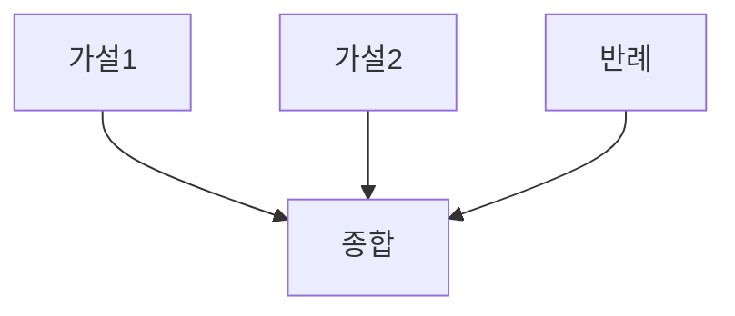

# Graph-of-Thoughts (GoT)

## 1. 핵심 개념 (Core Concept)

생각을 노드, 관계를 엣지로 표현하여 비선형적 추론·통합을 수행함. 멀티-스텝 의존성 관리에 유리함.

---

## 2. 상세 설명 (Detailed Explanation)

### 2.1 그래프 구조 설계(노드 타입/엣지 의미)
### 2.2 통합·정합성 평가

---

## 3. 예시 (Example)

---

## 4. 예상 면접 질문 (Potential Interview Questions)

- GoT와 ToT의 선택 기준은?

---

## 5. 더 읽어보기 (Further Reading)

- docs/references/anthropic/building-effective-agents.md

