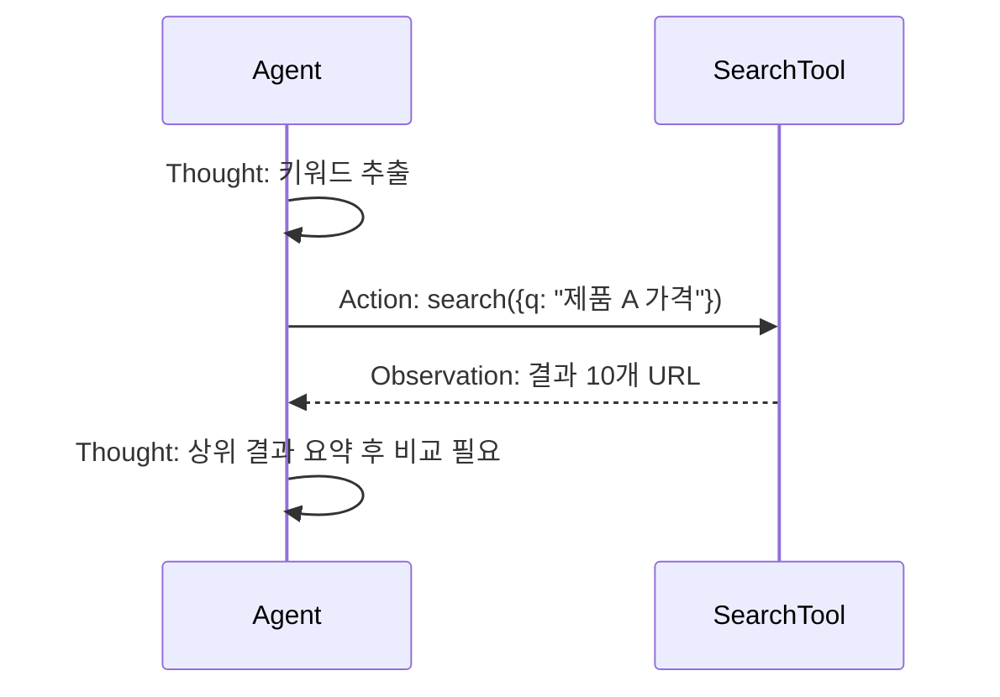

# ReAct

## 1. 핵심 개념 (Core Concept)

추론과 행동(툴 호출)을 교차 배치하여 정보 획득→추론 갱신의 루프를 형성, 정답률과 견고성을 향상합니다. Thought→Action→Observation 로그를 명시적으로 기록·검증하면 디버깅과 품질 관리가 용이합니다.

---

## 2. 상세 설명 (Detailed Explanation)

### 2.1 관찰-추론-행동 로그 구조
- Thought: 현재 가설과 다음 액션 계획(간결한 근거)
- Action: 함수/툴 이름, 파라미터(JSON), 타임아웃
- Observation: 도구 응답(요약/근거 링크)

### 2.2 툴 호출 스키마와 오류 복구
- 스키마: JSON-RPC/OpenAPI 기반 파라미터/응답 검증(5-9 참조)
- 실패: 재시도 정책(지수 백오프), 대체 툴, 질의 재구성(Re-asking)
- 보호: 호출 수/비용 상한, 금지 도메인/PII 필터

### 2.3 RAG/메모리와의 결합
- 검색→요약→메모리 업데이트→후속 질의 개선
- 장기 메모리/벡터DB에서 근거를 재주입하여 환각 방지

---

## 3. 예시 (Example)

### 3.1 웹 검색 ReAct 궤적(축약)
Thought: 최신 가격을 알기 위해 검색한다.
Action: search({"q":"제품A 2025 가격"})
Observation: 공식 스토어/가격 비교 사이트 링크
Thought: 공식 스토어 우선 확인 후 비교한다.
Action: fetch({"url":".../store"})
Observation: 가격=99,000원
Answer: 99,000원 (근거: 공식 스토어)

---

## 4. 예상 면접 질문 (Potential Interview Questions)

- ReAct와 단순 RAG의 차이점은?
- 툴 실패/허위 답변에 대한 견고성 확보 방법은?
- Observation을 어떻게 요약·정형화해 다음 Thought에 반영하는가?

---

## 5. 더 읽어보기 (Further Reading)

- docs/references/openai/a-practical-guide-to-building-agents-3.pdf
- docs/references/anthropic/building-effective-agents.md
- docs/references/google/Agents_Companion_v2.pdf

---

## 6. See also

- 툴 스키마/프로토콜: 5-9 → [tool-schemas-jsonrpc-openapi](../5-9-보안-and-프로토콜/tool-schemas-jsonrpc-openapi.md)
- 메모리/RAG: 5-2/5-4 → [memory-architecture](../5-2-메모리-and-컨텍스트-관리/memory-architecture.md), [advanced-agentic-rag](../5-4-retrieval-augmented-generation-rag/advanced-agentic-rag.md)
