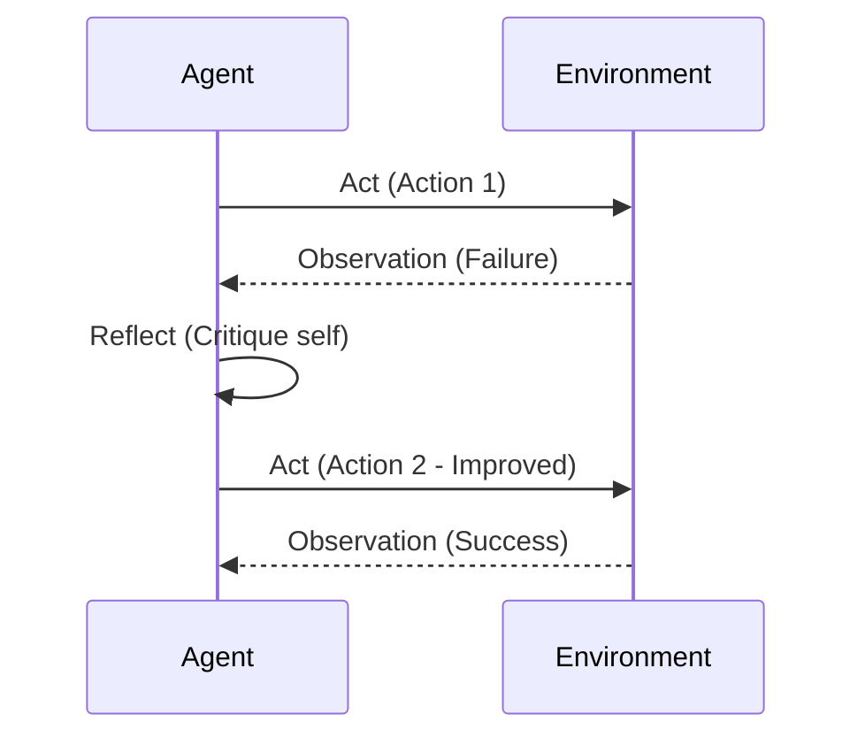
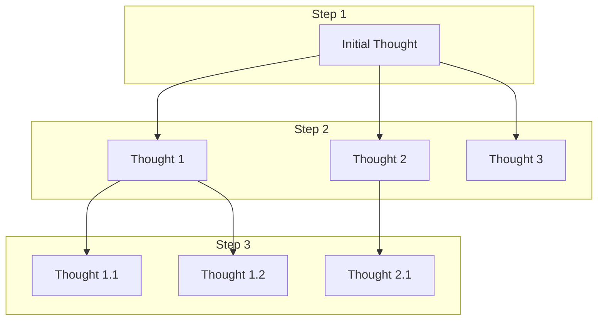

# 핵심 추론 패턴: ReAct, Reflexion, ToT, GoT

## 1. 핵심 개념 (Core Concept)

단순한 연쇄적 사고(Chain-of-Thought)를 넘어, 에이전트가 복잡한 문제를 해결하기 위해 사용하는 고급 추론 구조입니다. 이 패턴들은 에이전트가 **행동하고, 실수로부터 배우고, 여러 가능성을 탐색하고, 생각을 유연하게 결합**하도록 만들어 문제 해결 능력을 극대화합니다.

---

## 2. 상세 설명 (Detailed Explanation)

### 2.1 ReAct (Reason + Act)

가장 기본이 되는 패턴으로, **추론(Reason)**과 **행동(Act)**을 번갈아 수행합니다. LLM이 다음 행동 계획을 세우고(생각), 도구를 사용해 정보를 얻은 뒤(행동), 그 결과를 관찰하여 다음 생각을 이어가는 방식입니다.

```mermaid
graph TD
    A[Goal] --> B{Reason};
    B --> C[Act (Tool)];
    C --> D[Observe];
    D --> B;
```

-   **특징**: "생각 → 행동 → 관찰" 루프를 통해 외부 세계와 상호작용하며 점진적으로 문제를 해결합니다.
-   **장점**: 외부 도구의 최신 정보를 활용할 수 있고, 추론 과정을 추적하기 용이합니다.

### 2.2 Reflexion (Self-Reflection)

ReAct 패턴을 확장하여 **자기 성찰(Self-Reflection)** 단계를 추가한 것입니다. 에이전트는 행동(Act)이 실패하거나 비효율적이었을 때, 무엇이 잘못되었는지 스스로 평가하고(Reflect) 그 교훈을 다음 시도에 활용합니다.



-   **특징**: 실패 경험을 언어적 피드백으로 변환하여 메모리에 저장하고, 다음 계획 수립 시 참고합니다.
-   **장점**: 실수를 통해 학습하므로 반복적인 시도에서 성능이 점진적으로 향상됩니다.

### 2.3 Tree of Thoughts (ToT)

하나의 경로만 탐색하는 선형적 사고에서 벗어나, 문제 해결의 각 단계에서 **여러 가능한 생각(다음 단계)을 생성하고 트리(Tree) 형태로 탐색**합니다. 각 생각을 평가하여 가장 유망한 경로를 선택적으로 확장합니다.



-   **특징**: 너비 우선 탐색(BFS) 또는 깊이 우선 탐색(DFS)과 유사하게 여러 추론 경로를 동시에 고려합니다.
-   **장점**: 탐색 및 백트래킹이 필요한 복잡한 계획 문제에서 최적의 해결책을 찾을 가능성이 높습니다.

### 2.4 Graph of Thoughts (GoT)

ToT를 더욱 일반화하여, 생각을 **그래프(Graph) 구조로 관리**합니다. 이를 통해 여러 추론 경로를 병합(Merge)하거나, 특정 생각을 순환적으로 개선(Cycle)하는 등 훨씬 유연한 사고 흐름을 구성할 수 있습니다.

-   **특징**: 생각(노드)들을 자유롭게 연결하여 복잡한 의존 관계를 표현합니다. 생각의 결합, 분기, 순환이 모두 가능합니다.
-   **장점**: 여러 아이디어를 종합하거나, 피드백 루프를 통해 생각을 정교화하는 등 인간의 복잡한 사고 과정과 가장 유사한 추론이 가능합니다.

---

## 3. 비교 요약 (Comparison Summary)

| 패턴 | 구조 | 핵심 아이디어 | 장점 |
| :--- | :--- | :--- | :--- |
| **ReAct** | 선형 (Linear) | 추론과 행동의 교차 | 외부 정보 활용, 명확성 |
| **Reflexion** | 선형 + 피드백 루프 | 실패로부터의 학습 | 점진적 성능 향상 |
| **ToT** | 트리 (Tree) | 다중 경로 탐색 | 복잡한 계획 문제에 강함 |
| **GoT** | 그래프 (Graph) | 생각의 유연한 결합/변환 | 가장 복잡하고 유연한 추론 가능 |

---

## 4. 예상 면접 질문 (Potential Interview Questions)

*   **Q. ReAct와 Reflexion의 가장 큰 차이점은 무엇인가요?**
    *   **A.** ReAct는 추론과 행동을 반복하는 데 초점을 맞추지만, Reflexion은 행동의 결과를 스스로 평가하고 실패로부터 학습하여 다음 행동을 개선하는 '자기 성찰' 단계가 추가되었다는 점이 가장 큰 차이입니다.
*   **Q. ToT가 CoT(Chain-of-Thought)에 비해 갖는 장점은 무엇인가요?**
    *   **A.** CoT는 단일 경로로만 추론을 진행하지만, ToT는 여러 가능한 추론 경로를 동시에 탐색하고 평가하여 최적의 경로를 찾으므로, 하나의 실수가 전체 실패로 이어질 가능성이 적고 더 복잡한 문제 해결에 유리합니다.
*   **Q. GoT는 어떤 종류의 문제에서 특히 유용한가요?**
    *   **A.** 여러 하위 문제의 결과를 종합해야 하거나, 특정 아이디어를 반복적으로 정교화해야 하는 문제에 특히 유용합니다. 예를 들어, 다양한 소스의 정보를 취합하여 보고서를 작성하거나, 코드의 여러 부분을 동시에 개선하며 전체적인 아키텍처를 다듬는 작업에 강점을 보입니다.

---

## 5. 더 읽어보기 (Further Reading)

*   [ReAct: Synergizing Reasoning and Acting in Language Models](https://arxiv.org/abs/2210.03629)
*   [Reflexion: Language Agents with Verbal Reinforcement Learning](https://arxiv.org/abs/2303.11366)
*   [Tree of Thoughts: Deliberate Problem Solving with Large Language Models](https://arxiv.org/abs/2305.10601)
*   [Graph of Thoughts: Solving Elaborate Problems with Large Language Models](https://arxiv.org/abs/2308.09687)
