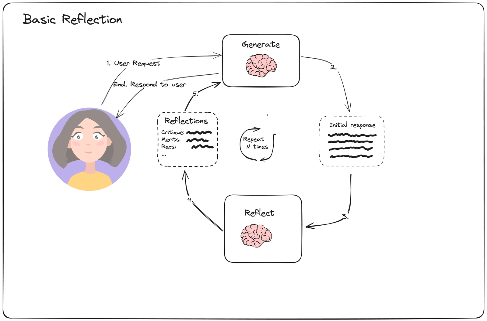

# Reflexion (자기 반성 및 수정)

## 1. 핵심 개념 (Core Concept)

Reflexion은 에이전트가 단순히 실패를 반복하는 것을 넘어, **스스로의 실패 경험으로부터 배우고 다음 행동을 개선**하게 하는 자기 수정(Self-correction) 패턴입니다. 이는 에이전트에게 '메타인지(Metacognition)' 능력을 부여하는 것으로, **평가(Evaluation)** 단계에서 행동의 결과를 판단하고, **성찰(Reflection)** 단계에서 실패의 원인을 분석하여 다음 계획에 반영하는 '내부 피드백 루프'를 통해 구현됩니다. 이는 마치 사람이 실수를 통해 배우는 과정과 같습니다.

*Note: 아래 다이어그램을 위한 이미지를 `docs/images/reflexion-pattern-diagram.png` 에 추가해주세요.*


---

## 2. 상세 설명 (Detailed Explanation)

Reflexion 패턴은 크게 **평가**와 **성찰**이라는 두 단계로 구성됩니다.

### 2.1 1단계: 평가 (Evaluation)

에이전트가 특정 행동(Action)을 수행하고 그 결과(Observation)를 얻으면, '평가자(Evaluator)'가 그 결과가 성공적인지 판단합니다.
- **평가 기준**: 미리 정의된 목표 달성 여부, 규칙 기반 검사(예: 코드 컴파일 성공 여부), 또는 LLM을 이용한 품질 점수(예: 답변의 명확성 점수) 등을 사용합니다.
- **결과**: 평가 결과가 '성공'이면 작업은 다음 단계로 진행되거나 종료됩니다. 결과가 '실패'이면, 2단계인 성찰 단계가 활성화됩니다.

### 2.2 2단계: 성찰 (Reflection)

평가 단계에서 '실패'로 판단되면, 에이전트는 왜 실패했는지 스스로 분석하고 교훈을 얻습니다.
- **자기 비판 (Self-Critique)**: LLM에게 실패한 행동과 그 결과(에러 메시지 등)를 제시하고, 실패의 근본 원인을 분석하도록 합니다. (예: `"코드 생성에 실패했다. 컴파일 에러는 'x is not defined'이다. 원인이 무엇인가?"`)
- **교훈 생성 및 저장**: LLM은 `"변수 x를 선언하지 않고 사용해서 발생한 오류이다. 다음부터는 변수를 사용하기 전에 반드시 선언해야 한다."` 와 같은 '교훈'을 생성합니다. 이 교훈은 **일화 기억(Episodic Memory)** 에 저장되어, 같은 실수를 반복하지 않도록 합니다.
- **계획 수정**: 생성된 교훈을 바탕으로, 에이전트는 다음 시도를 위한 수정된 계획을 수립합니다.

### 2.3 실패 카탈로그 (Failure Catalog)

성찰의 효율을 높이기 위해, 자주 발생하는 실패 유형과 그에 대한 해결 전략을 미리 정리해둔 '실패 카탈로그'를 활용할 수 있습니다. 평가자가 실패 유형을 감지하면, 카탈로그에서 해당 해결 전략을 찾아내어 성찰 프롬프트에 포함시켜주면, 에이전트가 더 빠르고 정확하게 계획을 수정할 수 있습니다.

---

## 3. 예시 (Example)

**목표**: "숫자 리스트에서 평균값을 계산하는 Python 함수 `calculate_average`를 작성하라."

1.  **시도 1 (Action)**: 에이전트가 아래와 같이 잘못된 코드를 생성합니다.
    ```python
    def calculate_average(numbers):
        return sum(numbers) # 평균이 아닌 합계를 반환하는 실수
    ```
2.  **평가 (Evaluation)**: 테스트 코드를 실행(`assert calculate_average([1, 2, 3]) == 2`)한 결과, `AssertionError`가 발생하여 '실패'로 평가됩니다.
3.  **성찰 (Reflection)**:
    - **자기 비판**: 에이전트가 실패 로그(`AssertionError: 6 != 2`)를 분석합니다. "코드가 합계(6)를 반환했지만, 기대값은 평균(2)이었다. 합계를 리스트의 길이로 나누는 것을 잊었다." 라고 원인을 파악합니다.
    - **교훈 저장**: "평균을 계산할 때는 합계를 개수로 나누어야 한다"는 교훈을 일화 기억에 저장합니다.
4.  **시도 2 (Revised Action)**: 수정된 계획에 따라 올바른 코드를 생성합니다.
    ```python
    def calculate_average(numbers):
        return sum(numbers) / len(numbers)
    ```
5.  **평가 (Evaluation)**: 테스트 코드를 다시 실행한 결과, 통과하여 '성공'으로 평가되고 작업이 종료됩니다.

---

## 4. 예상 면접 질문 및 모범 답안

### Q1. Reflexion과 단순 재시도(Retry)의 근본적인 차이는 무엇인가요?

**A.** 단순 재시도는 **동일한 행동을 그대로 반복**하는 것이고, Reflexion은 **실패 원인을 분석하여 행동을 수정한 뒤 다시 시도**하는 '지능적인 재시도'라는 점에서 근본적인 차이가 있습니다. 재시도는 일시적인 외부 오류에, Reflexion은 행동 자체의 근본적인 결함에 대응하기 위해 사용됩니다.

**[추가 설명]**
- **단순 재시도 (Simple Retry)**:
  - **로직**: `만약 실패하면, 했던 행동을 그대로 다시 한다.`
  - **가정**: 실패 원인이 일시적인 네트워크 오류와 같이 외부에 있다고 가정합니다.
  - **한계**: 만약 행동 자체에 버그가 있다면, 재시도는 백 번을 해도 성공할 수 없으며 자원만 낭비합니다.
- **Reflexion**:
  - **로직**: `만약 실패하면, 왜 실패했는지 성찰하고, 원인을 해결하는 새로운 행동을 시도한다.`
  - **가정**: 실패라는 결과로부터 배울 점이 있다고 가정합니다.
  - **비유**: 단순 재시도는 "PULL" 이라고 쓰인 문을 계속 미는 것과 같고, Reflexion은 문이 안 열리는 것을 보고(관찰), "PULL" 이라는 글자를 읽은 뒤(성찰), 문을 당겨서(수정된 행동) 여는 것과 같습니다.

### Q2. 실패 카탈로그는 어떻게 정의하고, 유지하며, 학습에 반영하나요?

**A.** 실패 카탈로그는 **자주 발생하는 실패 유형과 그에 대한 해결 전략을 구조화하여 정리한 것**입니다. 도메인 지식과 실제 운영 로그를 바탕으로 **정의**하고, YAML이나 JSON 파일 형태로 **유지**하며, 성찰(Reflexion) 단계에서 실패 유형에 맞는 해결 전략을 프롬프트에 주입하여 에이전트가 더 빠르고 정확하게 **학습(계획 수정)** 하도록 돕습니다.

**[추가 설명]**
- **정의**: `TOOL_ERROR`, `FORMAT_ERROR` 등 일반적인 실패 유형으로 시작하여, `COMPILATION_ERROR` 와 같이 해당 에이전트의 특정 도메인에 맞는 실패 유형을 추가합니다.
- **유지**: 각 실패 유형에 대한 해결 전략을 맵핑하여 구조화된 파일로 관리합니다.
  ```yaml
  - failure_type: COMPILATION_ERROR
    description: 생성된 코드가 컴파일에 실패했습니다.
    correction_strategy: "관찰된 컴파일 에러 메시지를 분석하여, 에러가 발생한 코드 라인과 원인(예: 변수 미선언)을 파악한 뒤, 이 문제를 해결하도록 코드를 수정하세요."
  ```
- **학습 반영**: 에이전트가 실패하면, 평가자는 실패 유형을 분류하고, Reflexion 모듈은 카탈로그에서 해당 `correction_strategy`를 가져옵니다. 이 전략을 성찰 프롬프트에 포함시켜 `"컴파일 에러가 발생했습니다. [해결 전략]에 따라 코드를 수정하세요."` 와 같이 지시함으로써, 에이전트가 막연하게 재시도하는 것이 아니라 명확한 가이드라인에 따라 행동을 수정하도록 합니다.

### Q3. 과도한 재시도 루프는 어떻게 억제하나요? (예산/정지 조건)

**A.** 과도한 루프는 **엄격한 '정지 조건(Stop Condition)'** 을 설정하여 억제합니다. 가장 일반적인 방법은 **1) 최대 시도 횟수 제한, 2) 자원 예산(비용, 시간) 제한, 3) 진행 상황 정체 감지**입니다. 이 중 하나라도 조건에 도달하면, 루프를 강제로 중단시키고 작업을 실패 처리합니다.

**[추가 설명]**
1.  **최대 시도 횟수 (Trial Budget)**: 가장 간단하고 효과적인 방법입니다. 특정 하위 작업에 대해 최대 2~3번의 Reflexion 기회만 부여하고, 그 이상은 허용하지 않습니다. 계속 실패하는 문제에 매달리지 않고 빠르게 실패를 인정하는 것이 중요합니다.
2.  **자원 예산 (Resource Budget)**: 작업 전체에 대한 최대 비용(LLM/Tool API 사용료)이나 최대 실행 시간을 설정하고, 이 한도를 초과하면 즉시 중단시킵니다.
3.  **진행 상황 정체 감지 (Progress Detection)**: 에이전트가 매번 다른 행동을 하지만, 최종 목표에는 전혀 가까워지지 않는 경우가 있습니다. 평가자가 단순히 성공/실패뿐만 아니라, '목표에 얼마나 가까워졌는가'를 점수화하고, 이 점수가 여러 번의 시도에도 불구하고 개선되지 않으면 루프를 중단시킵니다.
4.  **사이클 감지 (Cycle Detection)**: 에이전트가 수행한 (행동, 관찰) 쌍을 기록해두고, 동일한 패턴이 반복되면 루프에 빠졌다고 간주하고 중단시킬 수도 있습니다.