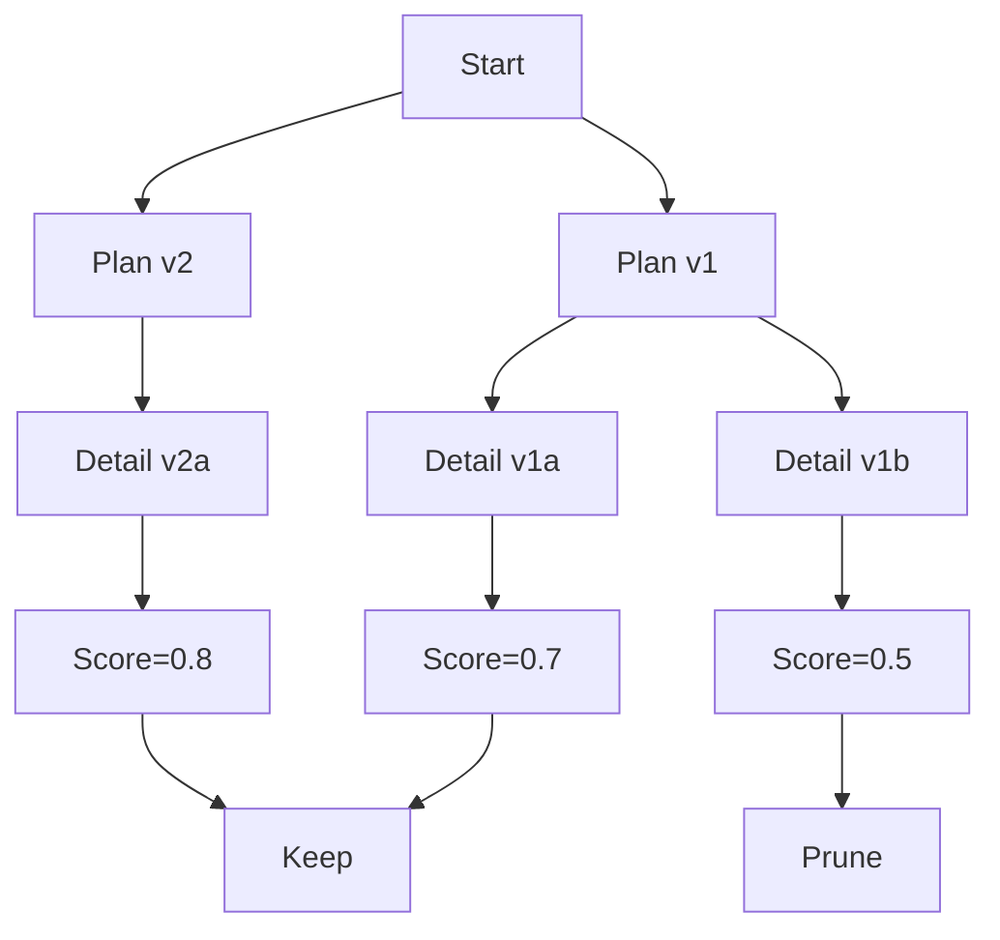

# Tree-of-Thoughts (ToT)

## 1. 핵심 개념 (Core Concept)

여러 후보 생각을 분기·탐색하여 전체 탐색 공간에서 더 나은 경로를 선택합니다. 빔서치/DFS/휴리스틱 평가를 결합해 품질을 높이되, 비용·지연이 증가하므로 제한된 예산 하에 동작하도록 설계합니다.

---

## 2. 상세 설명 (Detailed Explanation)

### 2.1 분기 생성·평가·프루닝 전략
- 분기 생성: 현재 상태에서 k개의 다음 단계 후보(생각)를 생성
- 평가: 휴리스틱(규칙/스코어 함수) 또는 외부 평가 모듈로 각 분기 점수화(세부 평가는 5-5 참조)
- 프루닝: 빔서치 상위 b개 유지, 불량 분기는 즉시 제거(Early Stopping)

### 2.2 비용·지연 vs 품질 트레이드오프
- 파라미터: 최대 깊이 d, 빔 폭 b, 총 노드 제한 N_max
- 최적화: 사전 휴리스틱으로 불필요 분기 억제, 중간 요약으로 토큰 절약

### 2.3 의사코드
```python
def tot_search(problem, beam=3, depth=4):
    frontier = [initial_state(problem)]
    for t in range(depth):
        candidates = []
        for state in frontier:
            branches = llm.propose_branches(state, k=beam)
            for br in branches:
                score = evaluate(br)  # 룰/외부 평가 모듈(세부는 5-5)
                candidates.append((br, score))
        frontier = topk(candidates, k=beam)
    return select_best(frontier)
```

---

## 3. 예시 (Example)

- 빔서치 기반 단계적 계획 생성(여행 일정/코딩 전략/실험 계획 등).



---

## 4. 예상 면접 질문 (Potential Interview Questions)

- ToT가 효과적인 문제 유형과 한계는?
- 빔 폭/깊이를 어떻게 정하는가? 실패 시 폴백 전략은?
- 평가자 바이어스는 어떻게 완화하는가?

---

## 5. 더 읽어보기 (Further Reading)

- docs/references/anthropic/building-effective-agents.md
- docs/references/openai/a-practical-guide-to-building-agents-3.pdf
- docs/references/google/Agents_Companion_v2.pdf

---

## 6. See also

- 그래프형 추론: 5-3 → [graph-of-thoughts-got](./graph-of-thoughts-got.md)
- 평가/운영: 5-5/5-6 → [prompt-evaluation-and-benchmarks](../5-5-프롬프트-엔지니어링-and-평가/prompt-evaluation-and-benchmarks.md), [evaluation-monitoring-ops](../5-6-agentops-운영-and-자동화/evaluation-monitoring-ops.md)
