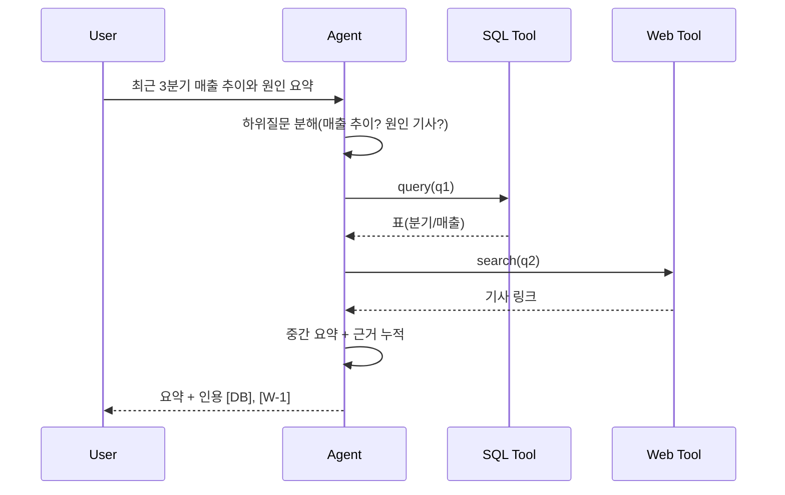

# 고급·Agentic RAG

## 1. 핵심 개념 (Core Concept)

질의 재작성·분해, 다중 스텝 검색, SQL/웹 등 툴을 결합해 고난도 질의의 정밀도를 높입니다. “ReAct + RAG + 메모리”를 결합한 에이전틱 루프로 증거를 누적·검증하며 답을 완성합니다.

---

## 2. 상세 설명 (Detailed Explanation)

### 2.1 쿼리 변환(재작성/분해)
- 재작성: 용어 표준화, 동의어 확장, 다국어 변환, HyDE(가설 문서 생성)
- 분해(Self-Ask): 복합 질의를 하위 질문으로 나눠 순차 검색/통합
- 요약: 중간 결과를 압축해 다음 검색의 키워드/엔티티로 사용

### 2.2 Multi-step Retrieval(증거 누적)
- 루프: 질의→검색→리랭크→컨텍스트→중간 답→다음 질의 갱신
- 누적: 필요 근거가 충족될 때까지 반복, 중복·모순은 제거/표시
- 중지 조건: 근거 수 임계값, 신뢰 스코어, 예산(토큰/시간/툴 호출)

### 2.3 툴 보강(SQL/웹/코드 실행)
- SQL/데이터 웨어하우스: 정량 근거 확보, 스키마는 툴 스키마로 제한(5-9 참조)
- 웹/문헌: 최신 정보 수집, 출처 신뢰도 태깅
- 코드/계산기: 수식/통계 검증, 단위 변환

### 2.4 Graph/Memory 강화(선택)
- GraphRAG: 문서→엔티티·관계 그래프 추출 후 그래프 워크 + 벡터 검색 결합
- 메모리: 세션/장기 메모리에서 관련 팩트 재주입(5-2 참조)

---

## 3. 예시 (Example)

### 3.1 시퀀스(재무 질의: SQL + 웹)


### 3.2 의사코드(간단)
```python
def agentic_rag(q, budget):
    memory, evidence = [], []
    while budget.ok():
        subq = rewrite_or_decompose(q, memory)
        cands = hybrid_search(subq)
        top = rerank(subq, cands, n=12)
        evidence = merge_evidence(evidence, top)
        if enough(evidence):
            break
        memory.append(summarize(top))
    return generate_answer(q, evidence, cite=True)
```

---

## 4. 예상 면접 질문 (Potential Interview Questions)

- 언제 Agentic RAG가 과한 복잡도인가?
- HyDE/다중 질의/분해가 도움이 되는 문제 유형은?
- 그래프/메모리 결합의 이점과 함정은?
- 중지 조건과 예산 제어를 어떻게 설계하는가?

---

## 5. 더 읽어보기 (Further Reading)

- docs/references/openai/a-practical-guide-to-building-agents-3.pdf
- docs/references/anthropic/effective-context-engineering-for-ai-agents.md
- docs/references/google/Agents_Companion_v2.pdf

---

## 6. 운영 팁 & See also

- 평가/회귀/지표 설계는 5-5 참조 → [prompt-evaluation-and-benchmarks](../5-5-프롬프트-엔지니어링-and-평가/prompt-evaluation-and-benchmarks.md)
- 메모리/압축/토큰 예산은 5-2 참조 → [memory-architecture](../5-2-메모리-and-컨텍스트-관리/memory-architecture.md), [context-compression-management](../5-2-메모리-and-컨텍스트-관리/context-compression-management.md)
- 툴 스키마/프로토콜은 5-9 참조 → [tool-schemas-jsonrpc-openapi](../5-9-보안-and-프로토콜/tool-schemas-jsonrpc-openapi.md)
