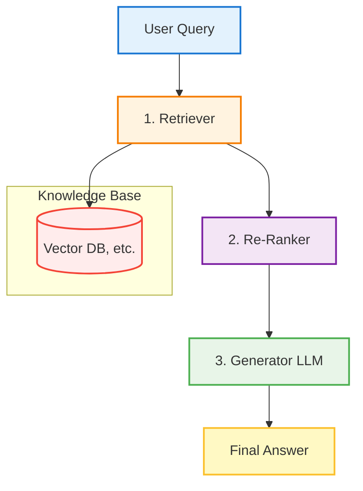

# 기본 RAG 파이프라인 (Retriever, Re-Ranker, Generator)

## 1. 핵심 개념 (Core Concept)

**RAG(검색 증강 생성, Retrieval-Augmented Generation)**는 LLM이 학습 데이터에 없는 최신 정보나 특정 도메인 지식에 접근할 수 있도록, 외부 데이터베이스에서 관련 정보를 검색(Retrieve)하여 이를 LLM의 컨텍스트에 보강(Augment)한 뒤, 최종 답변을 생성(Generate)하는 아키텍처임. 기본적인 RAG 파이프라인은 **Retriever**, **Re-Ranker**, **Generator**의 세 가지 핵심 구성 요소로 이루어지며, 이는 LLM의 환각(Hallucination)을 줄이고 답변의 신뢰성을 높이는 데 매우 효과적임.

---

## 2. 상세 설명 (Detailed Explanation)

기본적인 RAG 파이프라인은 사용자의 질문에 대해 정해진 순서대로 작동하는 선형적인(linear) 프로세스임.

### 2.1 1단계: Retriever (검색기)

Retriever는 사용자의 쿼리와 가장 관련성이 높은 정보를 대규모 지식 베이스(Knowledge Base)에서 신속하게 찾아내는 역할을 함.

*   **작동 방식**: 사용자의 쿼리를 임베딩 모델을 통해 벡터로 변환하고, 미리 벡터화되어 저장된 문서(Chunk)들과의 유사도(보통 코사인 유사도)를 계산하여 상위 K개의 문서를 후보로 반환함.
*   **주요 기술**: 벡터 데이터베이스(FAISS, Milvus 등)에서의 효율적인 유사도 검색(ANN, Approximate Nearest Neighbor) 알고리즘이 핵심임.
*   **과제**: 의미는 유사하지만 키워드가 다른 경우(Semantic Search)는 잘 찾아내지만, 키워드는 일치하지만 의미가 다른 경우(Keyword Search)에 취약할 수 있음. Google 문서에서 언급된 것처럼, 이를 보완하기 위해 키워드 검색과 벡터 검색을 결합하는 **하이브리드 검색(Hybrid Search)**이 효과적임.

### 2.2 2단계: Re-Ranker (재순위화기)

Re-Ranker는 Retriever가 찾아온 K개의 문서 후보들을 다시 한번 정밀하게 평가하여, 최종적으로 LLM에게 전달할 가장 정확하고 관련성 높은 문서를 선별하는 역할을 함. 이는 선택적인(optional) 단계이지만, RAG의 성능을 크게 향상시킬 수 있음.

*   **작동 방식**: 더 정교한 상호-인코더(Cross-Encoder) 모델을 사용하여, 쿼리와 각 문서 쌍의 관련도를 훨씬 더 정확하게 계산하고 순위를 재조정함.
*   **장점**: Retriever의 속도(Recall 중심)와 Re-Ranker의 정확도(Precision 중심)를 결합하여, 전체 시스템의 효율성과 품질을 모두 높일 수 있음.

### 2.3 3단계: Generator (생성기)

Generator는 최종적으로 선별된 문서(Context)와 사용자의 원본 쿼리를 함께 프롬프트로 구성하여 LLM에게 전달하고, 최종 답변을 생성하는 단계임.

*   **작동 방식**: LLM은 주어진 컨텍스트 정보를 바탕으로 사용자의 질문에 답변함. 이를 통해 LLM이 알지 못했던 정보에 대해 답변하거나, 환각을 줄이고 사실에 기반한 답변을 생성할 수 있음.
*   **프롬프트 엔지니어링**: "주어진 컨텍스트를 바탕으로 다음 질문에 답하세요." 와 같이 LLM이 컨텍스트를 충실히 따르도록 지시하는 것이 중요함.

---

## 3. 예시 (Example)

### 사용 사례: 사내 규정 안내 챗봇

*   **목표**: "새로운 직원이 '연차 휴가는 어떻게 사용하나요?'라고 질문함."

1.  **Retriever**: 사용자의 질문 "연차 휴가 사용법"을 벡터로 변환. 사내 규정 문서가 저장된 벡터 DB에서 '휴가 규정', '복리후생 가이드' 등 관련성이 높은 문서 10개를 검색함.
2.  **Re-Ranker**: 검색된 10개 문서 중, '연차 신청 절차', '잔여 연차 확인 방법' 등 질문과 직접적으로 관련된 상위 3개 문단을 선별함.
3.  **Generator**: 선별된 3개 문단 내용을 컨텍스트로 삼아, "연차 휴가는 인사 관리 시스템을 통해 최소 3일 전에 신청해야 하며, 잔여 연차는 시스템에서 확인할 수 있습니다. 자세한 내용은 첨부된 휴가 규정 문서를 참고하세요." 와 같은 최종 답변을 생성함.

---

## 4. 예상 면접 질문 (Potential Interview Questions)

*   **Q. RAG 파이프라인에서 Re-Ranker를 사용하는 이유는 무엇인가요?**
    *   **A.** Retriever는 속도를 위해 대량의 문서를 빠르게 가져오는 데 중점을 두기 때문에(Recall), 관련성이 다소 떨어지는 문서들이 포함될 수 있습니다. Re-Ranker는 더 정교하고 비용이 비싼 모델을 사용하여 이 후보군을 다시 한번 꼼꼼히 평가하고 순위를 매겨, 최종적으로 가장 관련성 높은 문서만 LLM에 전달하기 위해(Precision) 사용됩니다. 이를 통해 LLM이 불필요한 정보에 혼란스러워하는 것을 방지하고 답변의 질을 높일 수 있습니다.

*   **Q. RAG가 LLM의 환각(Hallucination) 문제를 어떻게 완화시켜주나요?**
    *   **A.** LLM이 자신의 내부 지식에만 의존하여 답변을 생성할 때 환각이 발생하기 쉽습니다. RAG는 신뢰할 수 있는 외부 지식 베이스에서 관련 정보를 검색하여, 이를 명확한 근거(Grounding)로 삼아 답변을 생성하도록 강제합니다. 프롬프트에 "주어진 컨텍T스트에만 기반하여 답변하라"고 지시함으로써, LLM이 사실과 다른 내용을 지어낼 가능성을 크게 줄여줍니다.

*   **Q. 기본 RAG 파이프라인의 한계는 무엇이라고 생각하며, 이를 어떻게 개선할 수 있을까요?**
    *   **A.** 기본 RAG는 단일 검색 후 생성하는 선형적인 구조라, 복잡하거나 모호한 질문에 대해서는 최적의 정보를 찾지 못할 수 있습니다. 이를 개선하기 위해, 사용자의 쿼리를 더 명확하게 재작성하거나(Query Rewriting), 여러 단계에 걸쳐 필요한 정보를 수집하고 종합하는 등, 검색 과정을 더 지능적으로 만드는 **Agentic RAG** 접근 방식을 도입할 수 있습니다.

---

## 5. 더 읽어보기 (Further Reading)

*   [What is RAG? by Pinecone](https://www.pinecone.io/learn/retrieval-augmented-generation/)
*   [Google Agent Document](/docs/assets/files/agentic-ai/google_agent.md)
*   [Anthropic Agent Document](/docs/assets/files/agentic-ai/anthropic_building_effective_ai_agents.md)