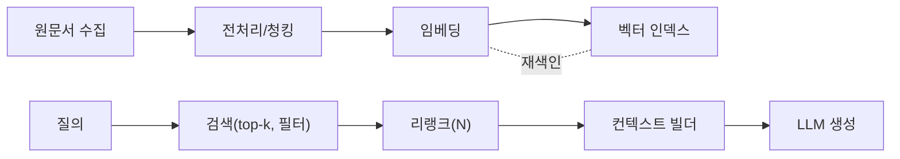

# 기본 RAG 파이프라인

## 1. 핵심 개념 (Core Concept)

문서 임베딩 기반 검색 → 재순위화(Re-rank) → 생성(Generate)을 연결해 “정답의 근거”를 찾아 답변에 주입하는 방식입니다. 핵심은 올바른 청킹·임베딩·검색 설정으로 관련 근거를 안정적으로 끌어오는 것입니다.

---

## 2. 상세 설명 (Detailed Explanation)

### 2.1 데이터 수집·전처리·청킹(Chunking)
- 전처리: 문서 포맷 정규화(HTML→Markdown/PDF→텍스트), 머리말/중복 제거, 페이지 메타데이터 보존
- 청킹: 200–400 토큰 권장, 15–20% 오버랩으로 문맥 단절 완화, 제목/헤더를 메타데이터로 포함
- 특수 케이스: 표/코드 블록은 별도 청킹, 문서/섹션 ID를 부여해 인용에 활용

### 2.2 임베딩·색인(Retriever)
- 임베딩: 일관된 모델/차원 사용, 정규화(코사인 용이) 권장, 주기적 재임베딩 계획 수립
- 인덱싱: HNSW/IVF(FAISS·Milvus 등) 또는 pgvector(ANN) 선택, 메타데이터 필터 지원 여부 확인
- 검색 설정: top-k, 유사도 임계값, 필터(언어·태그·버전)로 노이즈 억제

### 2.3 Re-ranker(선택)
- 1단계 후보 상위 N만 교차 인코더/LLM 리랭커로 재정렬하여 정밀도 향상
- 비용·지연 증가에 유의: N을 20–50 범위로 제한, 캐싱 적용

### 2.4 컨텍스트 빌더(Context Builder)
- 후보 정제: 중복·유사 청크 제거(MMR), 순서 정렬(제목→본문), 길이 예산에 맞춘 요약
- 인용: 출처/문서ID/섹션을 명시해 근거성 향상, 회귀 테스트에 유리

### 2.5 Generator(생성)
- 프롬프트: 역할/목표/제약/출력 스키마, “근거가 없으면 모른다고 답하라” 가드레일 포함
- 답변: 인용 블록(예: [DocA §3], [URL-2]) 삽입, 불확실성·한계 명시

---

## 3. 예시 (Example)

### 3.1 파이프라인 다이어그램


### 3.2 의사코드
```python
def rag_answer(query):
    cands = vector_search(query, k=50, filter={"lang":"ko"})
    top = rerank_cross_encoder(query, cands, top_n=12)
    context = build_context(top, budget=3000, cite=True)
    prompt = make_prompt(query, context, guardrails=True)
    return llm.generate(prompt)
```

---

## 4. 예상 면접 질문 (Potential Interview Questions)

- Re-Ranker 도입 판단 기준은?
- 청킹 크기·오버랩을 어떻게 정하는가?
- 유사도 임계값/필터/하이브리드를 어떻게 튜닝하는가?
- 근거 인용을 어떻게 강제·검증하는가?

---

## 5. 더 읽어보기 (Further Reading)

- docs/references/anthropic/effective-context-engineering-for-ai-agents.md
- docs/references/openai/a-practical-guide-to-building-agents-3.pdf
- docs/references/google/Agents_Companion_v2.pdf

---

## 6. 운영 팁 & See also

- 회귀 테스트/지표(Recall@k, Hit@k, NDCG)는 5-5 참조 → [prompt-evaluation-and-benchmarks](../5-5-프롬프트-엔지니어링-and-평가/prompt-evaluation-and-benchmarks.md)
- 메모리/압축 전략 결합은 5-2 참조 → [context-compression-management](../5-2-메모리-and-컨텍스트-관리/context-compression-management.md)
- 툴 스키마/프로토콜은 5-9 참조 → [tool-schemas-jsonrpc-openapi](../5-9-보안-and-프로토콜/tool-schemas-jsonrpc-openapi.md)
