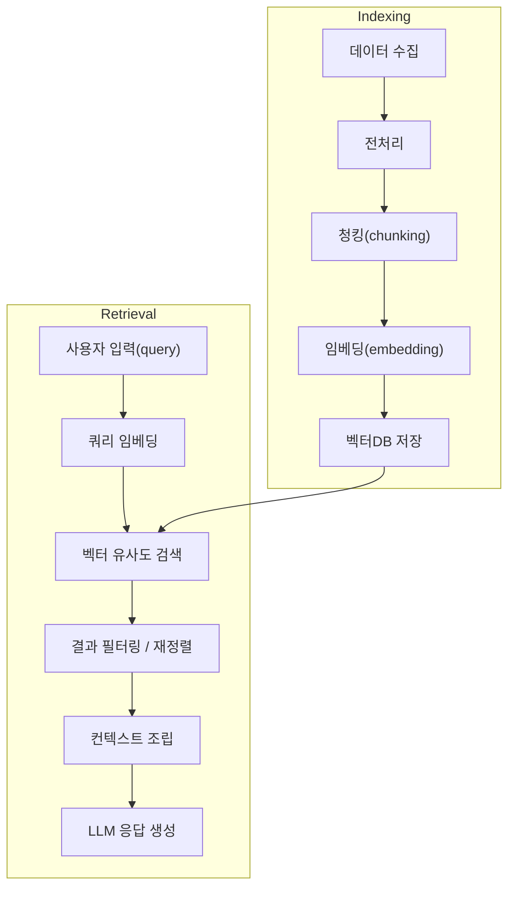

# 기본 RAG 파이프라인

## 1. 핵심 개념 (Core Concept)

기본 RAG(Retrieval-Augmented Generation) 파이프라인은 LLM이 외부 지식을 활용하여 답변을 생성하도록 만드는 가장 기본적인 구조입니다. **문서를 잘게 쪼개고(Chunking), 검색하기 좋게 색인한(Indexing) 뒤, 사용자의 질문과 가장 관련 높은 조각을 찾아(Retrieval), 이를 LLM의 컨텍스트에 넣어 답변을 생성(Generation)** 하게 하는 방식입니다. 이 파이프라인의 핵심은 **질문과 관련된 정확한 근거(context)를 안정적으로 찾아 LLM에게 제공**하는 것입니다.

- **핵심 비유(Analogy)**: 학생이 참고서로 오픈북 시험을 보는 것과 같습니다. 1) 참고서의 내용을 주제별로 잘게 쪼개 요약 노트를 만들고(Chunking), 2) 어느 페이지에 무슨 내용이 있는지 색인을 만듭니다(Indexing). 3) 시험 문제가 나오면, 색인을 보고 가장 관련 있는 페이지를 찾아(Retrieval) 책상 위에 펼쳐놓고, 4) 그 내용을 참고하여 답안지를 작성(Generation)합니다.

*Note: 아래 다이어그램을 위한 이미지를 `docs/images/basic-rag-pipeline-diagram.png` 에 추가해주세요.*

______________________________________________________________________

## 2. RAG 파이프라인 5단계

### 2.1 1단계: 데이터 수집 및 전처리 (Data Ingestion & Preprocessing/Parsing)

- **목적**: 다양한 포맷의 원본 문서들을 일관된 텍스트 형태로 변환합니다.
- **주요 작업**: HTML 태그 제거, PDF에서 텍스트 추출, 머리말/꼬리말/중복 내용 제거, 문서의 제목이나 출처 등 메타데이터 추출 및 보존.

### 2.2 2단계: 청킹 및 임베딩 (Chunking & Embedding)

- **목적**: 전처리된 긴 텍스트를 LLM이 처리하기 좋은 작은 단위(청크)로 나누고, 각 청크를 벡터(숫자 배열)로 변환하여 의미를 표현합니다.
- **청킹 (Chunking)**: 너무 크면 노이즈가 많고, 너무 작으면 의미가 손실됩니다. 보통 200~500 토큰 사이에서 시작하며, 문맥 단절을 막기 위해 청크 간 10~20%의 내용을 겹치게(Overlap) 설정합니다.
- **임베딩 (Embedding)**: 모든 청크는 동일한 임베딩 모델을 사용하여 고정된 차원의 벡터로 변환되어야 합니다. 이 벡터가 Vector DB에 저장되는 검색의 기본 단위가 됩니다.

### 2.3 3단계: 색인 및 검색 (Indexing & Retrieval)

- **목적**: 사용자의 질문과 의미적으로 가장 유사한 텍스트 조각(청크)들을 벡터 DB에서 신속하게 찾아냅니다.
- **색인 (Indexing)**: 생성된 벡터들을 검색에 용이하도록 Vector DB에 저장(색인)합니다. 이때 텍스트의 출처, 생성일 등의 메타데이터도 함께 저장합니다.
- **검색 (Retrieval)**: 사용자 질문 또한 동일한 임베딩 모델로 벡터로 변환한 뒤, Vector DB 내에서 코사인 유사도 등을 기준으로 가장 가까운 Top-K개의 청크 벡터를 가져옵니다.

### 2.4 4단계: 재정렬 및 컨텍스트 구성 (Re-ranking & Context Building)

- **목적**: 검색된 Top-K개의 청크들 중에서 최종 답변 생성에 사용할 가장 이상적인 순서와 조합을 만듭니다.
- **재정렬 (Re-ranking, 선택 사항)**: 검색된 K개의 후보(예: 50개)에 대해, 더 정교하지만 느린 Cross-Encoder 모델을 적용하여 질문과의 관련성을 다시 계산하고, 최종적으로 사용할 N개(예: 5개)를 추려냅니다. 이는 검색의 정밀도를 크게 향상시킵니다.
- **컨텍스트 구성**: 최종 선택된 청크들을 LLM의 컨텍스트 예산에 맞게 조합하고, 각 청크의 출처(인용 정보)를 명시하여 프롬프트에 포함시킵니다.

### 2.5 5단계: 생성 (Generation)

- **목적**: 구성된 컨텍스트와 원본 질문을 바탕으로 LLM이 최종 답변을 생성합니다.
- **주요 작업**: "제공된 컨텍스트만을 기반으로 답변하라. 정보가 없으면 모른다고 답하라" 와 같은 가드레일 프롬프트를 사용하여 환각을 억제합니다. 생성된 답변에는 각 내용의 근거가 된 출처를 인용(\[DocA §3\] 등)하도록 하여 신뢰성을 높입니다.

______________________________________________________________________

## 3. 예상 면접 질문 및 모범 답안

### Q1. Re-Ranker는 언제 도입해야 하며, 그 기준은 무엇인가요?

**A.** Re-Ranker는 초기 검색(Retriever)의 **재현율(Recall)은 높지만 정밀도(Precision)가 낮을 때** 도입을 고려해야 합니다. 즉, 검색 결과 상위 50개 안에 정답이 거의 항상 포함되지만, 정작 1~3위에는 관련성이 떨어지는 문서가 나타나는 경우입니다. Re-Ranker는 정밀도를 높여주지만, 지연 시간과 비용을 증가시키는 트레이드오프가 있어 신중하게 결정해야 합니다.

**\[추가 설명\]**

- **도입이 필요한 시나리오**: 내 RAG 시스템의 실패 사례를 분석해보니, 대부분의 실패가 'LLM이 헛소리를 해서'가 아니라, 'Retriever가 엉뚱한 문서를 가져와서' 발생하는 경우입니다. 이는 Retriever가 정답 문서를 찾긴 찾았지만, 순위를 뒤로 밀리게 하여 LLM이 보지 못했다는 의미입니다.
- **판단 기준**: 먼저 Retriever의 `top_k`를 50 정도로 늘려 재현율(Recall@50)을 측정합니다. 이 재현율이 충분히 높게 나온다면(예: 95% 이상), Retriever의 성능은 충분하며 이제 Re-Ranker를 도입하여 상위 50개 중 진짜 정답을 1~3위로 끌어올릴 차례입니다. 만약 Recall@50 자체가 낮다면, Re-Ranker가 아니라 임베딩 모델이나 청킹 전략부터 개선해야 합니다.

### Q2. 청킹(Chunking) 크기와 오버랩(Overlap)은 어떻게 정하는 것이 좋은가요?

**A.** 정답은 없으며, 데이터와 사용자의 질문 유형에 따라 달라지는 트레이드오프 관계입니다. **작은 청크**는 특정 사실을 찾는 데 유리하고, **큰 청크**는 넓은 문맥을 이해하는 데 유리합니다. 일반적으로 **256~512 토큰 크기에 10~20%의 오버랩**으로 시작하여, 실제 성능을 평가하며 최적값을 찾아나가는 것이 좋습니다.

**\[추가 설명\]**

- **청크 크기의 트레이드오프**:
  - **작은 청크 (예: 128 토큰)**: 장점은 특정 팩트(fact)를 정확히 찾아내고, LLM 컨텍스트에 노이즈를 적게 줍니다. 단점은 문장이나 단락이 중간에 잘려나가 전체적인 의미를 잃기 쉽습니다.
  - **큰 청크 (예: 1024 토큰)**: 장점은 문단의 완전한 의미와 문맥을 보존합니다. 단점은 질문과 관련 없는 불필요한 정보가 많이 포함되어 LLM을 혼란시킬 수 있습니다.
- **오버랩의 역할**: 청크와 청크 사이의 경계에서 문맥이 잘리는 것을 방지하는 완충 장치 역할을 합니다. 예를 들어, 한 문장이 청크의 맨 마지막에서 잘렸을 때, 오버랩이 있다면 다음 청크의 시작 부분에서 그 문장을 온전히 볼 수 있습니다.
- **최적화 전략**: 고정 크기 청킹으로 시작하되, 성능이 만족스럽지 않다면 문서의 구조(단락, 제목)를 이해하여 청킹하는 `Semantic Chunking` 같은 고급 기법을 고려해볼 수 있습니다.

### Q3. 검색 결과의 근거 인용(Citation)을 어떻게 강제하고 검증할 수 있나요?

**A.** **1) 컨텍스트 주입 시 출처 메타데이터를 명시적으로 포함**하고, **2) 프롬프트를 통해 인용을 강제**하며, **3) 최종 답변을 파싱하여 인용 여부와 정확성을 검증**하는 3단계로 구현할 수 있습니다.

**\[추가 설명\]**

1. **메타데이터 주입**: Vector DB에서 청크를 검색할 때, 텍스트 내용뿐만 아니라 `{"source": "doc_A.pdf", "page": 3}` 와 같은 메타데이터를 함께 가져옵니다. LLM에 전달하는 컨텍스트에 `[출처: doc_A.pdf, 3페이지] 하늘이 파란 이유는...` 와 같이 출처 정보를 명시적으로 텍스트에 포함시킵니다.
1. **프롬프트 강제**: 시스템 프롬프트에 `"당신은 반드시 제공된 컨텍스트에 기반하여 답변해야 하며, 모든 문장 끝에는 근거가 된 [출처]를 명시해야 합니다."` 와 같은 강력한 규칙을 부여합니다.
1. **후처리 검증**: 에이전트가 답변을 생성한 후, 후처리(post-processing) 단계에서 답변에 `[출처: ...]` 형식이 포함되어 있는지 정규표현식 등으로 확인합니다. 더 나아가, 답변의 내용이 실제 인용된 출처의 내용과 일치하는지 LLM 평가자를 통해 '사실 일관성 검증'을 수행하여 환각 인용(Hallucinated Citation)을 방지할 수 있습니다.

______________________________________________________________________

## 4. See also

- [고급·Agentic RAG](./advanced-agentic-rag.md)
- [임베딩 및 벡터 DB](./embeddings-and-vector-dbs.md)
- [컨텍스트 압축 및 관리](../5-2-%EB%A9%94%EB%AA%A8%EB%A6%AC-and-%EC%BB%A8%ED%85%8D%EC%8A%A4%ED%8A%B8-%EA%B4%80%EB%A6%AC/context-compression-management.md)
