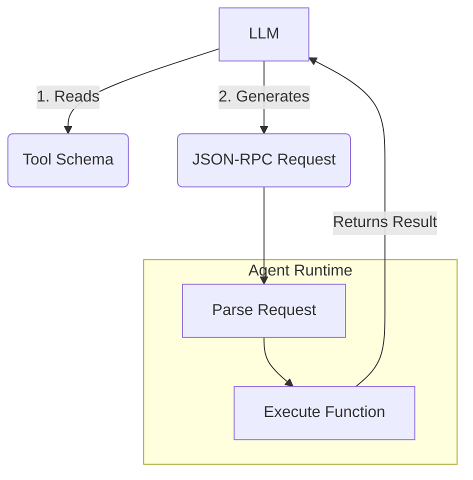

# JSON-RPC & 툴 스키마 (Tool Schemas)

## 1. 핵심 개념 (Core Concept)

**툴 스키마(Tool Schema)**는 AI 에이전트가 외부 툴(API, 함수 등)을 어떻게 사용할 수 있는지 명확하고 구조적으로 정의한 명세서임. LLM이 이 스키마를 이해하고, 그에 맞춰 **JSON-RPC**와 같은 형식으로 툴 호출을 생성함으로써, 에이전트는 비로소 안정적으로 외부 세계와 상호작용할 수 있게 됨. 즉, 툴 스키마는 인간 개발자를 위한 API 문서의 에이전트 버전이라고 할 수 있음.

---

## 2. 상세 설명 (Detailed Explanation)

### 2.1 툴 스키마: 에이전트를 위한 사용 설명서

에이전트가 툴을 사용하려면, 그 툴의 목적, 이름, 그리고 어떤 파라미터가 필요한지를 알아야 함. 툴 스키마는 이 정보를 기계가 읽을 수 있는 형식(주로 JSON Schema)으로 제공함.

*   **주요 구성 요소**:
    *   `name`: 툴의 이름 (예: `get_weather`)
    *   `description`: 툴의 기능을 설명하는 문장 (예: "특정 도시의 현재 날씨 정보를 가져옵니다.")
    *   `parameters`: 툴이 필요로 하는 인자들의 목록. 각 인자는 이름, 타입(string, integer 등), 설명, 필수 여부 등을 포함함.

Anthropic의 문서에서 강조하는 **에이전트-컴퓨터 인터페이스(ACI, Agent-Computer Interface)** 관점에서, 좋은 툴 스키마를 작성하는 것은 매우 중요함. 모델이 툴의 용도를 명확히 이해하고 실수 없이 사용하도록, 설명은 상세해야 하고 파라미터 이름은 직관적이어야 함.

### 2.2 JSON-RPC: 간단하고 표준화된 호출 방식

LLM이 사용할 툴과 파라미터를 결정하면, 이를 실행 가능한 형태로 만들어야 함. JSON-RPC(JSON Remote Procedure Call)는 이를 위한 간단하고 널리 쓰이는 프로토콜임.

*   **구조**:
    *   `jsonrpc`: 프로토콜 버전 (예: "2.0")
    *   `method`: 호출할 함수의 이름 (툴 이름)
    *   `params`: 함수에 전달할 인자들 (객체 또는 배열)
    *   `id`: 요청을 식별하기 위한 고유 ID

LLM은 툴 스키마를 보고 위와 같은 JSON 객체를 생성하며, 에이전트 시스템은 이 객체를 파싱하여 실제 함수를 실행하고 그 결과를 다시 LLM에게 돌려줌.



---

## 3. 예시 (Example)

### 사용 사례: 날씨 정보 조회 툴

1.  **툴 스키마 정의 (OpenAPI/JSON Schema 형식)**:
    ```json
    {
      "type": "function",
      "function": {
        "name": "get_current_weather",
        "description": "Get the current weather in a given location",
        "parameters": {
          "type": "object",
          "properties": {
            "location": {
              "type": "string",
              "description": "The city and state, e.g. San Francisco, CA"
            },
            "unit": {
              "type": "string",
              "enum": ["celsius", "fahrenheit"]
            }
          },
          "required": ["location"]
        }
      }
    }
    ```

2.  **사용자 요청**: "샌프란시스코 날씨 어때?"

3.  **LLM의 툴 호출 생성 (JSON-RPC 형식)**:
    ```json
    {
      "jsonrpc": "2.0",
      "id": 1,
      "method": "get_current_weather",
      "params": {
        "location": "San Francisco, CA",
        "unit": "celsius"
      }
    }
    ```

---

## 4. 예상 면접 질문 (Potential Interview Questions)

*   **Q. 에이전트에게 툴 스키마가 왜 중요한가요?**
    *   **A.** 툴 스키마는 에이전트의 LLM 두뇌에게 외부 툴의 사용법을 알려주는 명세서와 같습니다. 스키마가 없다면 LLM은 어떤 툴이 존재하고, 각 툴이 어떤 파라미터를 필요로 하는지 알 수 없어 안정적인 툴 사용이 불가능합니다. 즉, 툴 스키마는 에이전트와 외부 세계를 연결하는 신뢰성 있는 다리 역할을 합니다.

*   **Q. 좋은 툴 스키마를 설계하기 위한 원칙은 무엇인가요? (ACI 관점)**
    *   **A.** 첫째, 명확하고 상세한 설명(description)을 제공하여 모델이 툴의 기능과 적절한 사용 시점을 쉽게 파악하도록 해야 합니다. 둘째, 파라미터 이름을 직관적으로 짓고, 모델이 실수하기 어려운 단순한 데이터 타입을 사용해야 합니다. 예를 들어, Anthropic의 사례처럼 상대 경로 대신 절대 경로를 요구하여 모호함을 없애는 것이 좋은 설계입니다.

*   **Q. JSON-RPC 외에 에이전트가 툴을 호출하는 데 사용될 수 있는 다른 방식은 무엇이 있을까요?**
    *   **A.** RESTful API 호출 방식도 널리 사용됩니다. 이 경우 LLM은 HTTP 메소드(GET, POST 등), 엔드포인트 URL, 그리고 요청 본문(body)이나 쿼리 파라미터를 직접 생성해야 할 수 있습니다. GraphQL 쿼리를 생성하여 필요한 데이터만 정확히 요청하는 방식도 가능합니다. 어떤 방식이든, LLM이 해당 호출 구조를 안정적으로 생성할 수 있도록 명확한 명세와 예시를 제공하는 것이 중요합니다.

---

## 5. 더 읽어보기 (Further Reading)

*   [OpenAI Function Calling](https://platform.openai.com/docs/guides/function-calling)
*   [JSON-RPC 2.0 Specification](https://www.jsonrpc.org/specification)
*   [Anthropic Agent Document (Appendix 2: Prompt Engineering your Tools)](/docs/assets/files/agentic-ai/anthropic_building_effective_ai_agents.md)