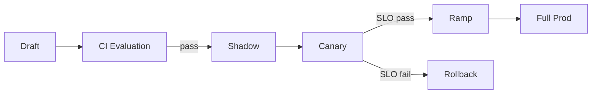

# 에이전트 라이프사이클 운영

## 1. 핵심 개념 (Core Concept)

개발→검증(CI Eval)→사전 배포(Shadow/Canary)→점진 배포(Ramp)→모니터링→롤백/개선의 라이프사이클을 정립하고, 리플레이·버전·캐시·로그 계약을 표준화해 안정적으로 운영합니다.

---

## 2. 상세 설명 (Detailed Explanation)

### 2.1 라이프사이클 단계와 게이팅
- Draft: 로컬/개발 환경, 실험 로그만 수집
- CI Evaluation: 고정 셋 회귀 테스트, 지표/비용/지연/스키마 패스 기준 충족 시 통과
- Shadow(Dark Launch): 실제 트래픽을 미러링, 사용자 응답에는 미반영, 로그·비용만 수집
- Canary: 일부 사용자/트래픽(예: 1–5%)에 신규 버전 활성화, SLO 위반 시 자동 롤백
- Ramp: 점진 확대(10→25→50→100%), 모니터링 강화, 비용·지연 버짓 확인



### 2.2 버전·설정 관리(재현성)
- 버전: 모델(`model_v`), 프롬프트(`prompt_v`), 툴 스키마(`tool_v`), 데이터/리트리버(`index_v`)
- 설정: temperature/top_p, top_k, 임계값, 타임아웃, 리트라이 정책, 비용/시간 한도
- 해시: 입력 컨텍스트 해시 + 버전 세트를 키로 사용하면 캐시·리플레이 일관성↑

### 2.3 로그/트레이싱/PII 보호
- 구조화 로그: `trace_id`, `span_id`, `user_id(scope)`, `attempt`, `tool_calls[]`, `cost`, `latency`
- 트레이싱: OpenTelemetry(텔레메트리 데이터의 생성·수집을 위한 오픈소스 표준), LangSmith(LangChain 기반 에이전트의 디버깅·추적에 특화된 플랫폼) 등으로 단계별 스팬 기록(프롬프트, 툴, 리랭커)
- PII: 민감정보 마스킹·접근제어(프로젝트/역할), 샘플링 비율 분리(운영/개발)

### 2.4 캐시 전략
- 응답 캐시: 키=프롬프트 템플릿 해시+컨텍스트 해시+버전 세트, TTL/무효화 정책(버전 교체 시)
- 툴 결과 캐시: 검색/웹/DB 읽기 결과 캐시, 만료는 문서 버전/ETag 기준
- LLM 호출 캐시 주의: 개인정보/세션 의존 컨텍스트는 분리

### 2.5 리플레이/실패 재현
- 궤적 저장: Thought/Action/Observation/Result와 도구 I/O를 모두 보존
- 리플레이 러너: 동일 버전·설정·시드로 반복 실행, 차이(Δ) 리포트 자동 생성
- 골든 트레이스: 대표 작업군의 성공 궤적을 버전별로 보관, 이상 탐지 기준으로 사용

### 2.6 롤아웃/롤백 정책
- 게이팅 임계값 예: EM≥65, Judge≥3.5/5, p95≤5s, 비용/요청≤$0.02, 스키마 위반율≤1%
- 롤백 트리거: 임계값 초과, 에러 버짓 소진, 장애 알림 연속 N회
- 폴백: 이전 버전 활성화, 일부 툴 비활성화(서킷 브레이커), 저비용 모델로 일시 대체

### 2.7 인시던트 대응·런북
- 탐지: 알림(슬랙/온콜) → 즉시 폴백 or 트래픽 축소
- 진단: 최근 배포/변경 목록, 영향 범위, 루트 원인(모델/프롬프트/툴/인프라)
- 교정: 핫픽스/재배포, 테스트 보강, 회귀 셋 업데이트

---

## 3. 예시 (Example)

### 3.1 구성 스냅샷(YAML)
```yaml
version:
  model_v: gpt-4.1-mini
  prompt_v: p_2025-10-29_01
  tool_v: t_1.4.2
  index_v: ix_2025-10-15
limits:
  max_cost_per_req: 0.02
  max_latency_ms_p95: 5000
retry:
  backoff: exponential
  max_attempts: 2
```

### 3.2 리플레이 의사코드
```python
def replay(trace_id, versions):
    traj = load_trajectory(trace_id)
    set_versions(versions)
    out = run_steps(traj.inputs, traj.steps)
    return diff(traj.outputs, out)
```

---

## 4. 예상 면접 질문 (Potential Interview Questions)

- 재현성 보장을 위한 핵심 메타데이터는?
- 어떤 기준으로 Shadow/Canary/Ramp를 통과시킬 것인가?
- 캐시 무효화와 버전 교체를 어떻게 안전하게 처리할 것인가?
- 폴백/서킷 브레이커는 어디에 삽입하는가?

---

## 5. 더 읽어보기 (Further Reading)

- docs/references/anthropic/building-effective-agents.md
- docs/references/openai/a-practical-guide-to-building-agents-3.pdf
- docs/references/google/Agents_Companion_v2.pdf

---

## 6. See also

- 평가/게이팅: 5-5 → [prompt-evaluation-and-benchmarks](../5-5-프롬프트-엔지니어링-and-평가/prompt-evaluation-and-benchmarks.md)
- 텔레메트리/자동화: 5-8 → [ci-cd-and-automation](../5-8-데이터-and-인프라/ci-cd-and-automation.md)
- 프로토콜/툴 스키마: 5-9 → [tool-schemas-jsonrpc-openapi](../5-9-보안-and-프로토콜/tool-schemas-jsonrpc-openapi.md)
