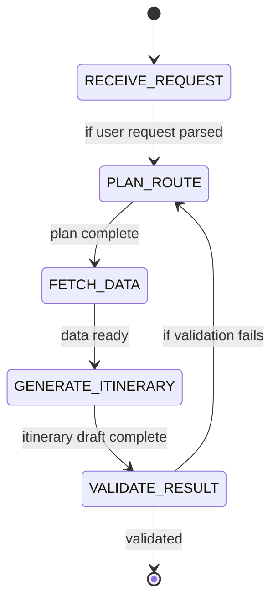
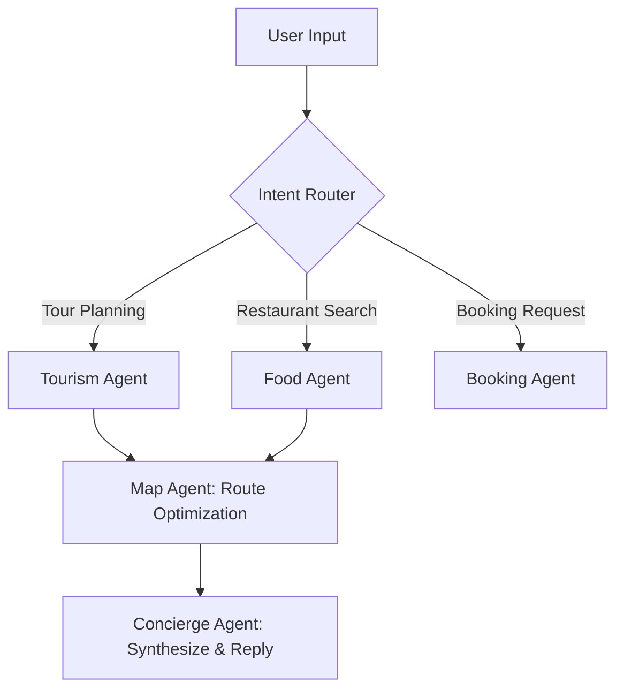

# 오케스트레이션 & 워크플로우 관리

## 1. 핵심 개념 (Core Concept)

오케스트레이션은 여러 에이전트와 도구가 포함된 복잡한 작업을 안정적으로 수행하기 위한 **중앙 관제 시스템**입니다. 이는 마치 오케스트라의 지휘자처럼, 각 연주자(에이전트/도구)에게 언제 무엇을 연주할지 지시하고, 전체 흐름을 조율하며, 문제가 발생했을 때 대처하는 역할을 합니다. 워크플로우를 상태 머신(State Machine)이나 방향성 비순환 그래프(DAG)로 명확히 정의하고, 그 위에 재시도, 서킷 브레이커 등 신뢰성 패턴을 적용하는 것이 핵심입니다.

*Note: 아래 다이어그램을 위한 이미지를 `docs/images/agent-orchestration-diagram.png` 에 추가해주세요.*

______________________________________________________________________

## 2. 왜 오케스트레이션이 필요한가?

단순한 ReAct 루프는 하나의 LLM과 몇 개의 도구로 구성된 간단한 작업에는 효과적입니다. 하지만 아래와 같은 복잡한 시나리오에서는 금방 한계에 부딪힙니다.

- **멀티-스텝 작업**: 여러 단계를 거쳐야 하는 작업 (예: 리서치 → 초안 작성 → 리뷰 → 수정)
- **멀티-에이전트 협업**: 여러 전문 에이전트가 협력해야 하는 작업 (예: 개발자 에이전트, 테스터 에이전트)
- **동적 분기**: 이전 단계의 결과에 따라 다음 행동이 달라져야 하는 경우
- **높은 신뢰성 요구**: 외부 API 호출 실패, LLM의 형식 오류 등 다양한 실패에 대응해야 하는 프로덕션 환경

오케스트레이션 프레임워크(LangGraph, CrewAI 등)는 이러한 복잡성을 관리하기 위한 구조와 패턴을 제공합니다.

______________________________________________________________________

## 3. 주요 설계 패턴

### 3.1 워크플로우 정의: 상태 머신 & DAG

#### 3.1.1 **상태 머신 (State Machine)**

시스템이 가질 수 있는 여러 상태(State)와 상태 간의 전이(Transition)를 명확히 정의합니다. (예: `PLANNING` 상태에서 `RETRIEVING` 상태로 전이)

- State Machine은 “현재 상태(Current State)”와 “전이 조건(Transition)”으로 시스템을 제어하는 고전적인 구조
- 각 상태는 특정 목적을 수행하며, 조건이 충족되면 다음 상태로 **전이(Transition)**

> 즉, “지금은 어떤 일을 하고 있고, 이 일이 끝나면 어디로 이동할지”를 명시적으로 표현.

**🧩** 예시: 여행 일정 추천 에이전트

1. **RECEIVE_REQUEST**: 사용자의 입력을 받아 목적지/기간/취향 등 파악
1. **PLAN_ROUTE**: 여행 경로를 계획 (LLM Reasoning 또는 Rule Engine)
1. **FETCH_DATA**: 외부 도구(API, DB) 호출 (예: Google Maps, TourAPI)
1. **GENERATE_ITINERARY**: LLM으로 최종 일정 생성
1. **VALIDATE_RESULT**: 품질 평가 및 피드백
1. 실패 시 다시 계획 단계로 전이(loop)

#### 3.1.2 **DAG (Directed Acyclic Graph)**

각 작업을 노드(Node)로, 작업 간의 의존성을 엣지(Edge)로 표현합니다. 병렬 실행이 가능한 작업을 명확히 보여주는 장점이 있습니다.

- State Machine이 “선형(Sequential)”이라면, Graph 구조는 “비선형(Non-linear)” — 즉, **병렬적이고 동적인 작업 처리에 최적화**
- 그 중에서도 DAG는 방향이 있는 (Directed) 비순환 그래프 입니다.
  - 순환(Loop) 불가: 항상 시작 → 끝 방향으로 흐름 존재, 의존성 기반 실행 순서가 명확히 정의됨

> 각 “노드(Node)”는 에이전트의 작업 단위(step),
> 각 “엣지(Edge)”는 데이터나 제어 흐름을 나타냄.

**💡 예시: LangGraph 또는 CrewAI 스타일**

- **Intent Router**: 사용자의 의도를 분류 (예: 여행/음식/예약)
- **전문 에이전트들**: 각 노드는 LLM + Tool 조합
- **Concierge Agent**: 모든 결과를 병합, 후처리, 응답 생성
- **병렬 수행 가능**: 음식/예약/경로가 동시에 실행되어 효율적

#### 3.1.3 **State Machine vs Graph Orchestration**

| **구분**                  | **State Machine (상태기계)**                                                                                                                                     | **Graph Orchestration (그래프 기반 오케스트레이션)**                                                                                                                                                            |
| ------------------------- | ---------------------------------------------------------------------------------------------------------------------------------------------------------------- | --------------------------------------------------------------------------------------------------------------------------------------------------------------------------------------------------------------- |
| **핵심 개념**             | 상태(State)와 전이(Transition)로 구성된 순차적 제어 구조                                                                                                         | 노드(Node)와 엣지(Edge)로 구성된 비선형적 데이터·제어 흐름                                                                                                                                                      |
| **흐름 구조**             | 선형(Sequential)                                                                                                                                                 | 비선형(Non-linear), DAG(Directed Acyclic Graph) 기반                                                                                                                                                            |
| **제어 방식**             | 명시적 전이 기반 (조건 만족 시 다음 상태로 이동)                                                                                                                 | 데이터 흐름 기반 (노드 간 병렬·분기·재귀 가능)                                                                                                                                                                  |
| **적합한 작업 유형**      | 절차적·순차적 프로세스 (예: 결제, 인증, 승인 등)                                                                                                                 | 병렬·탐색·협업 중심 프로세스 (예: 여행 추천, 연구, 분석 등)                                                                                                                                                     |
| **장점**                  | - 상태 전이가 명확해 **디버깅·테스트 용이** - **예측 가능한 흐름**으로 안정적 - **오류 처리 및 복구 절차 명시 가능** - 각 단계의 **로깅·모니터링 용이** | - **비선형적 흐름 제어 가능** (병렬, 피드백 루프 등) - **여러 에이전트 간 협업 및 데이터 공유**에 최적화 - **동적 재계획 및 흐름 수정 가능** (적응성 높음) - 복잡한 워크플로우를 **DAG로 시각화 가능** |
| **단점**                  | - 상태가 많아질수록 **복잡도 급증** - 병렬 분기 처리에 비효율적 - 새로운 흐름 추가 시 **확장성 낮음** - 예기치 못한 상황 대응력 부족                    | - **디버깅·추적 어려움** (경로 다양) - **결과 재현성 낮음** (동적 흐름) - 무한 루프·순환 참조 위험 존재 - 테스트 및 검증 자동화 어려움                                                                 |
| **유연성**                | 낮음 (사전 정의된 경로만 허용)                                                                                                                                   | 높음 (동적 분기·병렬 실행·피드백 가능)                                                                                                                                                                          |
| **확장성**                | 제한적 (상태 수 증가 시 관리 복잡)                                                                                                                               | 매우 높음 (노드 추가 및 재구성 용이)                                                                                                                                                                            |
| **디버깅 난이도**         | 쉬움 (상태 전이 명확)                                                                                                                                            | 어려움 (다양한 경로 및 동적 실행)                                                                                                                                                                               |
| **재현성(Repeatability)** | 높음 — 항상 동일한 흐름                                                                                                                                          | 낮음 — 상황·입력에 따라 경로 변화                                                                                                                                                                               |
| **학습 곡선**             | 비교적 단순 (전이 로직만 이해하면 됨)                                                                                                                            | 상대적으로 복잡 (그래프/DAG 개념 필요)                                                                                                                                                                          |
| **대표 구현체**           | LangChain SequentialChain, FSM, Workflow Engine                                                                                                                  | LangGraph, CrewAI, Google Vertex AI Agent Engine                                                                                                                                                                |
| **에이전트 사용 형태**    | 단일 에이전트의 내부 제어 (Perceive–Plan–Act 루프)                                                                                                               | 다중 에이전트 간 협력 및 병렬 오케스트레이션                                                                                                                                                                    |
| **비유적 설명**           | “정해진 절차를 따르는 로봇”                                                                                                                                      | “필요에 따라 팀을 구성하고 협력하는 조직”                                                                                                                                                                       |

#### 3.1.4 **Workflow Agents**: 워크플로우 에이전트 (Google-ADK)

- ADK는 “워크플로우 에이전트(workflow agents)”라는 개념을 제공하며, 이를 통해 **순차(Sequential)**, **병렬(Parallel)**, **반복(Loop)** 구조 등을 정의합니다.
- 또한, LLM 기반의 에이전트(LlmAgent)가 **동적으로 하위 에이전트(sub-agents)** 를 선택하거나 호출할 수 있는 라우팅(routing) 역할을 수행함. 즉, 코드상으로는 고정된 흐름과 동시에 런타임에 유연하게 결정되는 흐름이 혼합되어 있습니다.
- Flexible Orchestration : Define workflows using workflow agents (Sequential, Parallel, Loop) for predictable pipelines, or leverage LLM-driven dynamic routing (LlmAgent transfer) for adaptive behavior. [Google Blog](https://developers.googleblog.com/en/agent-development-kit-easy-to-build-multi-agent-applications/?utm_source=chatgpt.com)
- ADK는 **DAG처럼 완전 비순환 구조만을 고집하지 않고**, 순차·병렬·반복 구조를 포함한 워크플로우가 가능하며, 하위 에이전트를 동적으로 호출하는 라우팅 구조까지 포함하는 **혼합형(정적+동적)** 오케스트레이션 패턴을 채택합니다
- 상태(state) 관리, 메모리(context & memory manager), 라우터(router) 등을 포함하는 런타임 커널 구조를 채택하여 사용합니다.

#### 3.1.5 **주요 프레임워크들의 오케스트레이션 방식**

| **프레임워크**              | **오케스트레이션 방식 및 특징**                                                                                                | **장점**                                                                 | **주요 제약 및 특징**                                                                                                        |
| --------------------------- | ------------------------------------------------------------------------------------------------------------------------------ | ------------------------------------------------------------------------ | ---------------------------------------------------------------------------------------------------------------------------- |
| LangChain                   | 주로 “체인(Chain) + 에이전트(Agent)” 형태의 순차적 워크플로우 지원. 생성된 Agent가 도구(tool)를 호출하고 간단한 흐름을 구성함. | 빠른 프로토타이핑 가능, 사용성 높음, 다양한 통합 지원                    | 복잡한 다중 에이전트 흐름이나 비선형 워크플로우에는 설계가 제한될 수 있음                                                    |
| LangGraph                   | 그래프 기반(Graph) 워크플로우 중심. 노드/엣지로 흐름 설계 가능하며 순차 + 분기 + 루프 등 복잡한 제어 흐름 지원됨.              | 매우 유연하고 복잡한 워크플로우 설계에 강함, 상태관리·스트리밍 지원됨    | 러닝커브가 상대적으로 높음, 설계 복잡도가 올라감                                                                             |
| CrewAI                      | 다중 에이전트(Multi-Agent) 팀 개념 기반. 역할(role) 기반 에이전트를 구성하고 이들이 상호작용하며 일을 수행하는 흐름 설계됨.    | 역할 분담·병렬 협업 구조에 적합, 복잡한 작업을 여러 에이전트로 분해 가능 | 워크플로우 제어가 완전한 그래프 형태보다는 “에이전트 팀 + 작업 할당” 형태에 치중됨. 설계시 역할 정의·조율 오버헤드 있음.     |
| AutoGen                     | 콘버세이션(대화) 중심의 멀티-에이전트 프레임워크. 에이전트들이 자연어로 상호작용하며 역할을 바꾸거나 서로 협력함.              | 대화 중심, 빠른 프로토타이핑 가능, 여러 에이전트 간 상호작용에 적합      | 워크플로우 제어 및 명시적 그래프 설계가 다른 방식보다 덜 직관적일 수 있음. 복잡한 조건 분기·상태관리에서 설계 난이도가 있음. |
| Agent Development Kit (ADK) | 하이브리드 방식: 워크플로우 에이전트(순차, 병렬, 루프) 지원 + 동적 라우팅 가능한 LLM-기반 에이전트 구조 포함됨.                | 엔터프라이즈급 설계 가능, 구조화된 에이전트/워크플로우 패턴 지원         | 자유로운 그래프 설계보다는 워크플로우 패턴 위주일 수 있고, 커스텀 구조 설계 시 복잡도 증가할 수 있음                         |

### 3.2 라우팅 (Routing)

- **인텐트 라우터**: 사용자의 초기 입력을 분석하여, 가장 적합한 워크플로우나 에이전트에게 작업을 전달하는 '교통 경찰' 역할을 합니다.
- **툴 라우터**: 워크플로우의 특정 단계에서, 현재 상태에 가장 적합한 도구를 선택합니다. (예: '요약' 단계에서는 `summarizer_tool`, '검색' 단계에서는 `search_tool` 선택)

### 3.3 신뢰성 패턴 (Reliability Patterns)

- **재시도 (Retry)**
  - **문제**: 일시적인 네트워크 오류로 도구 호출이 실패할 수 있습니다.
  - **해결**: 지수 백오프(Exponential Backoff) 전략을 사용하여, 실패 시 잠시 기다렸다가 몇 차례 더 시도합니다.
- **멱등성 (Idempotency)**
  - **문제**: 재시도 과정에서 동일한 외부 API가 여러 번 호출되어, 결제가 두 번 되거나 티켓이 두 개 생성될 수 있습니다.
  - **해결**: 모든 '쓰기' 작업 요청에 고유한 `idempotency_key`를 포함시킵니다. 서버는 이 키를 기록해두고, 동일한 키로 요청이 다시 오면 실제 작업을 재수행하지 않고 첫 번째 성공 응답을 그대로 반환합니다.
- **서킷 브레이커 (Circuit Breaker)**
  - **문제**: 특정 도구 API가 다운되었는데, 시스템이 계속해서 해당 API를 호출하며 자원을 낭비하고 전체 시스템의 지연을 유발합니다.
  - **해결**: 특정 도구에서 에러율이 급증하면, '차단기'가 내려가 해당 도구로의 모든 호출을 일시적으로 막고 즉시 실패 처리합니다. 이는 장애가 다른 시스템으로 전파되는 것을 막아줍니다.
- **사가 패턴 (Saga Pattern)**
  - **문제**: 여러 단계의 외부 상태 변경 작업 중(예: 1.항공권 예약 → 2.호텔 예약 → 3.렌터카 예약), 중간 단계에서 실패하면 시스템의 상태가 일관되지 않게 됩니다. (항공/호텔은 예약됐지만, 렌터카는 예약 안 됨)
  - **해결**: 각 단계에 대한 '보상 트랜잭션(Compensating Transaction)'을 미리 정의합니다. (예: `book_flight`에 대한 `cancel_flight`). 중간에 실패하면, 이미 성공한 이전 단계들의 보상 트랜잭션을 역순으로 실행하여 전체 작업을 원자적인 것처럼 되돌립니다.

______________________________________________________________________

## 4. 예상 면접 질문 및 모범 답안

### Q1. 코디네이터/워커 패턴의 장단점은 무엇인가요?

**A.** **장점**은 중앙의 코디네이터가 전체 작업 흐름을 관리하여 역할 분담이 명확하고 디버깅이 용이하다는 것입니다. **단점**은 모든 통신이 코디네이터를 거치므로 병목 현상이 발생할 수 있고, 코디네이터가 실패하면 전체 작업이 중단되는 단일 실패점(Single Point of Failure)이 된다는 것입니다.

**\[추가 설명\]**
이 패턴은 작업 단계가 명확하고 순차적인 '조립 라인' 같은 프로세스에 매우 효과적입니다. 하지만, 여러 워커가 서로 유기적으로 소통하며 창의적인 결과를 만들어야 하는 작업에는 적합하지 않을 수 있습니다. 더 자세한 내용은 `agent-interaction-and-protocols.md` 문서를 참고하세요.

### Q2. 라우팅은 어느 단계에서 수행되며, 실패 시 어떻게 경로를 변경하나요?

**A.** 라우팅은 크게 **초기 인텐트 라우팅**과 **워크플로우 내 툴 라우팅** 두 단계에서 수행됩니다. 경로 변경은 **정적 폴백(미리 정의된 대체 경로)** 과 **동적 폴백(LLM이 실시간으로 새 경로 제안)** 방식으로 처리할 수 있습니다.

**\[추가 설명\]**

- **라우팅 단계**:
  1. **인텐트 라우팅**: 사용자의 첫 요청이 들어왔을 때, 이 요청의 의도를 파악하여 가장 적합한 워크플로우(예: '단순 질의응답', '예약 처리')로 보내는 '첫 관문' 역할을 합니다.
  1. **툴 라우팅**: 워크플로우가 진행되는 각 단계에서, 현재 상태에 가장 적합한 다음 도구나 에이전트를 선택하는 '교차로' 역할을 합니다.
- **경로 변경 전략**:
  - **정적 폴백**: `try { 구글_검색() } catch { 빙_검색() }` 처럼, 코드에 대체 경로를 명시적으로 하드코딩하는 방식입니다. 예측 가능하고 안정적입니다.
  - **동적 폴백**: 도구 호출이 실패하면, 그 에러 메시지를 LLM에게 전달하며 `"이 도구가 이 에러와 함께 실패했다. 이 문제를 우회하여 원래 목표를 달성할 새로운 계획을 세워라."` 라고 요청하는 방식입니다. 더 유연하고 회복탄력성이 높습니다.

### Q3. 멱등성 키(Idempotency Key)와 사가(Saga) 패턴은 어떤 종류의 작업에 적용해야 하나요?

**A.** **멱등성 키**는 재시도 시에도 **단 한 번만 실행되어야 하는 개별 행동**에 적용합니다. (예: 결제, 사용자 생성). **사가 패턴**은 여러 개의 개별 행동이 모여 하나의 논리적 단위를 이루는 **장기 실행 트랜잭션**에 적용하여, 중간에 실패했을 때 이전 단계들을 되돌리기(보상) 위해 사용합니다. (예: 여행 패키지 예약)

**\[추가 설명\]**

- **멱등성 키 적용 대상**: 외부 시스템의 상태를 변경하는 모든 '쓰기' 작업이 대상입니다. `create_booking`, `charge_credit_card`, `send_invoice` 등이 대표적입니다. `get_weather` 처럼 상태를 변경하지 않는 '읽기' 작업에는 필요 없습니다.
- **사가 패턴 적용 대상**: 여러 개의 독립적인 트랜잭션으로 구성된 비즈니스 프로세스에 적용됩니다. 예를 들어, '항공권 예약', '호텔 예약', '렌터카 예약'은 각각 독립된 시스템에 대한 트랜잭션이지만, 비즈니스적으로는 '여행 예약'이라는 하나의 논리적 단위입니다. 이 중 하나라도 실패하면, 이미 성공한 다른 예약들을 취소(보상)하여 데이터 정합성을 맞춰야 합니다.

______________________________________________________________________

## 5. See also

- [에이전트 상호작용 및 프로토콜](../5-1-%EC%8B%9C%EC%8A%A4%ED%85%9C-%EC%84%A4%EA%B3%84/agent-interaction-and-protocols.md)
- [평가 및 모니터링 (운영)](./evaluation-monitoring-ops.md)
