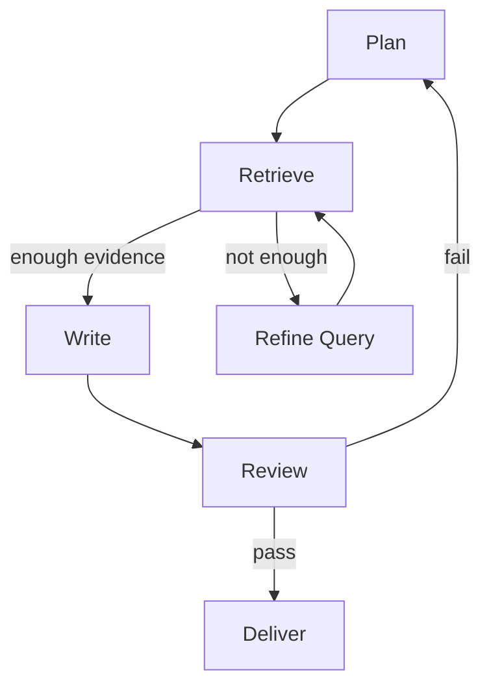
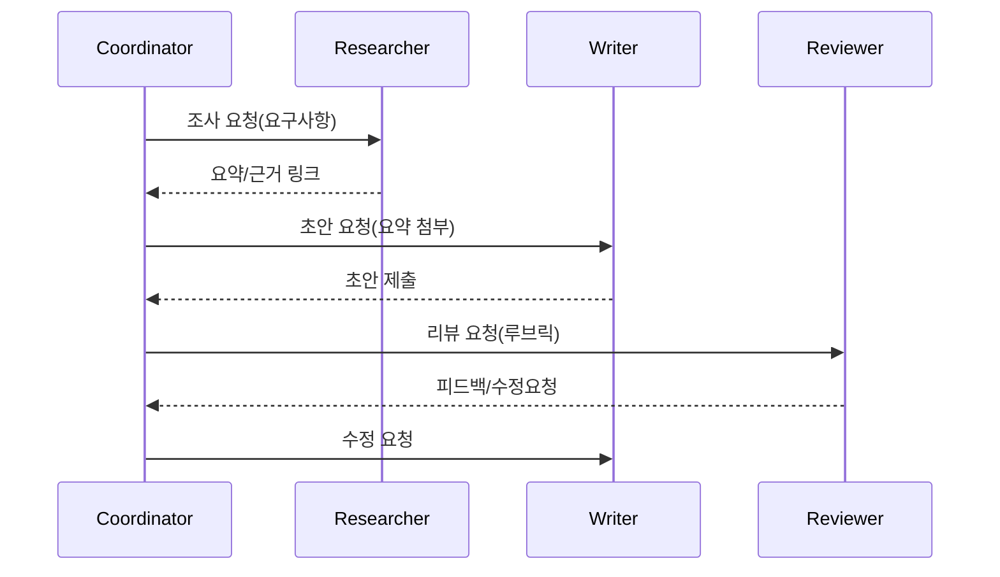

# 오케스트레이션 & 워크플로우 관리

## 1. 핵심 개념 (Core Concept)

멀티-에이전트/멀티-스텝 작업을 상태 머신·DAG로 정의하고, 라우터/재시도/서킷 브레이커/아이템포턴시 등 운영 패턴을 표준화하면 견고성과 가시성이 크게 향상됩니다. LangGraph/CrewAI 등 프레임워크는 구현을 가속하지만, “계약(툴/프롬프트/평가 스키마) 우선” 원칙이 중요합니다.

---

## 2. 상세 설명 (Detailed Explanation)

### 2.1 상태 머신·DAG 설계
- 노드: 단계(Planning/Searching/Writing/Review 등), 타입(LLM/Tool/Rule)
- 엣지: 전이 조건(성공/실패/분기), 타임아웃, 재시도
- 산출물: 각 노드 출력 스키마 고정(JSON), 실패 시 보상(Compensation) 또는 폴백 경로



### 2.2 라우팅(인텐트/툴/데이터)
- IntentRouter: 사용자 의도→워크플로우/에이전트 선택
- ToolRouter: 단계별 필요한 툴 선택(스키마/권한/비용/쿼터 고려)
- DataRouter: 데이터 소스/인덱스/네임스페이스 선택(언어/버전/보안)

### 2.3 신뢰성 패턴
- 재시도: 지수 백오프, 지능형 재질의(Re-asking), 최대 시도 제한
- 아이템포턴시: `idempotency_key`로 중복 실행 방지(특히 외부 API/결제/티켓 발행)
- 서킷 브레이커: 장애/오류율 급증 시 툴/경로 차단, 폴백 모델/경로 선택
- 시간 제한: 스텝/전체 타임아웃, 비용/시간 예산 공유

### 2.4 트랜잭션/사가(Compensation)
- 다중 툴 호출로 상태 변경 시, 실패에 대비한 보상 작업 정의(생성→취소, 생성→수정 등)
- 예: 티켓 생성 실패 시 부분 생성된 서브태스크 정리, DB 롤백 또는 보정 이벤트 발행

### 2.5 프레임워크 적용 포인트
- LangGraph: 상태 머신·분기/병합 제어, 콜백·트레이싱 연계가 용이
- CrewAI: 역할 기반 멀티-에이전트, 코디네이터/워커 템플릿 제공
- 가이드: 프레임워크 의존 코드를 최소화, 툴/프롬프트/평가 스키마는 외부 정의

---

## 3. 예시 (Example)

### 3.1 코디네이터-워커 시퀀스


### 3.2 상태 머신 의사코드
```python
def run_flow(task):
  state = plan(task)
  while not done(state):
    if need_evidence(state):
      state = retrieve(state)
    elif need_write(state):
      state = write(state)
    state = review(state)
    if fail(state):
      state = refine(state)  # re-ask/alt route
  return deliver(state)
```

---

## 4. 예상 면접 질문 (Potential Interview Questions)

- 코디네이터/워커 패턴의 장단점은?
- 어느 단계에서 라우팅을 하고, 실패 시 어떻게 경로를 바꾸는가?
- 아이템포턴시 키/사가 보상은 어디에 적용하는가?

---

## 5. 더 읽어보기 (Further Reading)

- docs/references/google/Agents_Companion_v2.pdf
- docs/references/openai/a-practical-guide-to-building-agents-3.pdf

---

## 6. See also

- 시스템 설계: 5-1 → [agent-interaction-and-protocols](../5-1-시스템-설계/agent-interaction-and-protocols.md), [components](../5-1-시스템-설계/components.md)
- 평가/모니터링: 5-6 → [evaluation-monitoring-ops](./evaluation-monitoring-ops.md)
- 프로토콜/툴 스키마: 5-9 → [tool-schemas-jsonrpc-openapi](../5-9-보안-and-프로토콜/tool-schemas-jsonrpc-openapi.md)
