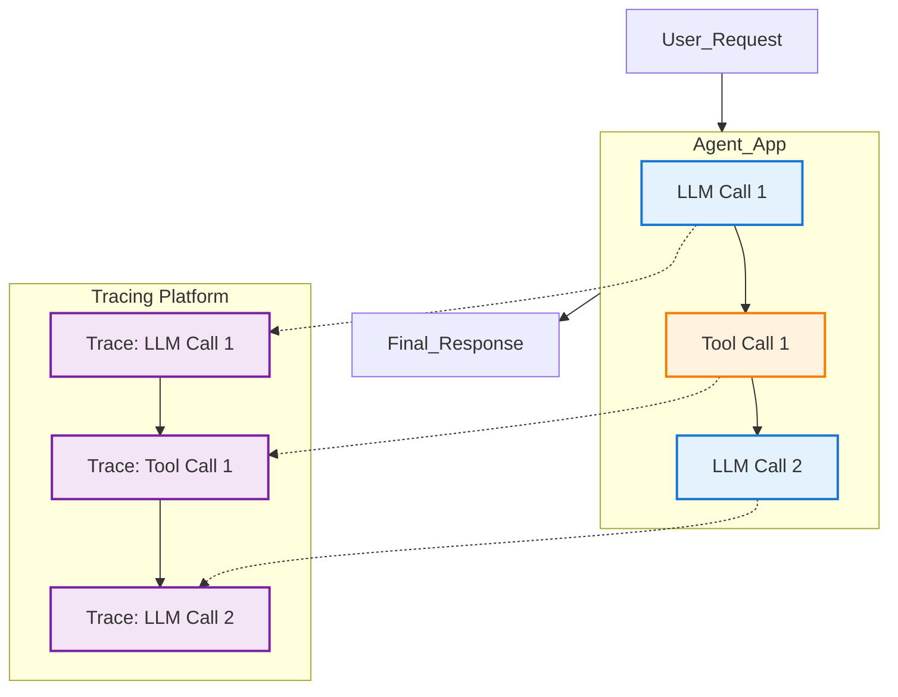

# 트레이싱 & 텔레메트리 (LangSmith, PromptLayer)

## 1. 핵심 개념 (Core Concept)

**트레이싱(Tracing)**과 **텔레메트리(Telemetry)**는 AI 에이전트의 내부 동작을 상세히 추적하고 관찰하기 위한 필수적인 모니터링 기술임. 에이전트가 하나의 요청을 처리하기 위해 수행하는 모든 단계(LLM 호출, 툴 사용, 계획 수정 등)를 시각적으로 추적하고, 관련된 데이터(지연 시간, 비용, 토큰 사용량)를 수집함. **LangSmith**, **PromptLayer**와 같은 도구들은 이러한 과정을 자동화하여, 에이전트의 복잡한 동작을 쉽게 디버깅하고 성능을 최적화할 수 있도록 돕는 **AgentOps**의 핵심 요소임.

---

## 2. 상세 설명 (Detailed Explanation)

에이전트는 비결정적(non-deterministic) 특성 때문에 기존 소프트웨어보다 디버깅과 성능 관리가 훨씬 어려움. 트레이싱과 텔레메트리는 이러한 문제를 해결하기 위한 관찰 가능성(Observability) 확보 수단임.

### 2.1 왜 트레이싱이 중요한가?

Google의 "Agents Companions V2" 백서에서 강조하듯, 에이전트의 최종 결과물만 보는 것은 빙산의 일각에 불과함. 에이전트가 **어떤 경로(Trajectory)**를 거쳐 그 결과에 도달했는지 이해하는 것이 중요함.

*   **디버깅**: 에이전트가 잘못된 답변을 내놓았을 때, 어떤 LLM 호출에서 환각이 발생했는지, 어떤 툴이 잘못된 결과를 반환했는지 정확히 찾아낼 수 있음.
*   **성능 최적화**: 각 단계별 지연 시간(latency)과 비용(cost)을 분석하여 병목 구간을 찾아내고, 불필요한 LLM 호출이나 툴 사용을 줄여 최적화할 수 있음.
*   **품질 평가**: 자동화된 평가뿐만 아니라, 실제 운영 환경에서 발생한 특정 실패 사례의 트레이스를 분석하여 에이전트의 약점을 파악하고 개선할 수 있음.

### 2.2 주요 트레이싱 도구

1.  **LangSmith**:
    *   LangChain 프레임워크와 긴밀하게 통합되어, LangChain으로 구축된 에이전트의 모든 실행 과정을 자동으로 추적함.
    *   각 단계의 입력, 출력, 지연 시간, 토큰 사용량을 상세히 보여주는 UI를 제공.
    *   특정 트레이스에 대한 인간의 피드백(좋아요/싫어요)을 기록하고, 이를 기반으로 평가 데이터셋을 구축하여 모델 및 프롬프트 튜닝에 활용할 수 있음.

2.  **PromptLayer**:
    *   OpenAI, Anthropic 등 다양한 LLM 제공업체와의 연동을 지원하는 LLMOps 플랫폼.
    *   프롬프트 템플릿의 버전을 관리하고, 각 버전에 따른 성능 변화를 추적하는 데 강점이 있음.
    *   사용자의 요청 기록과 LLM 응답을 로깅하고, 비용 및 지연 시간을 모니터링하는 대시보드를 제공.

3.  **OpenTelemetry 기반 자체 구축**:
    *   Cloud Trace와 같은 기존 APM(Application Performance Monitoring) 도구와 통합하여, LLM 호출을 하나의 '스팬(Span)'으로 간주하고 전체 시스템의 트레이스를 통합적으로 관리할 수 있음.

---

## 3. 예시 (Example)

### 사용 사례: 복잡한 고객 문의 처리 에이전트의 실패 분석

*   **상황**: 고객이 "지난 달 주문한 A 제품을 B 제품으로 교환하고, 차액을 내 포인트로 결제해줘"라고 요청했으나, 에이전트가 "알 수 없는 오류가 발생했습니다"라고 답변함.

1.  **트레이스 확인 (LangSmith)**: 개발자는 해당 요청의 트레이스를 LangSmith 대시보드에서 찾아봄.
2.  **단계별 분석**:
    *   **Trace 1**: `주문 내역 조회 툴` -> 성공. 지난 달 주문 내역을 정확히 찾아냄.
    *   **Trace 2**: `재고 확인 툴` -> 성공. B 제품의 재고가 충분함을 확인.
    *   **Trace 3**: `LLM 호출 (계획 수정)` -> LLM이 "차액을 포인트로 결제"하는 계획을 세움.
    *   **Trace 4**: `포인트 결제 툴` -> **실패**. 툴 호출 시 `user_id` 파라미터가 누락되어 API가 400 Bad Request 오류를 반환한 것을 발견.
3.  **원인 파악 및 수정**: 개발자는 LLM이 `주문 내역 조회` 결과에서 `user_id`를 추출하여 `포인트 결제 툴` 호출 시 전달하도록 프롬프트를 수정함. 수정 후, 동일한 요청에 대한 트레이스를 다시 실행하여 문제가 해결되었는지 확인함.

---

## 4. 예상 면접 질문 (Potential Interview Questions)

*   **Q. AI 에이전트 개발에서 트레이싱이 왜 특히 중요한가요?**
    *   **A.** 에이전트는 LLM의 비결정성과 여러 단계의 툴 호출 때문에 동작을 예측하기 어렵기 때문입니다. 트레이싱은 이러한 복잡한 내부 동작을 투명하게 만들어주는 '블랙박스 열기'와 같습니다. 이를 통해 에이전트가 왜 특정 행동을 했는지, 어느 단계에서 실패했는지를 명확히 파악하여 디버깅과 성능 개선을 할 수 있습니다.

*   **Q. LangSmith와 같은 LLMOps 도구가 기존의 APM 도구(예: Datadog, Cloud Trace)와 다른 점은 무엇인가요?**
    *   **A.** 기존 APM 도구는 주로 마이크로서비스 간의 API 호출이나 데이터베이스 쿼리를 추적하는 데 중점을 둡니다. 반면, LangSmith와 같은 LLMOps 도구는 LLM 호출에 특화되어 있습니다. 즉, 각 트레이스마다 사용된 프롬프트, 모델 설정, 생성된 응답, 토큰 사용량 등 LLM과 관련된 상세한 정보를 추적하고 시각화하는 데 최적화되어 있다는 점이 다릅니다.

*   **Q. 에이전트의 비즈니스 성과를 측정하기 위해 어떤 텔레메트리 데이터를 수집하고 모니터링하시겠습니까?**
    *   **A.** (Google 백서 참조) 기술적인 메트릭과 비즈니스 메트릭을 함께 수집해야 합니다. 기술적으로는 각 에이전트 실행의 **지연 시간, 비용, 오류율**을 추적합니다. 비즈니스 관점에서는 에이전트의 **목표 달성률(Goal Completion Rate)**, 사용자의 **만족도(👍/👎 피드백)**, 그리고 에이전트 사용이 최종적으로 **매출이나 사용자 참여도** 같은 핵심 비즈니스 지표(KPI)에 어떤 영향을 미치는지 측정하는 것이 중요합니다.

---

## 5. 더 읽어보기 (Further Reading)

*   [LangSmith Documentation](https://docs.smith.langchain.com/)
*   [PromptLayer Documentation](https://promptlayer.com/docs)
*   [OpenTelemetry Documentation](https://opentelemetry.io/docs/)
*   [Google Agent Document (AgentOps)](/docs/assets/files/agentic-ai/google_agent.md)