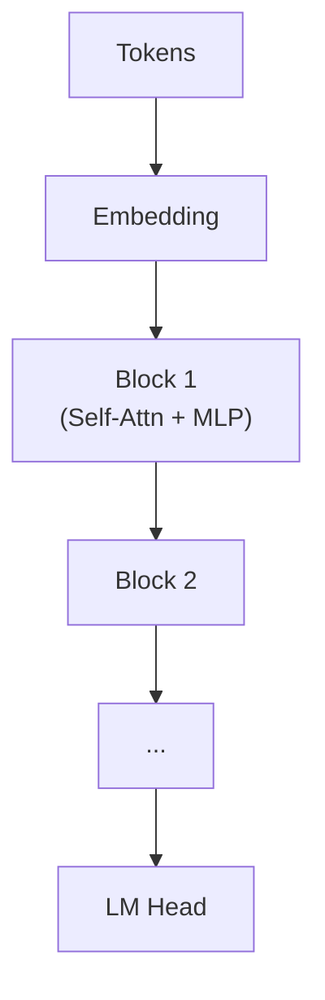

# LLM 아키텍처 핵심

## 1. 핵심 개념 (Core Concept)

에이전트 맥락에서 Transformer(Decoder-only), Attention, KV 캐시의 요점을 이해하면 성능·지연·비용을 예측하고 최적화할 수 있습니다. 본 문서는 개념을 그림과 함께 직관적으로 설명하고, 실무에서 자주 부딪히는 선택지(롱 컨텍스트, GQA/MQA, MoE 등)를 정리합니다.

---

## 2. 상세 설명 (Detailed Explanation)

### 2.1 Decoder-only 구조와 위치 표현(RoPE)
- Decoder-only: 이전 토큰만을 보며 다음 토큰을 예측하는 자기회귀(autoreg.) 구조, Causal Mask 사용.
- 블록 구성: Embedding → [Attn + MLP] × L → LM Head. Pre-Norm(RMSNorm) 채택이 일반적.
- 위치 표현: RoPE(Rotary Positional Embedding)로 각 헤드의 쿼리/키에 회전 변환을 적용해 상대 위치 정보를 부여, 긴 문맥에서 일반화가 양호.

### 2.2 효율적 어텐션과 Mixture-of-Experts(MoE)
- FlashAttention: 어텐션 계산을 타일링/커널 최적화로 재구성해 속도/메모리 효율↑(대형 컨텍스트에서 효과적)
- GQA/MQA: 다중쿼리/그룹쿼리 어텐션으로 KV 캐시 복제를 줄여 메모리/지연 절감(GPU 메모리 부족 시 유용)
- 희소/윈도우 어텐션: 슬라이딩/로컬 윈도우만 주목해 비용 감소(롱 컨텍스트에서 부분 적용)
- MoE: 다수 전문가 FFN 중 일부만 활성화(토큰 라우팅). 장점: 파라미터↑·추론 FLOPs 비슷. 주의: 라우팅 불균형, 용량 초과(capacity) 처리, 배치/서빙 복잡도.

### 2.3 KV 캐시와 지연 최적화(핵심)
- KV 캐시: 프롬프트 구간(prefill)에서 계산된 K/V를 캐싱, 디코딩 단계에서 재사용 → 토큰당 지연 감소.
- 메모리 추정: tokens × heads × head_dim × 2(K,V) × bytes. 예) 8k×32×128×2×2B(fp16) ≈ 131MB/배치항목.
- 최적화: KV 캐시 양자화(8b/4b), 공유/재사용(프리픽스/컨텍스트), PagedAttention(vLLM)로 조각화 방지, Chunked Prefill로 긴 입력 분할.
- 보완: Speculative Decoding(가벼운 Draft 모델로 후보 생성 후 검증), 배칭/연속 배칭(throughput↑), 스트리밍 토큰 조기 전송.

---

## 3. 예시 (Example)

- 다중 사용자 공통 프롬프트(지시문) + 사용자별 질의: 공통 프리픽스의 KV 캐시를 공유해 프리필 비용 절감.
- 검색 기반 답변: 장문 컨텍스트는 Chunked Prefill, 생성은 Speculative로 가속.

---

## 4. 예상 면접 질문 (Potential Interview Questions)

- MoE의 장단점과 라우팅 이슈는?
- GQA/MQA가 KV 메모리에 어떤 이득을 주는가?
- FlashAttention과 일반 어텐션의 차이와 적용 한계는?

---

## 5. 더 읽어보기 (Further Reading)

- 4장 LLM 관련 문서들(서빙/양자화/컨텍스트 확장 등)

---

## 6. See also

- 추론 최적화/서빙: 5-7 → [inference-optimization-and-serving](./inference-optimization-and-serving.md)
- 시스템 구성요소: 5-1 → [components](../5-1-시스템-설계/components.md)
- 메모리/압축: 5-2 → [context-compression-management](../5-2-메모리-and-컨텍스트-관리/context-compression-management.md)
