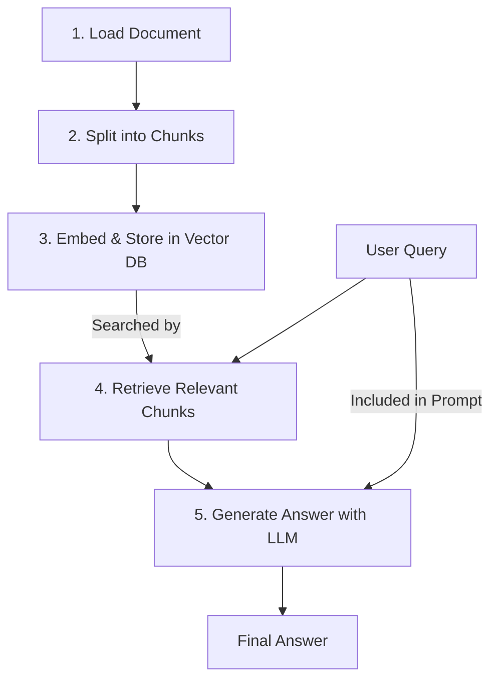

# 간단한 RAG 에이전트 구축 (Python + LangChain)

## 1. 핵심 개념 (Core Concept)

이 플레이북은 LangChain과 OpenAI를 사용하여 외부 문서(이 경우, 간단한 텍스트 파일)의 내용을 기반으로 질문에 답변하는 가장 기본적인 RAG(검색 증강 생성) 에이전트를 구축하는 과정을 안내함. 전체 프로세스는 **Load (로드)**, **Split (분할)**, **Store (저장)**, **Retrieve (검색)**, **Generate (생성)**의 5단계로 이루어짐. 이는 모든 복잡한 RAG 시스템의 근간이 되는 핵심 패턴임.

---

## 2. 상세 설명 (Detailed Explanation)

### 2.1 RAG 파이프라인 5단계

1.  **Load**: 외부 소스(파일, URL, DB 등)에서 원본 문서를 로드함.
2.  **Split**: 로드된 문서를 LLM의 컨텍스트 창에 맞게, 그리고 의미적으로 관련된 내용끼리 묶이도록 작은 청크(Chunk)로 분할함.
3.  **Store**: 분할된 각 청크를 임베딩 모델을 통해 벡터로 변환하고, 이 벡터들을 효율적인 검색을 위해 벡터 데이터베이스에 저장함.
4.  **Retrieve**: 사용자의 질문이 들어오면, 질문을 벡터로 변환하여 벡터 DB에서 의미적으로 가장 유사한 청크(문서)들을 검색함.
5.  **Generate**: 검색된 문서들을 사용자의 원본 질문과 함께 LLM의 프롬프트에 넣어 최종 답변을 생성함.



---

## 3. 예시 (Example)

### 코드 예시 (Python)

이 코드는 `langchain`, `openai`, `faiss-cpu` 라이브러리가 설치되어 있어야 실행 가능함. `OPENAI_API_KEY` 환경 변수 설정도 필요함.

```python
import os
from langchain_community.document_loaders import TextLoader
from langchain_openai import OpenAIEmbeddings, ChatOpenAI
from langchain.text_splitter import CharacterTextSplitter
from langchain_community.vectorstores import FAISS
from langchain.chains import RetrievalQA

# --- 1. 환경 설정 ---
# 실제 환경에서는 .env 파일 등을 사용하여 API 키를 관리해야 함
# os.environ["OPENAI_API_KEY"] = "YOUR_API_KEY"

# --- 2. 예제 문서 생성 ---
file_path = "mission_statement.txt"
with open(file_path, "w") as f:
    f.write("AI 엔지니어 가이드의 목표는 AI 기술 면접을 준비하는 모든 이들에게 최고의 나침반이 되는 것입니다. ")
    f.write("우리는 최신 기술 동향과 깊이 있는 이론을 결합하여 실용적인 지식을 제공합니다. ")
    f.write("이 가이드는 커뮤니티와 함께 성장하며, 지식의 장벽을 낮추는 것을 추구합니다.")

# --- 3. RAG 파이프라인 구축 ---

# 1. Load: 문서를 로드합니다.
loader = TextLoader(file_path)
documents = loader.load()

# 2. Split: 문서를 청크로 분할합니다.
text_splitter = CharacterTextSplitter(chunk_size=100, chunk_overlap=20)
chunks = text_splitter.split_documents(documents)

# 3. Store: 임베딩 모델과 벡터 DB를 사용하여 청크를 저장합니다.
embeddings = OpenAIEmbeddings()
vectorstore = FAISS.from_documents(chunks, embeddings)

# 4. Retrieve & 5. Generate: 검색기와 생성기를 결합한 QA 체인을 생성합니다.
llm = ChatOpenAI(model="gpt-3.5-turbo", temperature=0)
qa_chain = RetrievalQA.from_chain_type(
    llm=llm,
    chain_type="stuff",
    retriever=vectorstore.as_retriever()
)

# --- 4. 에이전트 실행 ---
query1 = "이 가이드의 목표는 무엇인가요?"
response1 = qa_chain.invoke(query1)
print(f"질문 1: {query1}")
print(f"답변 1: {response1['result']}\n")

query2 = "누구와 함께 성장하나요?"
response2 = qa_chain.invoke(query2)
print(f"질문 2: {query2}")
print(f"답변 2: {response2['result']}")

# --- 5. 정리 ---
os.remove(file_path)
```

### 실행 결과

```
질문 1: 이 가이드의 목표는 무엇인가요?
답변 1: 이 가이드의 목표는 AI 기술 면접을 준비하는 모든 이들에게 최고의 나침반이 되는 것입니다.

질문 2: 누구와 함께 성장하나요?
답변 2: 이 가이드는 커뮤니티와 함께 성장합니다.
```

---

## 4. 예상 면접 질문 (Potential Interview Questions)

*   **Q. 위 코드에서 `CharacterTextSplitter`의 `chunk_size`와 `chunk_overlap`은 어떤 역할을 하나요?**
    *   **A.** `chunk_size`는 문서를 나눌 최대 글자 수를 의미하고, `chunk_overlap`은 청크와 청크 사이에 겹치게 할 글자 수를 의미합니다. 겹치는 부분을 두는 이유는 문장의 의미가 청크 경계에서 잘리는 것을 방지하고, 검색 시 관련성 높은 컨텍스트를 더 잘 유지하기 위함입니다.

*   **Q. `RetrievalQA` 체인의 `chain_type="stuff"`는 무엇을 의미하나요? 다른 타입은 어떤 것이 있나요?**
    *   **A.** `stuff`는 가장 간단한 체인 타입으로, 검색된 모든 문서를 하나의 프롬프트에 모두 넣어서(stuff) LLM에게 전달하는 방식입니다. 문서의 양이 많아 컨텍스트 창을 초과할 경우 오류가 발생할 수 있습니다. 다른 타입으로는 `map_reduce`(각 문서를 개별적으로 요약하고, 그 요약본들을 다시 요약), `refine`(첫 문서로 답변을 생성하고, 다음 문서를 보며 답변을 점진적으로 개선), `map_rerank`(각 문서마다 답변을 생성하고, 가장 확실한 답변을 선택) 등이 있습니다.

*   **Q. 이 간단한 RAG 에이전트의 성능을 개선하려면 어떤 점들을 고려해볼 수 있을까요?**
    *   **A.** 먼저, 더 정교한 `TextSplitter`(예: `RecursiveCharacterTextSplitter`)를 사용하여 의미 단위의 청킹을 개선할 수 있습니다. 둘째, 검색된 문서의 순위를 재조정하는 `Re-Ranker`를 추가하여 LLM에 더 정확한 컨텍스트를 제공할 수 있습니다. 셋째, 사용자의 쿼리 자체를 LLM을 통해 더 명확하게 재작성하는 `Query Transformation` 단계를 추가하여 검색 성능을 높일 수 있습니다.

---

## 5. 더 읽어보기 (Further Reading)

*   [LangChain QA with RAG](https://python.langchain.com/docs/use_cases/question_answering/)
*   [Anthropic Agent Document (Start with simple patterns)](https://www.anthropic.com/engineering/building-effective-agents)