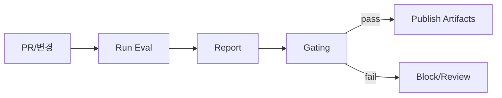

# CI/CD & 자동화

## 1. 핵심 개념 (Core Concept)

프롬프트/모델/툴/데이터가 바뀔 때마다 자동으로 평가하고, 기준을 넘으면 배포·확대를 진행하는 “데브옵스 루프”가 필요합니다. CI(회귀 평가/리포트) + CD(Shadow/Canary/Ramp) + 스케줄/배치(야간 RAG 인덱싱, 정기 재평가)를 결합합니다.

---

## 2. 상세 설명 (Detailed Explanation)

### 2.1 파이프라인 오케스트레이션(스케줄·버전·관찰)
- 스케줄: 야간 배치(대규모 평가/RAG 재임베딩), 시간 기반/이벤트 기반 트리거
- 버전: prompt_v/model_v/tool_v/index_v/runner_v 동시 추적, 아티팩트 저장
- 관찰: 로그/트레이싱/메트릭 수집(5-6/5-8 인프라 문서 참조)

### 2.2 재현성(설정 버전·시드·아티팩트)
- 설정: YAML/JSON으로 버전·파라미터 고정, 시드·샘플링 전략 고정
- 아티팩트: 리포트·스코어·샘플 출력·실패 케이스를 저장, UI에서 리플레이로 연결

### 2.3 데이터셋 분할·메트릭 트래킹(MLflow/W&B)
- 실험: 실험 ID/런 ID로 결과 추적, 대조군/변경군 비교 뷰
- 메트릭: 성능(EM/F1/ROUGE/Judge), 비용/지연, 스키마 위반률

---

## 3. 예시 (Example)

### 3.1 CI 파이프라인(머메이드)


### 3.2 GitHub Actions 스니펫(개념)
```yaml
name: eval-ci
on: [pull_request]
jobs:
  run-eval:
    runs-on: ubuntu-latest
    steps:
      - uses: actions/checkout@v4
      - name: Install deps
        run: pip install -r requirements.txt
      - name: Run eval
        run: python tools/eval_runner.py --config configs/eval/prompt_v_X.yaml
      - name: Upload report
        uses: actions/upload-artifact@v4
        with: {name: eval-report, path: out/report.json}
```

### 3.3 스케줄 배치(예: Airflow)
야간 RAG 재색인, 골든셋 회귀, 비용/지연 리포트, 실패 케이스 리플레이 큐 생성.

---

## 4. 예상 면접 질문 (Potential Interview Questions)

- Prompt 회귀 테스트를 CI에 통합하는 방법은?
- 게이팅 기준을 어떻게 정하고 운영에 반영하는가?
- 배치 평가/인덱싱 실패 시 복구 전략은?

---

## 5. 더 읽어보기 (Further Reading)

- docs/references/google/Agents_Companion_v2.pdf

---

## 6. See also

- 라이프사이클/배포: 5-6 → [agent-lifecycle-ops](../5-6-agentops-운영-and-자동화/agent-lifecycle-ops.md)
- 인프라/툴링: 5-8 → [infra-and-tooling](./infra-and-tooling.md)
- 평가/벤치마크: 5-5 → [prompt-evaluation-and-benchmarks](../5-5-프롬프트-엔지니어링-and-평가/prompt-evaluation-and-benchmarks.md)
