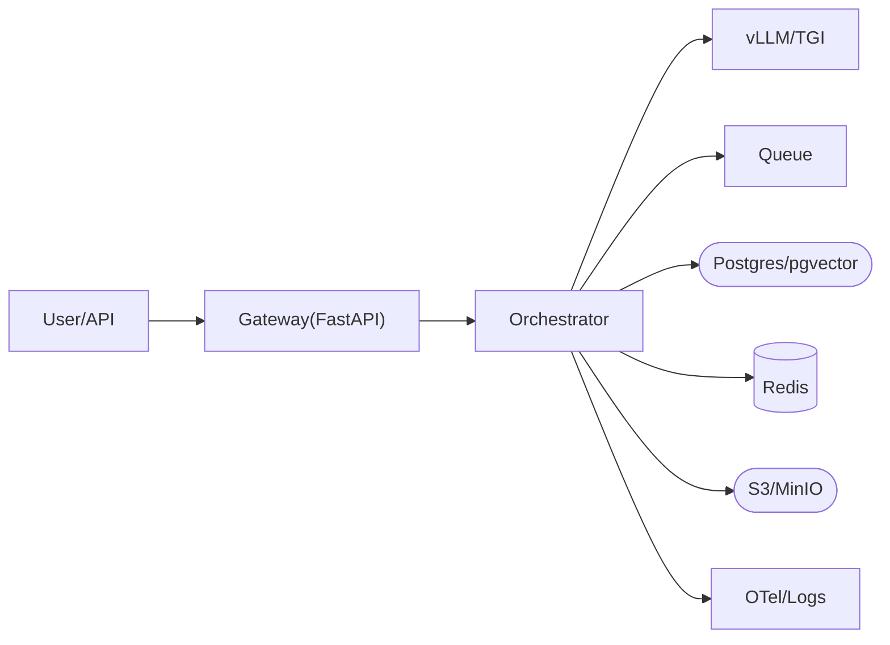

# 인프라 & 툴링

## 1. 핵심 개념 (Core Concept)

구성/비밀/스토리지/큐/캐시/서빙/관찰성까지 아우르는 “계약 우선 인프라”를 설계합니다. Python 스택(Hydra/Pydantic/Typer/FastAPI) + 실험/스케줄(Ray/Airflow/MLflow/W&B) + 데이터·캐시·메시징(ObjStore/PG/Redis/Kafka) + 서빙(vLLM/TGI/Ollama) + 관찰성(Prom/Grafana/OTel) 조합을 권장합니다.

---

## 2. 상세 설명 (Detailed Explanation)

### 2.1 구성·비밀 관리
- 구성: Hydra(계층 설정), Pydantic(검증), 환경별 오버레이(dev/stg/prod)
- 비밀: Vault/AWS SSM/GCP Secret Manager, 최소권한·순환 키, KMS 암호화

### 2.2 저장소·데이터베이스·캐시
- 오브젝트 스토어: 문서/리포트/아티팩트 저장(S3/GCS/MinIO)
- 관계형: Postgres(메타데이터/로그/권한), pgvector로 RAG/메모리 통합 가능
- 캐시: Redis(응답/툴 결과/레이트 리밋/분산 락), TTL/무효화 설계

### 2.3 메시징·오케스트레이션
- 큐/스트림: Kafka/Kinesis/SQS(비동기 작업, 재시도/데드레터)
- 워크플로우: Airflow/Prefect(스케줄/의존/관찰), Ray(대규모 병렬/분산)

### 2.4 서빙·네트워킹
- 서빙: vLLM/TGI/Ollama/TensorRT-LLM(5-7 참조), FastAPI 게이트웨이(OpenAI API 호환)
- 네트워크: egress 제한(웹 검색/툴 화이트리스트), 프록시, IAM/사내망
- 레이트 리밋: 사용자/테넌트/툴 단위 토큰/초, 비용 버짓 연계

### 2.5 관찰성·로깅·추적
- 메트릭: Prometheus → Grafana 대시보드, 알림 라우팅
- 추적: OpenTelemetry/LangSmith, 스팬 표준(프롬프트 구성/리트리버/툴/LLM)
- 로깅: 구조화 JSON, PII 마스킹, 장기 보존/컬럼나 지표화

### 2.6 에이전트 런타임 구성요소
- 프롬프트 캐시/컨텍스트 리미터/응답 평가기/비용 최적화기/서킷 브레이커
- 스키마 레지스트리(툴/프롬프트/평가), 피처 플래그, A/B·롤아웃 도우미

---

## 3. 예시 (Example)

### 3.1 MLflow/W&B 메트릭 트래킹
- 실험 런에 성능/비용/지연/스키마 위반률 기록, 아티팩트(리포트/샘플) 업로드
- 대조군/변경군 비교, 회귀 알림을 CI와 연동

### 3.2 Redis 캐시 키 설계
- 키 = hash(prompt_tpl) + hash(context) + versions(model/prompt/index/tool)
- 개인화/세션 의존 컨텍스트는 키 분리, TTL은 데이터/도메인에 맞춰 설정

---

## 4. 예상 면접 질문 (Potential Interview Questions)

- 실험 재현성 확보의 핵심 포인트는?
- 다중 테넌트 환경에서 권한/레이트 리밋을 어떻게 설계하는가?
- 로그/추적/메트릭을 어떤 표준으로 합치는가?

---

## 5. 더 읽어보기 (Further Reading)

- docs/references/anthropic/building-effective-agents.md

---

## 6. See also

- CI/CD 자동화: 5-8 → [ci-cd-and-automation](./ci-cd-and-automation.md)
- 서빙 최적화: 5-7 → [inference-optimization-and-serving](../5-7-llm-아키텍처-and-최적화/inference-optimization-and-serving.md)
- AgentOps 운영: 5-6 → [agent-lifecycle-ops](../5-6-agentops-운영-and-자동화/agent-lifecycle-ops.md)
