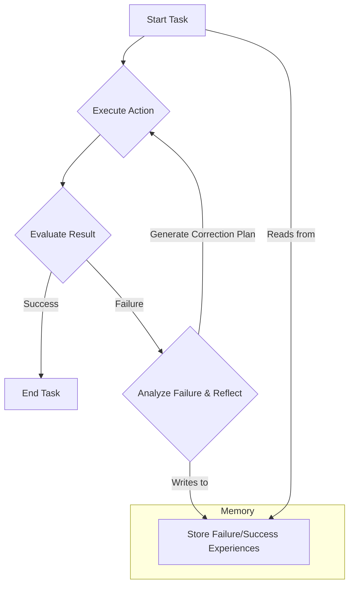

# 자동 평가 및 복구 루프 (Auto-Evaluation & Recovery Loops)

## 1. 핵심 개념 (Core Concept)

**자동 평가 및 복구 루프**는 AI 에이전트가 자신의 행동 결과를 스스로 평가하고, 실패했거나 결과가 미흡할 경우, 목표를 달성하기 위해 행동을 수정하고 자동으로 재시도하는 핵심적인 오케스트레이션 패턴임. 이는 에이전트에게 **자가 수정(Self-Correction)** 능력을 부여하여, 일시적인 오류나 잘못된 계획에 능동적으로 대처하게 함으로써 시스템 전체의 견고성(Robustness)과 신뢰성을 크게 향상시킴. 대표적으로 **Reflexion**이나 **Critic Agent**와 같은 기법이 이 패턴에 해당함.

---

## 2. 상세 설명 (Detailed Explanation)

에이전트는 툴 호출 실패, 잘못된 추론, 외부 환경의 변화 등 다양한 이유로 실패할 수 있음. 자동 평가 및 복구 루프는 이러한 실패를 워크플로우의 일부로 받아들이고 지능적으로 처리함.

### 2.1 평가 루프 (Evaluation Loop)

평가 루프는 에이전트가 특정 작업을 수행한 직후, 그 결과가 목표에 부합하는지 검증하는 단계임. Anthropic의 문서에서 제안된 **평가자-최적화(Evaluator-Optimizer)** 패턴이 대표적인 예시임.

*   **작동 방식**:
    1.  **실행 에이전트 (Optimizer)**: 특정 작업(예: 코드 작성, 보고서 초안 생성)을 수행함.
    2.  **평가자 에이전트 (Evaluator/Critic)**: 실행 결과를 미리 정의된 기준(예: 코드의 테스트 케이스 통과 여부, 보고서의 논리적 일관성)에 따라 평가함.
    3.  **피드백 생성**: 평가 결과가 기준에 미치지 못하면, 구체적인 비판이나 개선 방향을 담은 피드백을 생성함.
    4.  **반복**: 실행 에이전트는 이 피드백을 입력받아 작업을 다시 수행함. 이 과정은 평가를 통과할 때까지 반복됨.

### 2.2 자동 재시도 (Auto Retries)

자동 재시도는 주로 일시적인 오류(예: 네트워크 문제, API의 간헐적 실패)를 처리하기 위한 더 간단한 형태의 복구 루프임.

*   **작동 방식**: 툴 호출이나 LLM 호출이 실패했을 때, 즉시 작업을 중단하는 대신, 정해진 횟수(예: 3회)만큼 자동으로 재시도함.
*   **지수 백오프 (Exponential Backoff)**: 재시도 시마다 대기 시간을 점진적으로 늘려(예: 1초, 2초, 4초), 과도한 요청으로 인한 시스템 부하를 방지함.

### 2.3 Reflexion: 실패로부터 배우기

Reflexion은 한 단계 더 나아가, 에이전트가 실패 경험을 명시적인 기억으로 저장하고, 다음 시도에서 동일한 실수를 반복하지 않도록 하는 고급 기법임.

*   **작동 방식**:
    1.  에이전트가 특정 작업에 실패함.
    2.  **반성(Reflect)**: 에이전트는 실패의 원인을 스스로 분석하고, "다음부터는 X 대신 Y 방법을 시도해야겠다"와 같은 교훈을 자연어로 생성함.
    3.  **기억 저장**: 이 교훈을 장기 메모리(벡터 DB 등)에 저장함.
    4.  **다음 시도**: 다음 번에 유사한 작업을 수행할 때, 메모리에서 관련 교훈을 검색하여 계획에 반영함으로써 동일한 실패를 피함.

---

## 3. 예시 (Example)

### 사용 사례: 웹사이트 정보 수집 에이전트

*   **목표**: 특정 웹사이트에서 최신 뉴스 기사 3개의 제목과 요약문을 가져오기.

1.  **1차 시도**: 에이전트가 `read_url` 툴을 사용하여 웹사이트에 접근했으나, 해당 웹사이트가 동적 JavaScript로 컨텐츠를 로드하여 내용이 비어있는 HTML만 가져옴. **(실패)**

2.  **평가 및 반성 (Reflexion)**:
    *   **평가**: 결과물이 비어있으므로 작업 실패로 판단.
    *   **반성**: "`read_url` 툴은 JavaScript 렌더링을 지원하지 않아 실패했다. 다음부터 이런 사이트는 Selenium이나 Playwright 같은 브라우저 자동화 툴을 사용해야 한다."

3.  **2차 시도 (복구 루프)**:
    *   에이전트는 수정된 계획에 따라 `selenium_browser_tool`을 사용하여 웹사이트에 접근.
    *   JavaScript가 모두 렌더링된 후의 HTML 내용을 성공적으로 가져와 뉴스 기사 제목과 요약문을 추출함. **(성공)**

---

## 4. 예상 면접 질문 (Potential Interview Questions)

*   **Q. 에이전트 시스템에서 자동 평가 및 복구 루프가 왜 중요한가요?**
    *   **A.** 에이전트는 예측 불가능한 외부 환경과 상호작용하기 때문에 실패는 필연적입니다. 이 루프가 없다면 에이전트는 작은 실패에도 쉽게 전체 작업이 중단되어 버리는 매우 취약한 시스템이 됩니다. 자동 평가 및 복구 루프는 이러한 실패를 정상적인 워크플로우의 일부로 처리하여, 에이전트가 스스로 문제를 진단하고 해결책을 찾아 목표를 완수할 수 있도록 만들어주므로 시스템의 견고성과 자율성을 크게 높여줍니다.

*   **Q. '평가자-최적화' 패턴과 'Reflexion' 기법의 차이점은 무엇인가요?**
    *   **A.** '평가자-최적화' 패턴은 주로 현재 작업의 결과물을 개선하는 데 초점을 맞춘 동기식 루프입니다. 별도의 평가자 에이전트가 즉각적인 피드백을 주면 실행 에이전트가 이를 반영하여 결과물을 다듬습니다. 반면, 'Reflexion'은 실패 경험 자체를 장기적인 교훈으로 학습하는 데 더 중점을 둡니다. 실패 원인을 분석하여 명시적인 기억으로 저장하고, 미래의 다른 작업에서 동일한 실수를 반복하지 않도록 하는 비동기적인 학습 메커니즘에 가깝습니다.

*   **Q. 자동 재시도(Auto Retry)를 구현할 때 '지수 백오프(Exponential Backoff)'를 사용하는 이유는 무엇인가요?**
    *   **A.** API 서버의 일시적인 과부하 등으로 오류가 발생했을 때, 여러 클라이언트가 즉시 동시에 재시도하면 서버 부하가 더욱 가중되어 상황이 악화될 수 있습니다. 지수 백오프는 재시도 간격을 점차 늘려가며 요청을 분산시킴으로써, 서버가 부하로부터 회복할 시간을 주고 재시도 성공 확률을 높이는 효과적인 전략입니다.

---

## 5. 더 읽어보기 (Further Reading)

*   [Reflexion: Language Agents with Verbal Reinforcement Learning (Paper)](https://arxiv.org/abs/2303.11366)
*   [Anthropic Agent Document (Evaluator-Optimizer)](/docs/assets/files/agentic-ai/anthropic_building_effective_ai_agents.md)
*   [Google Agent Document (Feedback Loops)](/docs/assets/files/agentic-ai/google_agent.md)
