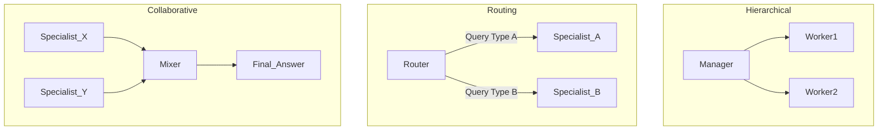

# 스케줄러 및 코디네이터 패턴 (Scheduler & Coordinator Patterns)

## 1. 핵심 개념 (Core Concept)

**스케줄러/코디네이터 패턴**은 멀티-에이전트 시스템에서 중앙의 조정자(Coordinator) 또는 관리자(Manager) 에이전트가 전체 작업의 흐름을 관리하고, 여러 전문 에이전트(Worker)에게 작업을 동적으로 할당 및 스케줄링하는 아키텍처임. 이는 복잡한 문제를 효율적으로 분업하고, 각 에이전트의 전문성을 극대화하며, 전체 프로세스를 일관성 있게 관리하기 위한 핵심적인 오케스트레이션 전략임. Google의 "Agents Companions V2" 문서에서 소개된 **계층적(Hierarchical)** 패턴이 대표적인 예시임.

---

## 2. 상세 설명 (Detailed Explanation)

단일 에이전트가 모든 것을 처리하는 대신, 중앙 코디네이터를 두는 방식은 다음과 같은 장점을 가짐.

*   **중앙 집중식 제어**: 전체 작업의 진행 상황을 한 곳에서 파악하고 관리할 수 있음.
*   **효율적인 작업 분배**: 코디네이터가 문제의 성격을 파악하고, 가장 적합한 전문 에이전트에게 작업을 위임하여 효율성을 높임.
*   **동적 계획 및 조정**: 작업 수행 중 예기치 않은 문제가 발생했을 때, 코디네이터가 개입하여 계획을 수정하거나 다른 에이전트에게 작업을 재할당할 수 있음.

### 2.1 주요 코디네이터 패턴

Google과 Anthropic의 문서에서는 다음과 같은 주요 패턴을 식별함.

1.  **계층적 패턴 (Hierarchical Pattern)**:
    *   **구조**: 명확한 상하 관계를 가짐. '매니저' 에이전트가 상위 목표를 받아 이를 여러 하위 작업으로 분해하고, 각 작업을 '워커' 에이전트에게 할당함. 워커들은 작업 결과를 매니저에게 보고하고, 매니저는 이를 종합하여 최종 결과물을 만듦.
    *   **예시**: `보고서 작성 매니저`가 `리서처 에이전트`와 `작성자 에이전트`를 조율하는 경우.

2.  **라우팅 패턴 (Routing Pattern)**:
    *   **구조**: 코디네이터가 '라우터' 또는 '디스패처' 역할을 함. 들어오는 요청의 종류를 분류하여, 해당 분야의 전문 에이전트에게 요청을 전달함.
    *   **예시**: `고객 지원 라우터`가 문의 내용을 분석하여 `환불 전문 에이전트`나 `기술 지원 전문 에이전트`로 연결하는 경우.

3.  **협력적 패턴 (Collaborative Pattern)**:
    *   **구조**: 코디네이터가 '믹서(Mixer)' 또는 '통합자' 역할을 함. 동일한 문제에 대해 여러 전문 에이전트가 각자의 관점에서 독립적으로 답변을 생성하면, 코디네이터는 이 답변들을 비교, 평가, 종합하여 가장 완전한 최종 답변을 구성함.
    *   **예시**: `응답 믹서`가 `차량 매뉴얼 에이전트`와 `운전 팁 에이전트`의 답변을 조합하여 더 풍부한 정보를 제공하는 경우.

---

## 3. 예시 (Example)

### 사용 사례: 자동화된 소프트웨어 개발 시스템

*   **목표**: "사용자 인증 기능 추가" 라는 높은 수준의 요구사항을 처리.

1.  **코디네이터 (프로젝트 매니저 에이전트)**: 요구사항을 분석하고, 다음과 같이 작업을 분해하여 각 전문 에이전트에게 스케줄링함.
    *   **Task 1 -> `DB_Admin_Agent`**: "사용자 테이블 스키마를 설계하고 마이그레이션 스크립트를 작성하라."
    *   **Task 2 -> `Backend_Agent`**: "로그인, 회원가입 API 엔드포인트를 개발하라."
    *   **Task 3 -> `Frontend_Agent`**: "로그인 및 회원가입 UI를 구현하라."
    *   **Task 4 -> `QA_Agent`**: "모든 기능이 통합된 후, E2E 테스트를 수행하고 결과를 보고하라."

2.  **작업 실행 및 조율**:
    *   `코디네이터`는 Task 1, 2, 3이 병렬로 진행될 수 있음을 인지하고 동시에 작업을 할당함.
    *   `Backend_Agent`가 작업 중 DB 스키마에 대한 질문이 생기면, `코디네이터`를 통해 `DB_Admin_Agent`에게 질의하고 답변을 전달받음.
    *   모든 개발 작업이 완료되면, `코디네이터`는 `QA_Agent`에게 테스트 시작을 지시함.

3.  **완료**: `QA_Agent`가 모든 테스트가 통과되었다고 보고하면, `코디네이터`는 전체 작업이 성공적으로 완료되었음을 최종적으로 판단함.

---

## 4. 예상 면접 질문 (Potential Interview Questions)

*   **Q. 멀티-에이전트 시스템에서 코디네이터 패턴을 사용하는 주된 이유는 무엇인가요?**
    *   **A.** 복잡한 문제를 효율적으로 해결하기 위해서입니다. 단일 에이전트는 여러 전문 분야를 모두 잘 처리하기 어렵습니다. 코디네이터는 문제를 작은 단위로 분해하고, 각 단위를 가장 잘 처리할 수 있는 전문 에이전트에게 위임함으로써 전체 시스템의 품질과 효율성을 높이는 '분업'의 효과를 가져옵니다.

*   **Q. 계층적 패턴과 라우팅 패턴의 차이점은 무엇인가요?**
    *   **A.** 라우팅 패턴은 주로 들어오는 단일 요청을 가장 적합한 하나의 전문가에게 '전달'하는 역할에 가깝습니다. 반면, 계층적 패턴에서 코디네이터는 하나의 상위 목표를 여러 하위 작업으로 '분해'하고, 여러 워커 에이전트의 작업을 '조율'하며, 그 결과들을 다시 '종합'하는 등 훨씬 더 능동적이고 복잡한 관리 역할을 수행합니다.

*   **Q. 좋은 코디네이터 에이전트를 설계하기 위해 가장 중요하게 고려해야 할 점은 무엇일까요?**
    *   **A.** 첫째, **작업 분해 능력**입니다. 복잡한 목표를 논리적이고 독립적인 하위 작업으로 잘 나누는 능력이 필수적입니다. 둘째, **에이전트 선택 능력**입니다. 각 하위 작업에 가장 적합한 전문 에이전트가 누구인지 정확히 판단해야 합니다. 셋째, **상태 추적 및 오류 처리 능력**입니다. 여러 워커 에이전트의 진행 상황을 추적하고, 특정 에이전트가 실패했을 때 이를 복구하거나 다른 대안을 제시하는 능력이 있어야 합니다.

---

## 5. 더 읽어보기 (Further Reading)

*   [Google Agent Document (Multi-Agent Design Patterns)](https://www.kaggle.com/whitepaper-agent-companion)
*   [Anthropic Agent Document (Orchestrator-workers)](https://www.anthropic.com/engineering/building-effective-agents)
*   [LangGraph for Multi-Agent Workflows](https://langchain-ai.github.io/langgraph/concepts/multi_agent/)