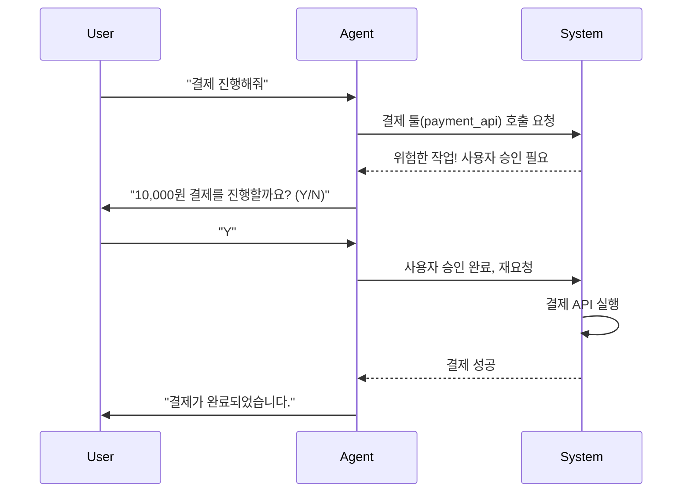

# 툴 권한 스코프 제한 (Tool Permission Scoping)

## 1. 핵심 개념 (Core Concept)

툴 권한 스코프 제한은 AI 에이전트가 작업을 수행하는 데 필요한 **최소한의 권한**만 각 툴(Tool) 또는 기능(Function)에 부여하는 보안 원칙입니다. 이를 통해 에이전트가 오작동하거나 외부 공격(예: 프롬프트 인젝션)에 의해 탈취되었을 때 발생할 수 있는 잠재적 피해를 최소화하고 시스템의 안정성과 신뢰성을 높입니다.

---

## 2. 상세 설명 (Detailed Explanation)

AI 에이전트는 강력한 툴을 사용하여 파일 시스템 접근, 데이터베이스 쿼리, 외부 API 호출 등 다양한 작업을 수행할 수 있습니다. 그러나 이러한 강력한 기능은 심각한 보안 위험을 동반하므로, 툴의 권한을 신중하게 제어하는 것이 매우 중요합니다.

### 2.1 최소 권한 원칙 (Principle of Least Privilege, PoLP)

보안의 가장 기본적인 원칙 중 하나로, 모든 구성 요소(사용자, 프로세스, 에이전트)는 자신의 역할을 수행하는 데 필수적인 최소한의 권한만 가져야 한다는 개념입니다.

*   **적용 예시**:
    *   **파일 접근**: `read_file` 툴은 특정 디렉토리(예: `/workspace/docs`)에 대한 읽기 권한만 가져야 하며, 시스템 디렉토리(예: `/etc`) 접근이나 쓰기 권한은 없어야 합니다.
    *   **데이터베이스 접근**: 데이터 분석 에이전트는 `SELECT` 쿼리만 실행할 수 있고, `UPDATE`, `DELETE` 등의 데이터 수정 권한은 제한되어야 합니다.
    *   **API 호출**: 이메일 발송 툴은 하루에 보낼 수 있는 이메일 수를 제한하여 스팸 발송에 악용되는 것을 방지합니다.

### 2.2 동적 권한 부여 (Dynamic Permission Scoping)

에이전트의 현재 작업(Task)이나 대화의 맥락(Context)에 따라 필요한 툴의 권한을 동적으로 조정하는 고급 기법입니다.

*   **작동 방식**: 에이전트가 특정 작업을 시작할 때 필요한 권한을 임시로 부여하고, 작업이 완료되면 즉시 회수합니다.
*   **예시**:
    1.  사용자가 "내 클라우드 환경에 새 가상머신을 배포해줘"라고 요청합니다.
    2.  에이전트는 먼저 비용, 사양 등을 사용자에게 보고합니다.
    3.  사용자가 최종적으로 "응, 진행해"라고 **명시적으로 승인**합니다.
    4.  이때 시스템은 에이전트에게 일시적으로 클라우드 제어 API(Terraform, AWS SDK 등)에 대한 실행 권한을 부여합니다.
    5.  배포가 완료되거나 실패하면 해당 권한은 자동으로 회수됩니다.

### 2.3 사용자 확인 및 승인 (User-in-the-Loop)

되돌릴 수 없거나(irreversible), 비용이 발생하거나, 민감한 데이터를 다루는 중요한 작업을 수행하기 전에는 반드시 사용자에게 명시적인 확인과 승인을 받는 절차입니다. 이는 에이전트의 자율성과 시스템의 안전성 사이의 균형을 맞추는 핵심적인 안전장치입니다.

---

## 3. 예시 (Example)

### 코드 예시 (Python Pseudo-code)

'''python
# 각 툴에 허용된 스코프를 정의
# 실제 시스템에서는 외부 설정 파일이나 정책 엔진(예: OPA)으로 관리하는 것이 좋음
TOOL_PERMISSIONS = {
    "file_reader": {
        "allowed_paths": ["/home/user/documents/"],
        "allowed_operations": ["read"]
    },
    "database_querier": {
        "allowed_statements": ["SELECT"],
        "max_result_rows": 1000
    },
    "payment_processor": {
        "requires_user_consent": True,
        "max_amount": 500.00 # 500달러 이하만 가능
    }
}

def execute_tool(user_id, tool_name, params):
    if tool_name not in TOOL_PERMISSIONS:
        raise PermissionError(f"Tool '{tool_name}' is not registered.")

    permission = TOOL_PERMISSIONS[tool_name]

    # 1. 사용자 승인 확인
    if permission.get("requires_user_consent"):
        if not get_user_consent(user_id, f"Execute '{tool_name}' with {params}?"):
            raise PermissionError("User consent denied.")

    # 2. 스코프 규칙 검사
    if tool_name == "file_reader":
        if not any(params["path"].startswith(p) for p in permission["allowed_paths"]):
            raise PermissionError("File path is not allowed.")
    
    # ... (다른 툴에 대한 규칙 검사)

    # 3. 모든 검사를 통과하면 실제 툴 실행
    print(f"Executing tool '{tool_name}' with valid permissions.")
    # result = real_tool_logic(tool_name, params)
    # return result

def get_user_consent(user_id, message):
    # 실제로는 사용자에게 UI를 통해 확인을 받는 로직
    print(f"Awaiting consent from {user_id}: {message}")
    # response = input("Approve? (y/n): ")
    # return response.lower() == 'y'
    return True # 예시를 위해 항상 승인

# 에이전트의 호출 시뮬레이션
execute_tool("user-123", "payment_processor", {"amount": 99.99})
# execute_tool("user-123", "file_reader", {"path": "/etc/passwd"}) # -> PermissionError 발생
'''

---

## 4. 예상 면접 질문 (Potential Interview Questions)

*   **Q. AI 에이전트가 사용하는 툴의 권한을 제한하는 것이 왜 중요한가요?**
    *   **A.** 에이전트는 LLM의 예측 불가능성, 프롬프트 인젝션 공격 등으로 인해 의도치 않거나 악의적인 행동을 할 수 있습니다. 툴의 권한을 최소한으로 제한하면, 이러한 문제가 발생하더라도 피해 범위를 통제할 수 있습니다. 예를 들어, 파일 읽기 툴이 특정 디렉토리에만 접근 가능하다면, 에이전트가 탈취되더라도 시스템 전체의 중요 파일이 유출되는 최악의 상황을 막을 수 있습니다.
*   **Q. 툴 권한을 관리하기 위한 좋은 아키텍처는 무엇일까요?**
    *   **A.** 중앙화된 정책 엔진(Policy Engine)을 도입하는 것이 좋습니다. 예를 들어 OPA(Open Policy Agent)와 같은 도구를 사용하여 툴 권한 정책을 코드로 정의하고 애플리케이션 로직과 분리합니다. 에이전트가 툴을 호출할 때마다, API 게이트웨이나 미들웨어에서 정책 엔진에 해당 요청이 허용되는지 질의하는 방식입니다. 이 아키텍처는 권한 정책을 일관성 있게 관리하고, 비즈니스 로직 변경 없이 유연하게 정책을 수정할 수 있는 장점이 있습니다.
*   **Q. 사용자의 명시적인 승인을 받아야 하는 툴은 어떤 기준으로 선정해야 할까요?**
    *   **A.** 주로 **비가역성(irreversibility), 비용, 민감 정보 접근**이라는 세 가지 기준으로 판단해야 합니다. 첫째, 파일 삭제나 데이터베이스 레코드 변경처럼 되돌릴 수 없는 작업을 수행하는 툴. 둘째, 외부 서비스 결제와 같이 실제 비용이 발생하는 툴. 셋째, 이메일, 주소록, 의료 기록 등 개인정보나 민감한 정보에 접근하는 툴은 반드시 실행 전에 사용자에게 명확히 고지하고 명시적인 동의를 얻는 절차를 거쳐야 합니다.

---

## 5. 더 읽어보기 (Further Reading)

*   [OWASP Top 10 for Large Language Model Applications](https://owasp.org/www-project-top-10-for-large-language-model-applications/) (특히 LLM04: Model Permission Issues)
*   [The Principle of Least Privilege (PoLP)](https://www.comptia.org/content/articles/what-is-the-principle-of-least-privilege)
*   [Open Policy Agent (OPA)](https://www.openpolicyagent.org/)