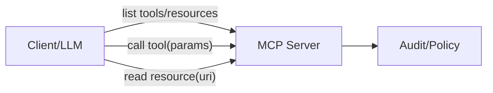

# 표준 통신 프로토콜

## 1. 핵심 개념 (Core Concept)

에이전트 간 상호운용성과 도구 통합을 위해 A2A/ACP/MCP를 이해·적용합니다. 핵심은 “메시지/툴/리소스”의 표준 스키마를 공유해 구현을 교체 가능하게 만드는 것입니다.

______________________________________________________________________

## 2. 상세 설명 (Detailed Explanation)

### 2.1 A2A(Agent-to-Agent) / ACP(Agent Communication Protocol)

- A2A: 에이전트 간 메시지 교환·역할 분담·상태 공유의 총칭(표준 명세는 다양)
- ACP(일반 개념): 메시지 포맷(`role`,`intent`,`payload`,`schema_ref`), 상태/세션, 오류·재시도 규칙을 명시
- 패턴: Coordinator/Worker, Committee(합의/토론), Reviewer(심사). 재시도·합의·중재를 프로토콜에 포함

### 2.2 MCP(Model Context Protocol) 개요

- 목적: LLM이 안전하게 “리소스(읽기)”와 “툴(실행)”에 접근하도록 표준화
- 구성: MCP Server(리소스/툴/프롬프트 제공) ↔ MCP Client(LLM/앱). 전송은 주로 JSON-RPC 기반
- 리소스(Resources): 문서/파일/DB 등 읽기 전용 핸들, URI/메타 포함
- 툴(Tools): 함수 호출 가능한 작업(파라미터/응답 스키마 필수), 권한/쿼터/오류 모델 명시
- 세션/컨텍스트: 클라이언트가 현재 세션의 컨텍스트/권한 범위를 서버에 전달, 서버는 제한 집행



### 2.3 운영과의 연계(→ 5-6), 프롬프트/툴 스키마 연계(→ 5-5/5-9)

- 운영: 정책 엔진/감사 로그/레이트 리밋 연계, 버전/스키마 레지스트리 관리
- 프롬프트: 툴 설명/제약/스키마를 시스템 지시문에 반영, 스키마 위반 시 자동 교정 프롬프트
- 보안: 툴 권한 범위·쿼터·휴먼 승인 정책을 MCP 서버에서 강제

______________________________________________________________________

## 3. 예시 (Example)

### 3.1 MCP 등록(개념 JSON-RPC)

```json
{
  "jsonrpc":"2.0","method":"tools/list","id":1
}
{
  "jsonrpc":"2.0","result":{
    "tools":[{"name":"search_docs","schema":"#/schemas/search"}]}
}
```

### 3.2 A2A 메시지(개념)

```json
{"role":"coordinator","intent":"write","payload":{"outline":"..."},"schema_ref":"doc_outline_v1"}
```

______________________________________________________________________

## 4. 예상 면접 질문 (Potential Interview Questions)

- MCP를 도입할 때 고려할 운영상의 포인트는?
- 툴/리소스의 권한·쿼터·오류 모델을 어디서 강제할 것인가?
- A2A 패턴에서 합의/중재는 어떻게 정의하는가?

______________________________________________________________________

## 5. 더 읽어보기 (Further Reading)

- docs/references/google/Agents_Companion_v2.pdf
- docs/references/openai/a-practical-guide-to-building-agents-3.pdf
- docs/references/anthropic/building-effective-agents.md

______________________________________________________________________

## 6. See also

- 툴 스키마/보안: 5-9 → [tool-schemas-jsonrpc-openapi](./tool-schemas-jsonrpc-openapi.md), [security-and-guardrails](./security-and-guardrails.md)
- 상호작용 패턴: 5-1 → [agent-interaction-and-protocols](../5-1-%EC%8B%9C%EC%8A%A4%ED%85%9C-%EC%84%A4%EA%B3%84/agent-interaction-and-protocols.md)
