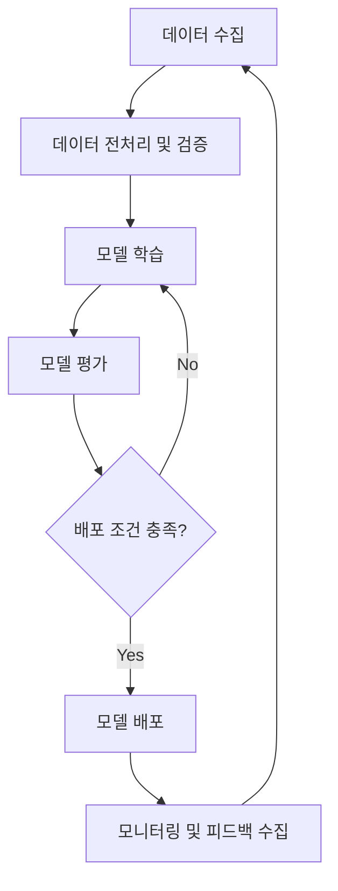

# ML 파이프라인 개요 (ML Pipeline Overview)

## 1. 핵심 개념 (Core Concept)

ML 파이프라인은 머신러닝 모델을 개발하고 배포하는 전체 과정을 자동화한 워크플로우임. 데이터 수집, 전처리, 모델 학습, 평가, 배포, 모니터링의 단계를 체계적으로 연결하여 모델 개발의 효율성, 재현성, 신뢰성을 높이는 것을 목표로 함.

______________________________________________________________________

## 2. 상세 설명 (Detailed Explanation)

### 2.1 전체 파이프라인 흐름

ML 파이프라인은 일반적으로 아래와 같은 순서로 구성되며, 각 단계는 독립적으로 실행되거나 전체가 유기적으로 연결되어 자동화됨.

### 2.2 단계별 상세 설명

| 단계                                   | 주요 활동                                                                                               | 설명                                                                                                 |
| :------------------------------------- | :------------------------------------------------------------------------------------------------------ | :--------------------------------------------------------------------------------------------------- |
| **데이터 수집 (Data Ingestion)**       | - 데이터 소스 연결 (DB, API, 로그 파일 등) - 데이터 스트리밍 또는 배치 수집                          | 모델 학습에 필요한 원시 데이터를 다양한 소스로부터 가져오는 단계.                                    |
| **데이터 전처리 (Data Preprocessing)** | - 결측치/이상치 처리 - 정규화/표준화 - 피처 엔지니어링                                            | 수집된 데이터를 모델이 학습하기 좋은 형태로 가공하는 과정. 데이터 품질이 모델 성능에 큰 영향을 미침. |
| **모델 학습 (Model Training)**         | - 알고리즘 선택 - 하이퍼파라미터 튜닝 - 분산 학습                                                 | 준비된 데이터셋을 사용하여 머신러닝 모델을 학습시키는 단계.                                          |
| **모델 평가 (Model Evaluation)**       | - 성능 지표 계산 (정확도, F1-score 등) - A/B 테스트 - 기존 모델과 성능 비교                       | 학습된 모델이 비즈니스 요구사항과 성능 목표를 충족하는지 검증하는 단계.                              |
| **모델 배포 (Model Deployment)**       | - REST API, gRPC 등 서빙 - Canary, Blue/Green 배포 전략 적용                                         | 검증된 모델을 실제 서비스 환경에 배포하여 사용자가 예측 결과를 받을 수 있도록 함.                    |
| **모니터링 (Monitoring)**              | - 모델 성능 저하 감지 (Model Drift) - 데이터 분포 변화 감지 (Data Drift) - 시스템 리소스 모니터링 | 배포된 모델의 성능을 지속적으로 추적하고, 성능 저하 시 재학습 파이프라인을 트리거함.                 |

______________________________________________________________________

## 3. 예시 (Example)

### 사용 사례 (Use Case)

- **추천 시스템**: 사용자의 행동 데이터를 주기적으로 수집하여 새로운 추천 모델을 자동으로 학습하고 배포함.
- **금융 사기 탐지**: 실시간으로 발생하는 거래 데이터를 분석하여 사기 거래 패턴을 학습하고, 업데이트된 모델을 통해 사기 거래를 차단함.
- **자연어 처리 챗봇**: 사용자 질문 로그를 분석하여 답변 품질이 낮은 경우를 파악하고, 관련 데이터를 추가 학습시켜 모델을 개선함.

______________________________________________________________________

## 4. 예상 면접 질문 (Potential Interview Questions)

- **Q. ML 파이프라인을 도입하면 어떤 장점이 있나요?**
  - **A.** 첫째, 수동 작업을 자동화하여 개발 및 배포 속도를 높여 생산성을 향상시킵니다. 둘째, 모든 과정을 코드화하고 버전을 관리하여 실험의 재현성을 보장합니다. 셋째, 지속적인 모니터링과 재학습을 통해 모델의 성능을 최신 상태로 유지하고 안정적인 서비스 운영을 가능하게 합니다.
- **Q. 데이터 드리프트(Data Drift)와 컨셉 드리프트(Concept Drift)의 차이점은 무엇인가요?**
  - **A.** 데이터 드리프트는 입력 데이터의 통계적 분포가 시간이 지남에 따라 변하는 현상을 의미합니다. 예를 들어, 새로운 사용자 그룹이 유입되면서 데이터의 특성이 바뀌는 경우입니다. 반면, 컨셉 드리프트는 입력 피처와 타겟 변수 간의 관계 자체가 변하는 것을 의미합니다. 예를 들어, 경제 상황 변화로 인해 사용자의 구매 패턴 자체가 바뀌는 경우입니다.
- **Q. 모델 배포 전략 중 Canary 배포와 Blue/Green 배포의 차이점을 설명해주세요.**
  - **A.** Blue/Green 배포는 구버전(Blue)과 신버전(Green) 환경을 동시에 운영하다가 트래픽을 한 번에 신버전으로 전환하는 방식입니다. 롤백이 빠르다는 장점이 있습니다. 반면, Canary 배포는 일부 사용자(예: 5%)에게만 신버전을 먼저 공개하고, 문제가 없다고 판단되면 점진적으로 트래픽을 늘려나가는 방식입니다. 위험을 최소화하며 안정적으로 배포할 수 있다는 장점이 있습니다.

______________________________________________________________________

## 5. 더 읽어보기 (Further Reading)

- [Google Cloud: What is MLOps?](https://cloud.google.com/mlops/what-is-mlops)
- [AWS: MLOps를 사용한 기계 학습](https://aws.amazon.com/ko/machine-learning/mlops/)
- [Microsoft Azure: MLOps(기계 학습 작업)란?](https://azure.microsoft.com/ko-kr/products/machine-learning/mlops)
