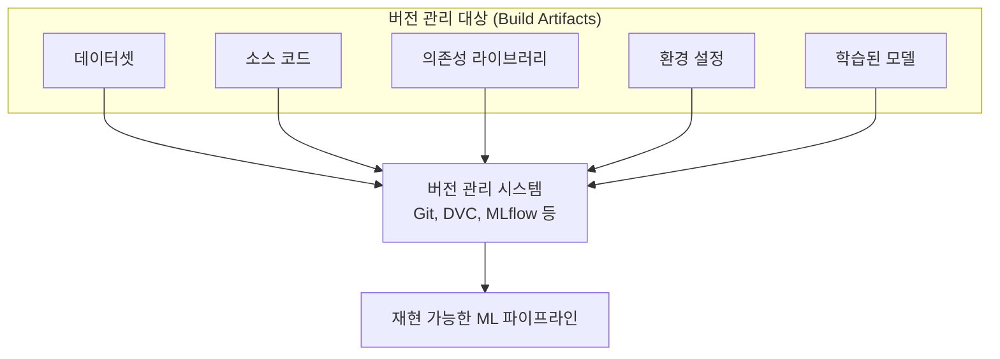

# 재현성 및 빌드 아티팩트 (Reproducibility & Build Artifacts)

## 1. 핵심 개념 (Core Concept)

ML 파이프라인에서의 재현성이란, 동일한 데이터와 코드를 사용했을 때 항상 동일한 모델과 결과를 만들어내는 것을 의미함. 빌드 아티팩트는 이 재현성을 보장하기 위해 파이프라인의 각 단계에서 생성되는 모든 결과물(데이터셋, 모델, 코드, 설정 등)을 버전화하여 저장한 것을 말함.

______________________________________________________________________

## 2. 상세 설명 (Detailed Explanation)

### 2.1 재현성이 중요한 이유

- **신뢰성 및 검증**: 특정 시점의 모델이 어떤 데이터와 코드로 만들어졌는지 추적할 수 있어 결과의 신뢰도를 높이고, 문제 발생 시 원인 파악이 용이함.
- **협업 효율성**: 여러 명의 엔지니어가 동일한 환경에서 실험하고 결과를 공유할 수 있어 협업을 원활하게 함.
- **규제 및 감사 대응**: 금융, 의료 등 규제가 중요한 산업에서 모델의 결정 과정을 투명하게 설명하고 감사에 대응하는 데 필수적임.

### 2.2 재현성 확보를 위한 핵심 요소

재현성을 확보하기 위해서는 파이프라인의 모든 구성 요소를 명시적으로 버전 관리해야 함.

| 요소                          | 설명                                                           | 관리 도구 예시                |
| :---------------------------- | :------------------------------------------------------------- | :---------------------------- |
| **데이터셋 (Dataset)**        | 모델 학습, 검증, 테스트에 사용된 정확한 버전의 데이터.         | `DVC`, `Git LFS`, `Pachyderm` |
| **소스 코드 (Source Code)**   | 데이터 전처리, 피처 엔지니어링, 모델 학습 및 평가 코드.        | `Git`, `GitHub`, `GitLab`     |
| **의존성 (Dependencies)**     | `requirements.txt`, `environment.yml` 등 라이브러리 버전 정보. | `Pip`, `Conda`, `Docker`      |
| **환경 설정 (Configuration)** | 하이퍼파라미터, 학습 설정, 인프라 구성 등.                     | `YAML`, `JSON` 파일, `MLflow` |
| **모델 아티팩트 (Model)**     | 학습된 모델 가중치, 직렬화된 모델 파일 (`.pkl`, `.h5`).        | `MLflow`, `Kubeflow`, `S3` 등 |

______________________________________________________________________

## 3. 예시 (Example)

### 시나리오: 3개월 전 모델의 성능 저하 원인 분석

1. **문제 발생**: 현재 운영 중인 모델의 예측 정확도가 갑자기 떨어짐.
1. **재현 시작**: 3개월 전, 가장 성능이 좋았던 모델의 빌드 아티팩트를 가져옴.
   - `Git`에서 `v1.2` 태그의 소스 코드를 `checkout`.
   - `DVC`를 이용해 해당 버전의 학습 데이터(`data/processed_v1.2.csv`)를 가져옴.
   - `Docker` 이미지를 통해 `requirements-v1.2.txt`에 명시된 라이브러리 환경을 구성.
1. **모델 재학습 및 비교**: 가져온 아티팩트를 사용해 모델을 재학습하고, 현재 운영 중인 모델과 성능을 비교 분석함.
1. **원인 파악**: 분석 결과, 최근 데이터 분포가 크게 변하면서(Data Drift) 모델 성능이 저하되었음을 확인함. 이전 버전의 데이터 전처리 로직이 현재 데이터 특성을 반영하지 못했던 것.
1. **해결**: 새로운 데이터 분포에 맞게 전처리 로직을 수정하고, 재학습 파이프라인을 실행하여 모델을 업데이트함.

______________________________________________________________________

## 4. 예상 면접 질문 (Potential Interview Questions)

- **Q. DVC(Data Version Control)와 Git의 차이점은 무엇이며, 왜 함께 사용해야 하나요?**
  - **A.** Git은 텍스트 기반의 소스 코드를 버전 관리하는 데 최적화되어 있지만, 대용량 파일(데이터셋, 모델 등)을 효율적으로 처리하지 못합니다. DVC는 이러한 대용량 파일을 위한 버전 관리 도구로, 실제 파일은 별도의 스토리지(S3, GCS 등)에 저장하고 Git에는 해당 파일을 가리키는 작은 메타데이터 파일만 저장합니다. 따라서 코드(Git)와 데이터(DVC)를 함께 버전 관리하여 완전한 재현성을 확보할 수 있습니다.
- **Q. ML 파이프라인에서 Docker와 같은 컨테이너 기술을 사용하는 주된 이유는 무엇인가요?**
  - **A.** 주된 이유는 실행 환경의 일관성을 보장하기 위함입니다. Docker 컨테이너는 운영체제, 라이브러리, 시스템 도구 등 코드 실행에 필요한 모든 환경을 이미지로 패키징합니다. 이를 통해 개발자의 로컬 환경, 테스트 서버, 프로덕션 환경 어디에서나 동일한 조건으로 코드를 실행하여 "제 컴퓨터에서는 됐는데..."와 같은 문제를 원천적으로 방지하고 재현성을 높일 수 있습니다.
- **Q. 모델 아티팩트 외에 추가적으로 추적하고 관리해야 할 빌드 아티팩트에는 어떤 것들이 있을까요?**
  - **A.** 모델 자체 외에도, 모델을 생성하고 평가하는 데 사용된 모든 것을 추적해야 합니다. 구체적으로는 (1) 모델 학습에 사용된 정확한 버전의 데이터셋, (2) 데이터 전처리 및 모델 학습 코드, (3) `requirements.txt`와 같은 라이브러리 의존성 정보, (4) 학습률, 배치 사이즈 등 하이퍼파라미터 설정 파일, (5) 모델 평가 결과 및 로그 등이 있습니다. 이 모든 것을 묶어서 하나의 빌드 아티팩트로 관리해야 완전한 재현이 가능합니다.

______________________________________________________________________

## 5. 더 읽어보기 (Further Reading)

- [DVC Official Documentation](https://dvc.org/doc)
- [MLflow Official Documentation](https://mlflow.org/docs/latest/index.html)
- [Pachyderm: The Data Foundation for AI](https://www.pachyderm.com/)
