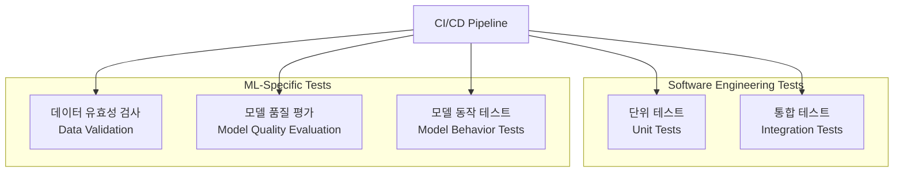

# ML 자동화 테스트 (데이터, 모델 품질)

## 1. 핵심 개념 (Core Concept)

ML 자동화 테스트는 CI/CD 파이프라인에 통합되어 데이터, 코드, 모델의 품질을 지속적으로 검증하는 프로세스임. 기존 소프트웨어 테스트와 더불어, 데이터 유효성 검사, 모델 성능 평가, 비즈니스 로직 검증 등 ML 시스템의 특수성을 고려한 테스트를 자동화하여 안정성과 신뢰성을 확보하는 것을 목표로 함.

______________________________________________________________________

## 2. 상세 설명 (Detailed Explanation)

### 2.1 ML 테스트의 종류와 범위

ML 시스템의 테스트는 일반적인 소프트웨어 테스트 범위를 포함하며, 데이터와 모델에 대한 테스트가 추가됨.



| 테스트 종류            | 대상                | 주요 활동                                                 | 도구 예시                    |
| :--------------------- | :------------------ | :-------------------------------------------------------- | :--------------------------- |
| **단위 테스트**        | 코드 (함수, 클래스) | 데이터 전처리, 피처 엔지니어링 등 개별 함수의 정확성 검증 | `pytest`, `unittest`         |
| **통합 테스트**        | 파이프라인 컴포넌트 | 데이터 처리와 모델 학습 등 여러 컴포넌트의 상호작용 검증  | `pytest`, `MLflow`           |
| **데이터 유효성 검사** | 데이터              | 스키마, 통계적 분포, 결측치/이상치 등 데이터 품질 검증    | `Great Expectations`, `TFDV` |
| **모델 품질 평가**     | 모델 성능           | 정확도, F1-score 등 성능 지표가 기준치를 통과하는지 검증  | `scikit-learn`, `MLflow`     |
| **모델 동작 테스트**   | 모델 예측           | 특정 입력에 대한 예측 결과의 일관성, 공정성, 강건성 검증  | `CheckList`, `Fairlearn`     |

### 2.2 데이터 품질 자동화 테스트

"Garbage In, Garbage Out" 원칙에 따라 데이터 품질은 모델 성능에 결정적임. 따라서 데이터 테스트는 ML 테스트의 첫 단계임.

- **스키마 검증**: 데이터의 컬럼, 타입, 순서 등이 사전에 정의된 스키마와 일치하는지 확인.
- **통계적 검증**: 데이터의 평균, 표준편차, 분포 등이 예상 범위 내에 있는지 확인하여 데이터 드리프트(Data Drift)를 조기에 감지.
- **이상치 및 결측치 검증**: 허용 범위를 벗어나는 이상치나 과도한 결측치가 없는지 확인.

### 2.3 모델 품질 자동화 테스트

학습된 모델이 배포 가능한 수준인지 판단하기 위한 테스트.

- **성능 임계치 검증**: 테스트 데이터셋에 대한 모델의 성능 지표(예: Accuracy > 95%)가 사전에 정의된 임계치를 넘는지 확인.
- **모델 비교 테스트**: 새로 학습된 모델이 기존에 운영 중인 모델(Champion Model)보다 우수한 성능을 보이는지 비교.
- **공정성 및 편향성 테스트**: 특정 인구 집단(성별, 인종 등)에 대해 모델이 불공정한 예측을 하지는 않는지 검증.
- **강건성(Robustness) 테스트**: 입력 데이터에 약간의 노이즈나 변형을 가했을 때, 모델의 예측이 얼마나 일관성 있게 유지되는지 확인.

______________________________________________________________________

## 3. 예시 (Example)

### CI/CD 파이프라인에서의 자동화 테스트 (GitHub Actions)

```yaml
name: ML CI/CD with Automated Testing

on:
  push:
    branches: [ main ]
  pull_request:
    branches: [ main ]

jobs:
  test-and-train:
    runs-on: ubuntu-latest
    steps:
    - name: Checkout code
      uses: actions/checkout@v3

    - name: Set up Python
      uses: actions/setup-python@v3
      with:
        python-version: '3.9'

    - name: Install dependencies
      run: pip install -r requirements.txt

    - name: Run Unit Tests (pytest)
      run: pytest tests/unit

    - name: Validate Data (Great Expectations)
      run: great_expectations checkpoint run my_data_checkpoint

    - name: Train Model
      run: python src/train.py

    - name: Evaluate Model Quality
      run: python src/evaluate.py --model-path model.pkl
```

위 예시는 `main` 브랜치에 코드가 Push되거나 Pull Request가 생성될 때마다 다음을 자동으로 수행함:

1. 단위 테스트 실행 (`pytest`)
1. 데이터 유효성 검사 (`Great Expectations`)
1. 모델 학습 및 평가

______________________________________________________________________

## 4. 예상 면접 질문 (Potential Interview Questions)

- **Q. 일반적인 소프트웨어 테스트와 ML 시스템 테스트의 가장 큰 차이점은 무엇인가요?**
  - **A.** 가장 큰 차이점은 테스트 대상에 '데이터'와 '모델'이 포함된다는 점입니다. 일반적인 소프트웨어는 코드가 정해진 로직대로 동작하는지만 검증하면 되지만, ML 시스템은 코드뿐만 아니라 입력 데이터의 품질, 그리고 그 데이터로 학습된 모델의 예측 성능까지 검증해야 합니다. 따라서 데이터 유효성 검사, 모델 성능 평가, 드리프트 감지 등 ML 고유의 테스트가 추가됩니다.
- **Q. 데이터 유효성 검사를 자동화할 때 주로 어떤 항목들을 확인해야 하나요?**
  - **A.** 주로 세 가지를 확인합니다. 첫째, 데이터 스키마(컬럼, 타입 등)가 정의와 일치하는지 검사합니다. 둘째, 데이터의 통계적 속성(평균, 중앙값, 분포 등)이 예상 범위 내에 있는지 확인하여 데이터 드리프트를 감지합니다. 셋째, 결측치나 이상치의 비율이 허용 가능한 수준인지 검사하여 데이터의 품질 자체를 보증합니다.
- **Q. 새로운 모델을 배포하기 전에 기존 모델과 비교하는 테스트(A/B 테스트, 섀도우 테스트 등)는 왜 중요한가요?**
  - **A.** 오프라인 테스트(test set)에서 성능이 좋았던 모델이 실제 온라인 환경에서도 항상 좋은 성능을 보장하지는 않기 때문입니다. 실제 트래픽의 특성은 테스트셋과 다를 수 있습니다. 따라서 섀도우 테스트(Shadow Test)를 통해 신규 모델을 실제 환경에 배포하되 예측 결과는 저장만 하고 서비스에는 반영하지 않음으로써 위험 없이 성능을 검증하거나, A/B 테스트를 통해 일부 사용자에게만 신규 모델을 노출하여 실제 환경에서의 성능을 직접 비교하고 점진적으로 배포하기 위해 중요합니다.

______________________________________________________________________

## 5. 더 읽어보기 (Further Reading)

- [Martin Fowler: Continuous Integration](https://martinfowler.com/articles/continuousIntegration.html)
- [Google Cloud: ML 모델 테스트 전략](https://cloud.google.com/architecture/testing-ml-models)
- [Great Expectations Documentation](https://docs.greatexpectations.io/)
