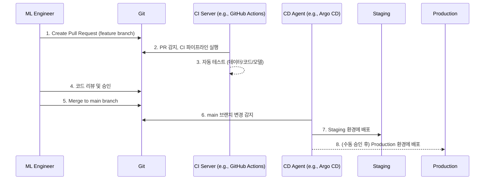

# GitOps 및 Pull Request 워크플로우

## 1. 핵심 개념 (Core Concept)

GitOps는 Git을 "단일 진실 공급원(Single Source of Truth)"으로 사용하여 인프라와 애플리케이션(ML 모델 포함)의 상태를 선언적으로 관리하고, Git에 발생한 변경사항을 자동화된 시스템이 운영 환경에 동기화하는 방식임. Pull Request(PR) 워크플로우는 이러한 변경사항을 코드 리뷰, 자동화 테스트 등 협업과 검증의 과정을 거쳐 `main` 브랜치에 병합하는 체계적인 절차를 의미함.

______________________________________________________________________

## 2. 상세 설명 (Detailed Explanation)

### 2.1 GitOps의 핵심 원칙

1. **선언적 정의**: 시스템의 모든 상태(인프라, 설정, 모델 버전 등)는 코드로 정의되어 Git 저장소에서 관리됨.
1. **버전 관리 및 불변성**: Git을 통해 모든 변경사항이 버전 관리되며, 한 번 배포된 버전은 변경되지 않음.
1. **자동 동기화**: Git 저장소의 변경사항이 운영 환경에 자동으로 반영됨 (Agent 기반).
1. **지속적인 검증**: 동기화된 시스템의 상태를 지속적으로 확인하여 Git 저장소의 상태와 일치하도록 보장함.

### 2.2 ML 파이프라인에서의 GitOps 워크플로우

ML 파이프라인에 GitOps를 적용하면, 모델 학습 및 배포의 모든 과정을 Git을 중심으로 관리하여 투명성과 재현성을 극대화할 수 있음.

1. **Pull Request 생성**: 엔지니어는 새로운 기능(예: 모델 구조 변경)을 `feature` 브랜치에서 개발하고 `main` 브랜치로의 병합을 요청하는 PR을 생성함.
1. **CI 트리거**: PR이 생성되면 CI 서버가 이를 감지하고, 자동화된 테스트(단위 테스트, 데이터 유효성 검사, 모델 학습 및 평가)를 실행함.
1. **코드 리뷰**: 동료 엔지니어들이 변경된 코드를 리뷰하고 개선 사항을 논의함.
1. **Merge**: 모든 테스트를 통과하고 리뷰가 승인되면, 코드를 `main` 브랜치에 병합함.
1. **CD 트리거**: CD 에이전트(예: Argo CD)가 `main` 브랜치의 변경사항(예: 배포 설정 파일 변경)을 감지함.
1. **자동 배포**: CD 에이전트가 변경된 내용을 Staging 또는 Production 환경에 자동으로 배포하여 Git의 상태와 운영 환경을 일치시킴.

______________________________________________________________________

## 3. 예시 (Example)

### 사용 사례: 새로운 추천 모델 배포

1. **브랜치 생성**: `feature/new-recommendation-model` 브랜치를 생성하고 모델 코드와 학습 파이프라인 코드를 수정함.
1. **PR 생성 및 CI 실행**: `main`으로 향하는 PR을 생성. GitHub Actions가 자동으로 다음을 수행:
   - `pytest`로 유틸리티 함수 테스트.
   - `DVC`로 새로운 데이터셋을 가져와 유효성 검사.
   - 수정된 코드로 모델을 학습하고, 기존 모델보다 성능이 10% 이상 향상되었는지 테스트.
1. **리뷰 및 병합**: 팀 리더가 PR의 변경 내용을 확인하고, 테스트 결과를 검토한 후 승인(Approve) 및 병합(Merge)함.
1. **GitOps 기반 배포**: `main` 브랜치에 병합된 후, Argo CD가 쿠버네티스 클러스터의 배포 설정 변경을 감지함. Argo CD는 새로운 버전의 모델 서빙 이미지를 Staging 환경에 자동으로 배포함.
1. **프로덕션 배포**: Staging 환경에서 최종 검증 후, 운영자는 Argo CD UI에서 버튼을 클릭하여 Production 환경으로의 동기화를 수동으로 승인함.

______________________________________________________________________

## 4. 예상 면접 질문 (Potential Interview Questions)

- **Q. GitOps가 기존의 CI/CD 파이프라인과 다른 점은 무엇인가요?**
  - **A.** 기존 CI/CD는 주로 `push` 기반으로, CI 서버가 스크립트를 실행하여 운영 환경에 직접 변경사항을 밀어넣는 방식입니다. 반면, GitOps는 `pull` 기반으로, 운영 환경에 설치된 에이전트가 Git 저장소를 감시하다가 변경사항이 생기면 스스로 내용을 당겨와 상태를 동기화합니다. 이로 인해 운영 환경의 접근 권한을 CI 서버에 부여할 필요가 없어 보안성이 높고, 모든 상태가 Git에 선언적으로 관리되므로 시스템의 상태를 파악하고 복구하기가 더 쉽습니다.
- **Q. ML 프로젝트에서 Pull Request 기반의 워크플로우를 사용하면 어떤 이점이 있나요?**
  - **A.** 여러 이점이 있습니다. 첫째, 코드 리뷰를 통해 잠재적인 버그를 사전에 발견하고 코드 품질을 높일 수 있습니다. 둘째, 자동화된 테스트를 연동하여 데이터나 모델의 품질 저하를 초래하는 변경이 `main` 브랜치에 통합되는 것을 막을 수 있습니다. 셋째, 모든 변경사항에 대한 논의와 결정 과정이 PR에 기록으로 남아 협업의 투명성과 추적성을 높여줍니다.
- **Q. ML 모델 배포 시, GitOps를 사용하면 재현성 측면에서 어떤 장점이 있나요?**
  - **A.** GitOps는 모델 배포에 필요한 모든 것, 즉 모델 아티팩트의 버전, 서빙 환경에 대한 설정(예: 쿠버네티스 YAML), 필요한 라이브러리 버전(예: Dockerfile) 등을 모두 Git에서 코드로 관리합니다. 따라서 특정 시점의 배포 상태를 재현하고 싶을 때, 해당 시점의 Git 커밋을 `checkout`하는 것만으로 당시의 배포 환경과 모델을 정확하게 복원할 수 있습니다. 이는 문제 해결, 감사 대응, 실험 반복 등에서 매우 강력한 장점입니다.

______________________________________________________________________

## 5. 더 읽어보기 (Further Reading)

- [GitOps Guide](https://www.gitops.tech/)
- [Argo CD Documentation](https://argo-cd.readthedocs.io/en/stable/)
- [Atlassian: Pull Request](https://www.atlassian.com/git/tutorials/making-a-pull-request)
