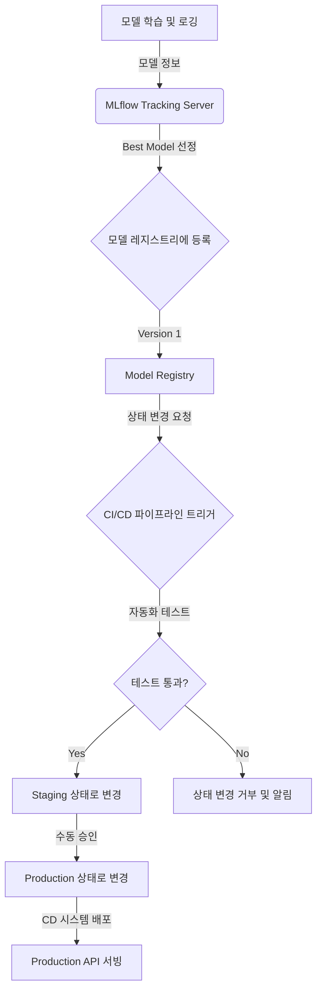

# 모델 레지스트리 및 버전 관리

## 1. 핵심 개념 (Core Concept)

모델 레지스트리는 학습된 머신러닝 모델의 생명주기를 중앙에서 관리하고 추적하는 시스템임. 모델의 버전을 관리하고, 각 버전에 대한 메타데이터(학습 데이터, 파라미터, 성능 지표 등)를 저장하며, 모델의 상태(Staging, Production, Archived)를 관리하여 체계적이고 안정적인 모델 배포 및 관리를 지원함.

---

## 2. 상세 설명 (Detailed Explanation)

### 2.1 모델 레지스트리의 주요 기능

-   **모델 버전 관리**: 동일한 모델의 여러 버전을 등록하고, 각 버전의 차이점을 추적함.
-   **메타데이터 저장소**: 각 모델 버전을 생성하는 데 사용된 소스 코드, 학습 데이터 버전, 하이퍼파라미터, 평가 지표 등을 저장하여 완전한 재현성을 보장함.
-   **모델 스테이지 관리**: 모델을 `Staging`, `Production`, `Archived` 와 같은 단계로 나누어 관리하며, 각 단계 간의 전환을 통제함. 이를 통해 검증된 모델만 프로덕션에 배포할 수 있음.
-   **API 제공**: CI/CD 파이프라인이나 다른 애플리케이션에서 프로그래밍 방식으로 모델을 등록하고, 특정 버전의 모델을 가져올 수 있는 API를 제공함.

### 2.2 모델 레지스트리 워크플로우



1.  **모델 학습 및 로깅**: 실험 과정에서 생성된 모델의 파라미터, 성능 지표, 아티팩트 등을 `MLflow Tracking`과 같은 도구를 사용해 기록함.
2.  **모델 등록**: 여러 실험 중 가장 성능이 좋은 모델을 선정하여 모델 레지스트리에 새로운 버전으로 등록함.
3.  **스테이지 전환 요청**: 등록된 모델(`Version 1`)을 `Staging` 환경으로 배포하기 위해 상태 변경을 요청함.
4.  **자동화된 검증**: 상태 변경 요청은 CI/CD 파이프라인을 트리거하여 해당 모델 버전에 대한 추가적인 통합 테스트나 섀도우 테스트를 수행함.
5.  **승인 및 배포**: 모든 검증을 통과하면, 담당자가 최종 승인을 통해 모델의 상태를 `Production`으로 변경하고, CD 시스템은 이를 감지하여 실제 서빙 환경에 해당 버전의 모델을 배포함.

### 2.3 대표적인 도구: MLflow & SageMaker

| 기능 | MLflow | Amazon SageMaker Model Registry |
| :--- | :--- | :--- |
| **개요** | 오픈소스 플랫폼으로, 클라우드에 구애받지 않고 유연하게 구축 가능. | AWS 생태계에 완전히 통합된 완전 관리형 서비스. |
| **주요 특징** | - `Tracking`, `Projects`, `Models`, `Registry` 4개 컴포넌트로 구성<br>- Python, R, Java 등 다양한 언어 지원<br>- 온프레미스, 모든 클라우드에서 사용 가능 | - SageMaker 파이프라인, IAM 등과 긴밀하게 연동<br>- 배포 승인 및 거부에 대한 추적 및 감사 기능 제공<br>- 데이터 리니지(Lineage) 추적 기능 강력 | 
| **사용 시나리오** | 멀티 클라우드 전략을 사용하거나 특정 벤더에 종속되고 싶지 않은 경우. | AWS를 주요 클라우드로 사용하며, 인프라 관리 부담 없이 MLOps를 구축하고 싶은 경우. |

---

## 3. 예시 (Example)

### 코드 예시 (MLflow)

```python
import mlflow
from sklearn.ensemble import RandomForestRegressor

# 1. MLflow Tracking 시작
mlflow.set_tracking_uri("http://localhost:5000")
mlflow.start_run(run_name="My RandomForest Run")

# 모델 학습
rf = RandomForestRegressor(n_estimators=100, max_depth=10)
rf.fit(X_train, y_train)

# 2. 모델 성능 및 파라미터 로깅
mlflow.log_param("n_estimators", 100)
mlflow.log_metric("rmse", 0.15)

# 3. 모델을 "sk-learn" flavor로 로깅하고 레지스트리에 등록
# registered_model_name: 레지스트리에 등록될 모델의 이름
mlflow.sklearn.log_model(
    sk_model=rf,
    artifact_path="random-forest-model",
    registered_model_name="house-price-predictor"
)

mlflow.end_run()

# 4. 특정 버전의 모델 로드 (애플리케이션에서 사용)
model_name = "house-price-predictor"
model_version = 1

# "models:/<model_name>/<version>" URI 사용
loaded_model = mlflow.pyfunc.load_model(
    model_uri=f"models:/{model_name}/{model_version}"
)

predictions = loaded_model.predict(new_data)
```

---

## 4. 예상 면접 질문 (Potential Interview Questions)

*   **Q. 모델 레지스트리를 사용하는 가장 큰 이유는 무엇인가요?**
    *   **A.** 모델의 생명주기를 체계적으로 관리하여 MLOps의 안정성과 효율성을 높이기 위함입니다. 레지스트리가 없다면 어떤 모델이 어디에 배포되었는지, 어떤 데이터로 학습되었는지 추적하기 어렵습니다. 모델 레지스트리는 모델의 버전, 성능, 상태(Staging, Production 등)를 중앙에서 관리함으로써, 검증된 모델만 안정적으로 배포하고 문제가 발생했을 때 빠르게 롤백하는 것을 가능하게 합니다.
*   **Q. 모델 레지스트리에서 모델의 "스테이지(Stage)"를 구분하여 관리하는 것이 왜 중요한가요?**
    *   **A.** 모델의 배포 파이프라인에 대한 거버넌스와 통제를 제공하기 때문입니다. 예를 들어, `Staging` 단계에서는 모델이 프로덕션에 배포되기 전 최종 통합 테스트나 A/B 테스트를 거치게 할 수 있습니다. `Production` 단계는 실제 서비스 중인 모델을 의미하며, `Archived` 단계는 더 이상 사용되지 않는 모델을 보관하는 용도입니다. 이처럼 스테이지를 구분하면 각 환경에 맞는 검증 절차를 강제하고, 승인된 모델만 안전하게 배포할 수 있습니다.
*   **Q. MLflow와 같은 오픈소스 도구 대신 SageMaker와 같은 클라우드 관리형 서비스를 사용하는 것의 장단점은 무엇인가요?**
    *   **A.** 장점은 AWS의 다른 서비스(S3, IAM, SageMaker Pipelines 등)와 완벽하게 통합되어 있어 MLOps 파이프라인을 빠르고 쉽게 구축할 수 있고, 인프라 관리에 대한 부담이 적다는 것입니다. 단점은 특정 클라우드 벤더(AWS)에 종속될 수 있다는 점과, 세밀한 커스터마이징이나 다른 클라우드와의 연동 측면에서 유연성이 떨어질 수 있다는 것입니다.

---

## 5. 더 읽어보기 (Further Reading)

*   [MLflow Models Documentation](https://mlflow.org/docs/latest/models.html)
*   [Amazon SageMaker Model Registry Documentation](https://docs.aws.amazon.com/sagemaker/latest/dg/model-registry.html)
*   [Databricks: What is a Model Registry?](https://www.databricks.com/glossary/model-registry)