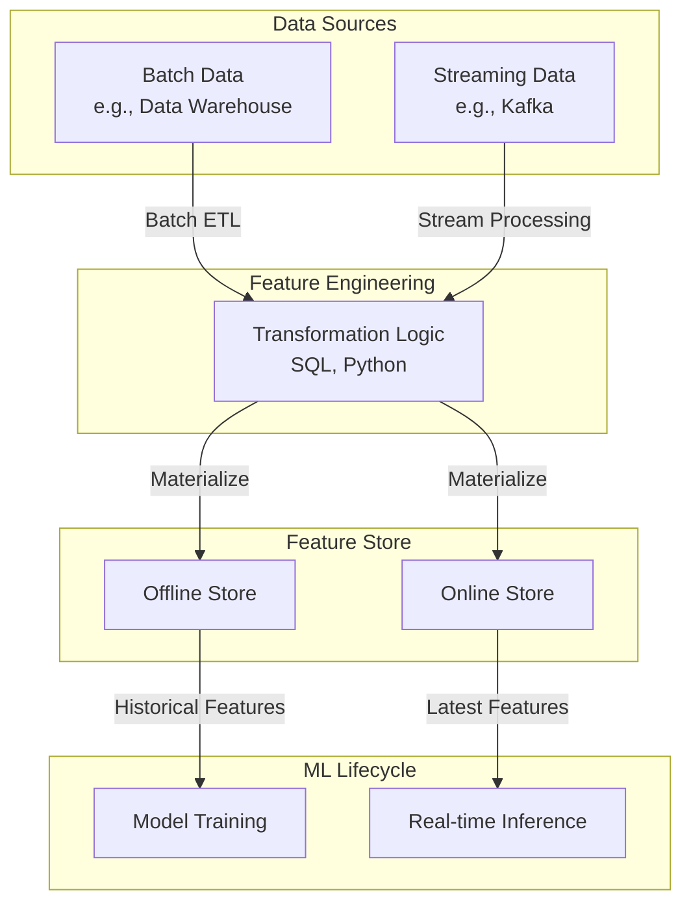

# 오프라인 vs 온라인 피처 스토어

## 1. 핵심 개념 (Core Concept)

피처 스토어는 사용 목적에 따라 오프라인 스토어(Offline Store)와 온라인 스토어(Online Store)로 나뉨. 오프라인 스토어는 대용량의 과거 피처 데이터를 저장하여 모델 학습 및 분석에 사용되고, 온라인 스토어는 실시간 추론을 위해 최신 피처 값을 낮은 지연 시간(Low Latency)으로 제공하는 데 사용됨. 이 둘을 함께 사용하여 학습-서빙 스큐를 방지하고 일관성 있는 ML 시스템을 구축함.

---

## 2. 상세 설명 (Detailed Explanation)

### 2.1 피처 스토어 아키텍처

일반적인 피처 스토어는 데이터 소스, 피처 변환, 그리고 오프라인/온라인 스토어로 구성됨.

### 2.2 오프라인 스토어 (Offline Store)

*   **목적**: 모델 학습, 피처 탐색 및 분석, 새로운 피처 개발.
*   **저장 데이터**: 전체 이력 데이터 (수개월 ~ 수년 분량의 대용량 피처).
*   **주요 특징**:
    *   **대용량 저장**: 페타바이트(PB) 규모의 데이터를 저장할 수 있도록 설계됨.
    *   **높은 처리량(High Throughput)**: 대규모 데이터 스캔 및 조인 연산에 최적화됨.
    *   **Point-in-Time 조회**: 특정 시점 기준으로 정확한 피처를 조회하여 학습 데이터셋을 생성.
*   **기술 스택**: `Snowflake`, `Google BigQuery`, `Amazon Redshift`, `Apache Hive` 등 데이터 웨어하우스나 데이터 레이크 기술 사용.

### 2.3 온라인 스토어 (Online Store)

*   **목적**: 실시간 모델 추론(Inference) 시 피처 제공.
*   **저장 데이터**: 각 엔티티(Entity)에 대한 최신 피처 값.
*   **주요 특징**:
    *   **낮은 지연 시간(Low Latency)**: 밀리초(ms) 단위의 빠른 응답 속도로 피처를 조회할 수 있어야 함.
    *   **높은 동시성(High Concurrency)**: 다수의 실시간 예측 요청을 동시에 처리할 수 있어야 함.
    *   **Key-Value 조회**: 주로 엔티티 ID(Key)를 통해 피처(Value)를 조회하는 방식에 최적화됨.
*   **기술 스택**: `Redis`, `Amazon DynamoDB`, `Google Cloud Firestore`, `Cassandra` 등 고성능 Key-Value 저장소 사용.

### 2.4 비교 요약

| 구분 | 오프라인 스토어 (Offline Store) | 온라인 스토어 (Online Store) |
| :--- | :--- | :--- |
| **주요 용도** | 모델 학습, 피처 분석, 배치 예측 | 실시간 예측 (온라인 추론) |
| **데이터** | 대용량 과거 데이터 (Historical Data) | 최신 피처 값 (Latest Values) |
| **요구사항** | 높은 처리량 (High Throughput) | 낮은 지연 시간 (Low Latency), 높은 동시성 |
| **핵심 기능** | Point-in-Time Join | Key-Value Lookup |
| **대표 기술** | BigQuery, Snowflake, Hive | Redis, DynamoDB, Cassandra |

---

## 3. 예시 (Example)

### 시나리오: 금융 사기 탐지 시스템

*   **피처**: `user_id`를 엔티티로 하여, `지난 1시간 동안의 거래 횟수`, `지난 24시간 동안의 평균 거래 금액` 등의 피처를 정의.

1.  **피처 계산 및 저장**:
    *   **배치 파이프라인**: 매일 한 번씩 전체 거래 내역을 분석하여 과거 피처를 계산하고 **오프라인 스토어(BigQuery)**에 저장.
    *   **스트리밍 파이프라인**: 새로운 거래가 발생할 때마다 실시간으로 피처를 업데이트하여 **온라인 스토어(Redis)**에 저장.

2.  **모델 학습 (오프라인)**:
    *   데이터 과학자는 **오프라인 스토어**에 접근하여 지난 1년간의 사기 거래 데이터를 포함한 학습 데이터셋을 생성.
    *   이때, Point-in-Time Join을 사용하여 각 거래가 발생한 시점의 정확한 피처 값을 가져옴.
    *   생성된 학습 데이터셋으로 사기 탐지 모델을 학습.

3.  **실시간 추론 (온라인)**:
    *   사용자가 결제를 시도하면, API 서버는 `user_id`를 가지고 **온라인 스토어**에 피처를 요청.
    *   온라인 스토어는 밀리초 내에 해당 사용자의 최신 피처(`지난 1시간 거래 횟수` 등)를 반환.
    *   API 서버는 이 피처를 모델에 입력하여 사기 여부를 예측하고 결과를 사용자에게 반환.

---

## 4. 예상 면접 질문 (Potential Interview Questions)

*   **Q. 피처 스토어에서 오프라인 스토어와 온라인 스토어를 분리하는 이유는 무엇인가요?**
    *   **A.** 두 스토어의 요구사항이 근본적으로 다르기 때문입니다. 오프라인 스토어는 모델 학습을 위해 대용량의 데이터를 효율적으로 처리하는 높은 처리량(High Throughput)이 중요합니다. 반면, 온라인 스토어는 실시간 서빙을 위해 매우 빠른 응답 속도(Low Latency)와 높은 동시성(High Concurrency)이 필수적입니다. 이처럼 상이한 요구사항을 만족시키기 위해 각 용도에 최적화된 별도의 저장 기술(예: 오프라인은 BigQuery, 온라인은 Redis)을 사용하여 시스템을 구성하는 것입니다.
*   **Q. 학습-서빙 스큐(Training-Serving Skew)를 방지하기 위해 오프라인/온라인 스토어가 어떻게 기여하나요?**
    *   **A.** 동일한 피처 엔지니어링 로직을 통해 계산된 결과를 각각 오프라인 스토어와 온라인 스토어에 저장함으로써 기여합니다. 즉, 모델을 학습시킬 때 사용한 피처(오프라인 스토어에서 가져옴)와 실시간 예측에 사용하는 피처(온라인 스토어에서 가져옴)가 동일한 소스와 계산 로직에서 나왔음을 보장합니다. 이를 통해 학습 시점과 서빙 시점의 피처 값이 일관성을 유지하게 되어 스큐 문제를 해결할 수 있습니다.
*   **Q. 온라인 피처 스토어를 구현할 때 어떤 데이터베이스 기술을 선택하겠으며, 그 이유는 무엇인가요?**
    *   **A.** 주로 Redis나 DynamoDB와 같은 Key-Value 저장소를 선택하겠습니다. 그 이유는 온라인 스토어의 핵심 요구사항인 낮은 지연 시간과 높은 동시성을 만족시키기 위함입니다. 이러한 저장소들은 특정 키(예: 사용자 ID)에 대한 값을 매우 빠르게 조회하는 데 최적화되어 있어, 수많은 실시간 예측 요청을 지연 없이 처리해야 하는 모델 서빙 환경에 가장 적합합니다.

---

## 5. 더 읽어보기 (Further Reading)

*   [Online vs. Offline Feature Stores (Feast Docs)](https://docs.feast.dev/getting-started/concepts/online-vs-offline)
*   [The Architecture of a Feature Store (Tecton Blog)](https://www.tecton.ai/blog/the-architecture-of-a-feature-store/)