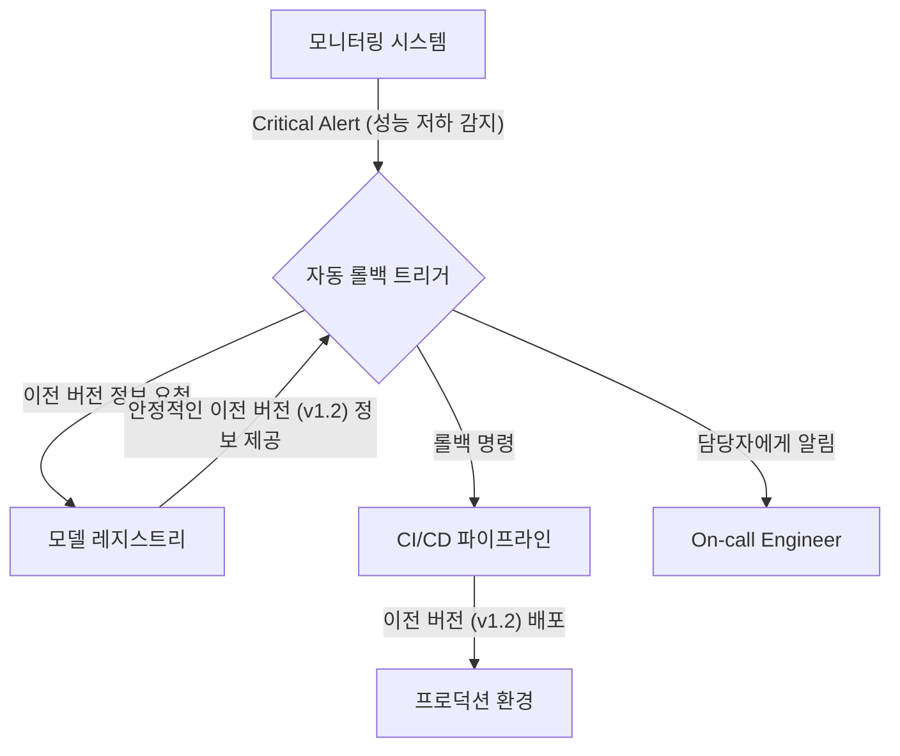

# ML 모니터링과 알림 및 롤백 정책

## 1. 핵심 개념 (Core Concept)

ML 모니터링은 프로덕션 환경에서 운영 중인 모델의 성능과 안정성을 지속적으로 추적하는 활동임. 알림 및 롤백 정책은 모니터링 결과, 사전에 정의된 임계치를 벗어나는 이상 현상(예: 성능 저하, 데이터 드리프트)이 감지되었을 때, 이를 담당자에게 신속히 알리고 시스템을 안정적인 이전 상태로 되돌리는 자동화된 대응 절차를 의미함. 이는 ML 시스템의 신뢰성과 비즈니스 연속성을 보장하는 데 필수적임.

---

## 2. 상세 설명 (Detailed Explanation)

### 2.1 모니터링 대상

안정적인 ML 시스템 운영을 위해서는 모델 성능뿐만 아니라 시스템의 여러 측면을 종합적으로 모니터링해야 함.

| 모니터링 영역 | 주요 지표 | 설명 |
| :--- | :--- | :--- |
| **모델 성능** | 정확도, 정밀도, 재현율, F1-score, AUC 등 | 모델이 비즈니스 목표를 얼마나 잘 달성하고 있는지 측정. |
| **드리프트** | 데이터 드리프트(분포 변화), 컨셉 드리프트(관계 변화) | 모델 성능 저하의 근본 원인이 될 수 있는 데이터와 모델의 변화를 감지. |
| **운영 상태** | 예측 지연 시간(Latency), 처리량(Throughput), 에러율 | 모델 서빙 시스템 자체의 기술적인 상태를 확인. |
| **데이터 품질** | 결측치 비율, 스키마 변경, 데이터 유효성 | 모델에 입력되는 데이터의 품질이 일관성 있게 유지되는지 확인. |

### 2.2 효과적인 알림(Alerting) 전략

알림은 단순히 문제를 알리는 것을 넘어, 실행 가능한(Actionable) 정보를 제공해야 함. '알림 피로(Alert Fatigue)'를 방지하고 신속한 대응을 유도하는 것이 중요.

*   **심각도 등급화 (Tiered Severity)**: 알림을 `Critical`, `Warning`, `Info` 등 심각도에 따라 등급화하여 대응의 우선순위를 정함.
    *   `Critical`: 즉각적인 자동 롤백 트리거 (예: 모델 정확도 20% 급락).
    *   `Warning`: 근무 시간 내에 담당자에게 티켓 생성 및 알림 (예: 데이터 드리프트 지수 임계치 초과).
*   **정적/동적 임계치 설정**: 고정된 값(예: 에러율 > 5%)을 사용하는 정적 임계치와 더불어, 통계적 기법(예: 3-sigma)이나 이상 탐지 알고리즘을 활용하여 평소와 다른 패턴을 감지하는 동적 임계치를 함께 사용.
*   **통합 알림 채널**: PagerDuty, Opsgenie 등 인시던트 관리 도구와 Slack, 이메일 등 커뮤니케이션 채널을 통합하여 알림을 중앙에서 관리하고 담당자에게 신속히 전파.

### 2.3 자동화된 롤백(Rollback) 정책

롤백은 문제가 발생한 모델을 이전의 안정적인 버전으로 신속하게 되돌리는 최후의 보루임. 롤백 절차는 최대한 자동화되어야 함.

*   **롤백 트리거 조건**: 롤백이 실행될 명확한 조건을 사전에 정의. (예: `Critical` 등급의 알림 발생 시)
*   **버전 관리**: 모델 레지스트리를 통해 모든 모델 버전을 관리하고, 각 버전을 `stable`, `canary` 등으로 태깅하여 롤백할 대상을 명확히 함.
*   **자동화된 파이프라인**: CI/CD 파이프라인이 롤백 트리거를 받으면, 모델 레지스트리에서 지정된 이전 버전의 모델을 가져와 프로덕션 환경에 자동으로 재배포하도록 구성.
*   **Canary/Blue-Green 배포 활용**: 신규 모델 배포 시 Canary나 Blue-Green 전략을 사용하면, 문제 발생 시 트래픽을 즉시 구버전으로 전환할 수 있어 롤백을 더 빠르고 안전하게 수행할 수 있음.

---

## 3. 예시 (Example)

### 시나리오: 추천 모델의 성능 저하에 따른 자동 롤백

1.  **상황**: 새로 배포된 추천 모델 `v2.1`의 클릭률(CTR)이 급격히 감소하기 시작.
2.  **모니터링 및 알림**:
    *   모니터링 시스템(e.g., Grafana, Prometheus)이 `v2.1` 모델의 CTR이 지난 1시간 평균 대비 30% 하락한 것을 감지.
    *   이 값은 사전에 정의된 `Critical` 임계치를 초과하여, PagerDuty로 자동 롤백 파이프라인을 트리거하고 ML 엔지니어링 팀의 Slack 채널에 알림을 보냄.
3.  **자동 롤백 실행**:
    *   트리거된 CI/CD 파이프라인(e.g., Jenkins, GitHub Actions)은 모델 레지스트리(e.g., MLflow)에 마지막으로 `stable` 태그가 붙었던 `v2.0` 모델을 조회.
    *   파이프라인은 `v2.0` 모델 아티팩트를 가져와 프로덕션 서빙 환경에 재배포함.
4.  **후속 조치**:
    *   시스템은 몇 분 내에 안정적인 `v2.0` 버전으로 자동 복구됨.
    *   알림을 받은 엔지니어는 `v2.1` 모델의 성능 저하 원인을 분석하기 시작. (예: 특정 아이템에 대한 잘못된 추천 생성, 데이터 파이프라인 오류 등)

---

## 4. 예상 면접 질문 (Potential Interview Questions)

*   **Q. 효과적인 ML 모니터링 시스템을 구축하기 위해 어떤 지표들을 주로 확인해야 할까요?**
    *   **A.** 크게 네 가지 영역을 종합적으로 모니터링해야 합니다. 첫째, 정확도, F1-score 등 **모델 성능 지표**를 통해 비즈니스 목표 달성 여부를 확인합니다. 둘째, 데이터 및 컨셉 **드리프트 지표**를 통해 모델 성능 저하의 근본 원인을 추적합니다. 셋째, 지연 시간, 에러율 등 **운영 지표**를 통해 서빙 시스템의 안정성을 확인합니다. 마지막으로, 입력 데이터의 **품질 지표**(결측치, 스키마)를 모니터링하여 "Garbage in, garbage out"을 방지해야 합니다.
*   **Q. 모델 롤백 전략을 설계할 때 가장 중요하게 고려해야 할 점은 무엇인가요?**
    *   **A.** 가장 중요한 것은 **자동화**와 **명확한 트리거 조건**입니다. 문제 발생 시 사람이 개입하여 수동으로 롤백하는 것은 대응 시간을 지연시키고 더 큰 장애로 이어질 수 있습니다. 따라서 어떤 조건(예: 특정 성능 지표가 얼마 이하로 떨어지면)에서 롤백을 실행할지 명확하게 정의하고, 이 조건이 충족되었을 때 CI/CD 파이프라인을 통해 자동으로 이전 버전이 배포되도록 설계하는 것이 핵심입니다. 이를 위해 모델 레지스트리를 통한 철저한 버전 관리는 필수적입니다.
*   **Q. '알림 피로(Alert Fatigue)'란 무엇이며, 이를 방지하기 위한 방법은 무엇이 있을까요?**
    *   **A.** '알림 피로'는 너무 많거나 중요하지 않은 알림에 지속적으로 노출되어, 정작 중요한 알림에 둔감해지거나 대응하지 못하게 되는 현상을 말합니다. 이를 방지하기 위해서는 첫째, 알림의 **심각도를 등급화**(Critical, Warning 등)하여 우선순위를 부여해야 합니다. 둘째, 모든 알림은 **실행 가능한(Actionable)** 정보를 담고 있어야 하며, 구체적인 대응 절차(Playbook)와 연결되어야 합니다. 셋째, 단순 고정 임계치뿐만 아니라 이상 탐지 알고리즘을 도입하여 정말로 의미 있는 이상 패턴만 알림으로 받도록 개선할 수 있습니다.

---

## 5. 더 읽어보기 (Further Reading)

*   [Google Cloud: MLOps: Continuous delivery and automation pipelines in machine learning](https://cloud.google.com/architecture/mlops-continuous-delivery-and-automation-pipelines-in-machine-learning)
*   [Evidently AI: Open-source ML monitoring](https://www.evidentlyai.com/)
*   [NannyML: Open-source library for post-deployment model performance estimation](https://nannyml.com/)
*   [The MLOps Lifecycle: Model Deployment and Monitoring (Databricks Blog)](https://www.databricks.com/blog/2020/01/22/the-mlops-lifecycle-model-deployment-and-monitoring.html)