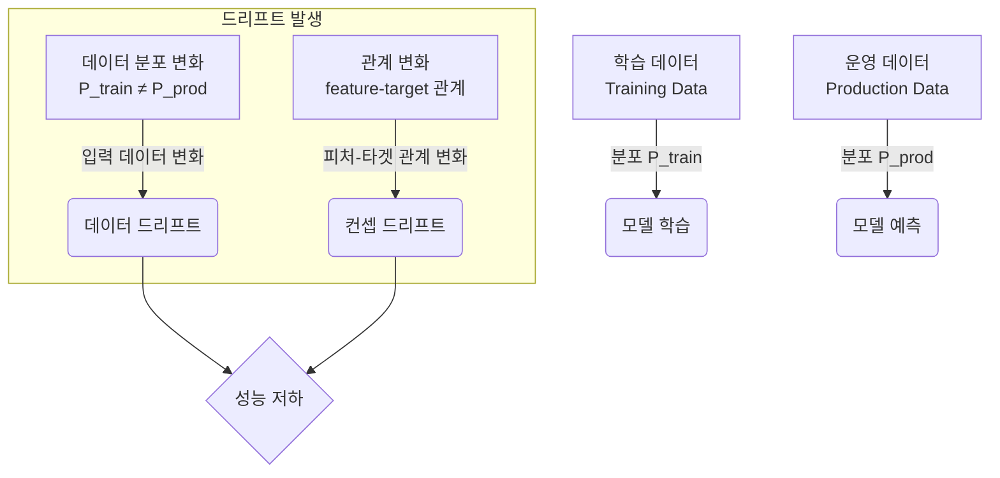

# 데이터 및 모델 드리프트 탐지

## 1. 핵심 개념 (Core Concept)

드리프트(Drift)는 시간이 지남에 따라 모델의 예측 성능이 저하되는 현상을 설명하는 용어임. **데이터 드리프트(Data Drift)**는 프로덕션 환경의 입력 데이터 분포가 학습 시점의 데이터 분포와 달라지는 것을 의미하며, **컨셉 드리프트(Concept Drift)**는 피처와 타겟 변수 간의 실제 관계가 변하는 것을 의미함. 이러한 드리프트를 탐지하고 대응하는 것은 ML 모델의 생명주기 관리에서 매우 중요함.

---

## 2. 상세 설명 (Detailed Explanation)

### 2.1 데이터 드리프트 (Data Drift)

데이터 드리프트는 모델 자체는 그대로지만, 입력되는 데이터의 특성이 변하여 발생하는 문제입니다. 예를 들어, 새로운 사용자 그룹이 유입되거나 외부 환경(계절, 경제 상황)이 변하는 경우 발생할 수 있습니다.

*   **탐지 방법**: 학습 데이터의 분포와 현재 데이터의 분포를 통계적으로 비교.
    *   **단변량(Univariate) 드리프트**: 개별 피처의 분포 변화를 측정.
        *   **연속형 변수**: 콜모고로프-스미르노프(Kolmogorov-Smirnov, K-S) 검정, 모집단 안정성 지수(Population Stability Index, PSI).
        *   **범주형 변수**: 카이제곱(Chi-Squared) 검정, PSI.
    *   **다변량(Multivariate) 드리프트**: 여러 피처 간의 상관관계나 전체 데이터 공간의 변화를 측정. (예: PCA 기반 방법, 적대적 검증)
*   **대응**: 데이터 전처리 로직을 수정하거나, 최신 데이터를 포함하여 모델을 재학습.

### 2.2 컨셉 드리프트 (Concept Drift)

컨셉 드리프트는 데이터의 분포는 동일하더라도, 피처와 정답(Label) 사이의 관계 자체가 변하는 더 근본적인 문제입니다. 예를 들어, 사용자의 선호도가 바뀌어 동일한 상품이라도 구매 여부가 달라지는 경우입니다. 컨셉 드리프트는 종종 **모델 드리프트(Model Drift)**와 동일한 의미로 사용됩니다.

*   **탐지 방법**: 정답(Ground Truth) 데이터가 수집된 후, 모델의 예측 성능을 지속적으로 모니터링하여 성능 저하를 직접 감지.
    *   정확도, F1-score, AUC 등 핵심 성능 지표가 특정 임계치 이하로 떨어지는지 확인.
*   **대응**: 모델 구조를 변경하거나, 새로운 관계를 학습할 수 있는 최신 데이터로 모델을 재학습 또는 재개발.

### 2.3 드리프트 유형 비교

| 구분 | 데이터 드리프트 (Data Drift) | 컨셉 드리프트 (Concept Drift) |
| :--- | :--- | :--- |
| **변화의 주체** | 입력 데이터(X)의 분포 P(X) | 피처와 타겟의 관계 P(y|X) |
| **예시** | 새로운 지역의 사용자가 유입되어 평균 연령대가 바뀜. | 경제 불황으로 인해 소득 수준과 소비 패턴의 관계가 바뀜. |
| **탐지 시점** | 예측 시점 (정답 없이 데이터만으로 가능) | 정답 수집 후 (모델 성능 측정 필요) |
| **주요 탐지 기법** | K-S 검정, PSI, 카이제곱 검정 | 정확도, AUC 등 성능 지표 모니터링 |



### 2.4 대표적인 드리프트 탐지 도구

*   **Evidently AI**: 데이터 드리프트, 컨셉 드리프트, 데이터 품질을 시각적으로 분석하는 리포트를 생성하는 오픈소스 라이브러리.
*   **NannyML**: 정답 데이터가 없는 상황에서도 모델 성능을 추정하고, 드리프트를 탐지하는 데 특화된 오픈소스 라이브러리.
*   **MLflow**: 모델 실험 추적 기능의 일부로, 학습된 모델과 함께 입력 데이터 스키마, 예시 등을 저장하여 드리프트 분석의 기반을 제공.
*   **클라우드 플랫폼**: Amazon SageMaker Model Monitor, Google Cloud Model Monitoring, Azure Machine Learning data drift detection 등 주요 클라우드 제공사들이 관리형 모니터링 서비스를 제공.

---

## 3. 예시 (Example)

### 코드 예시 (Evidently AI를 사용한 데이터 드리프트 탐지)

```python
import pandas as pd
from sklearn import datasets
from evidently.report import Report
from evidently.metric_preset import DataDriftPreset

# 데이터 로드 (학습 데이터와 현재 데이터 예시)
iris_data = datasets.load_iris(as_frame=True)
iris_frame = iris_data.frame

reference_data = iris_frame.iloc[:100] # 학습 데이터로 가정
current_data = iris_frame.iloc[100:]  # 현재 데이터로 가정 (분포가 다름)

# 드리프트 리포트 생성
data_drift_report = Report(metrics=[
    DataDriftPreset(),
])

data_drift_report.run(reference_data=reference_data, current_data=current_data)

# HTML 파일로 리포트 저장 및 확인
data_drift_report.save_html("iris_data_drift_report.html")
```

위 코드는 `reference_data`(학습 데이터)와 `current_data`(운영 데이터)의 분포를 비교하여 각 피처별 드리프트 여부, 분포 시각화 등을 포함한 HTML 리포트를 생성함.

---

## 4. 예상 면접 질문 (Potential Interview Questions)

*   **Q. 데이터 드리프트와 컨셉 드리프트의 차이점을 실제 예시를 들어 설명해주세요.**
    *   **A.** **데이터 드리프트**는 모델을 사용하는 사용자층이 바뀌는 것처럼 입력 데이터의 특성이 변하는 것입니다. 예를 들어, 학생을 대상으로 하던 대출 모델을 직장인에게 적용하기 시작하면, 소득, 나이 등의 데이터 분포가 달라지는데 이것이 데이터 드리프트입니다. **컨셉 드리프트**는 피처와 결과의 관계 자체가 변하는 것입니다. 예를 들어, 코로나19 이후로 사람들의 여행 패턴이 바뀌어, 이전에는 휴가철에 항공권 가격이 비쌌던 관계(피처-타겟 관계)가 더 이상 유효하지 않게 되는 것이 컨셉 드리프트입니다.
*   **Q. 정답(Ground Truth)을 실시간으로 얻기 어려운 서비스에서 모델 드리프트를 어떻게 탐지할 수 있을까요?**
    *   **A.** 정답이 없는 경우, 컨셉 드리프트를 직접 측정하기는 어렵습니다. 따라서 **데이터 드리프트**를 대리 지표(Proxy)로 활용하는 것이 현실적인 접근법입니다. 입력 데이터의 분포가 크게 변했다면, 모델 성능 또한 저하되었을 가능성이 높다고 가정하는 것입니다. K-S 검정이나 PSI 같은 통계적 기법으로 데이터 드리프트를 지속적으로 모니터링하고, 드리프트가 감지되면 모델 재평가나 재학습을 트리거할 수 있습니다. NannyML과 같은 라이브러리는 정답 없이도 모델 성능을 추정하는 알고리즘을 제공하여 이 문제를 해결하는 데 도움을 줍니다.
*   **Q. 데이터 드리프트가 발생했을 때, 가장 먼저 어떤 조치를 취해야 할까요?**
    *   **A.** 가장 먼저 **드리프트의 원인을 분석**해야 합니다. 드리프트가 발생한 피처가 무엇인지, 분포가 어떻게 변했는지, 비즈니스적으로 어떤 변화(예: 신규 마케팅 캠페인, 계절적 요인)와 관련이 있는지 파악하는 것이 중요합니다. 원인 분석 후, 간단한 데이터 전처리 로직 수정(예: 스케일링 범위 변경)으로 해결될 문제인지, 아니면 변화된 데이터 분포를 반영하기 위한 모델 재학습이 필요한지 결정해야 합니다. 무조건적인 재학습이 항상 정답은 아니며, 비용과 효과를 고려한 판단이 필요합니다.

---

## 5. 더 읽어보기 (Further Reading)

*   [Evidently AI Documentation](https://docs.evidentlyai.com/)
*   [What is Data Drift and How to Detect It (AWS Blog)](https://aws.amazon.com/what-is/data-drift/)
*   [A Guide to Data and Concept Drift (NannyML Blog)](https://nannyml.com/blog/a-guide-to-data-and-concept-drift)