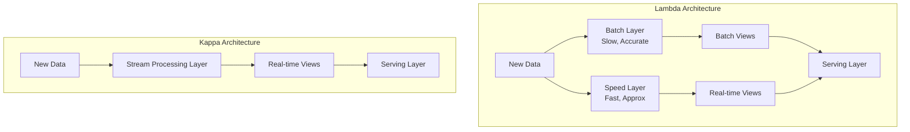

# 데이터 아키텍처: Lambda, Kappa 그리고 그 너머

## 1. 핵심 개념 (Core Concept)

데이터 아키텍처는 대용량 데이터를 처리하고 분석하기 위한 시스템의 청사진임. **람다(Lambda) 아키텍처**는 배치(Batch)와 스트리밍(Streaming) 처리를 모두 사용하는 하이브리드 접근 방식이며, **카파(Kappa) 아키텍처**는 모든 것을 스트림으로 처리하여 시스템을 단순화한 방식임. 2025년 현재, 이러한 논의는 \*\*데이터 레이크하우스(Data Lakehouse)\*\*와 \*\*데이터 메시(Data Mesh)\*\*라는 더 큰 패러다임으로 확장되어 데이터 관리의 중앙화와 분산화에 대한 논의로 발전함.

______________________________________________________________________

## 2. 상세 설명 (Detailed Explanation)

### 2.1 전통적인 아키텍처: Lambda vs. Kappa

| 구분              | 람다(Lambda) 아키텍처                                                                       | 카파(Kappa) 아키텍처                                                                   |
| :---------------- | :------------------------------------------------------------------------------------------ | :------------------------------------------------------------------------------------- |
| **핵심 아이디어** | 배치 레이어(정확성)와 스피드 레이어(실시간성)를 분리하여 두 마리 토끼를 모두 잡으려는 시도. | 모든 데이터를 스트림으로 보고, 하나의 스트림 처리 파이프라인으로 통일하여 단순성 추구. |
| **장점**          | - 대용량 데이터의 정확한 처리 보장 - 실시간 쿼리 지원                                    | - 아키텍처 단순 - 개발 및 유지보수 비용 절감                                        |
| **단점**          | - 두 개의 파이프라인을 유지해야 하므로 복잡성이 높고 비용이 많이 듦.                        | - 과거 데이터 전체에 대한 복잡한 재처리(reprocessing)가 어려울 수 있음.                |

### 2.2 현대 데이터 아키텍처: Lakehouse vs. Mesh

2025년 현재, 데이터 아키텍처의 논의는 어떻게 데이터를 저장하고 소유권을 관리할 것인가로 확장됨.

- **데이터 레이크하우스 (Data Lakehouse)**: **중앙 집중화**의 현대적 접근. 데이터 레이크의 저비용 저장소와 유연성에 데이터 웨어하우스의 ACID 트랜잭션, 스키마 관리, 거버넌스 기능을 결합한 형태. 모든 데이터를 단일 플랫폼에 저장하여 '단일 진실 공급원(Single Source of Truth)'을 구축하고, 데이터 사일로(silo) 문제를 해결하는 것을 목표로 함. (예: Databricks, Snowflake)

- **데이터 메시 (Data Mesh)**: **분산화**를 통한 민첩성 확보. 데이터를 중앙에서 관리하는 대신, 각 비즈니스 도메인(예: 마케팅, 재무)이 데이터의 소유권을 갖고, 다른 팀이 쉽게 사용할 수 있도록 '제품으로서의 데이터(Data as a Product)'를 제공하는 조직적, 기술적 패러다임. 중앙 팀의 병목 현상을 해결하고, 각 도메인의 전문성을 활용하여 데이터 품질과 확장성을 높이는 것을 목표로 함.

### 2.3 아키텍처의 진화

과거의 람다/카파 논쟁이 \*\*"어떻게 처리할 것인가"\*\*에 대한 것이었다면, 현대의 레이크하우스/메시 논쟁은 \*\*"어떻게 관리하고 소유할 것인가"\*\*에 대한 논의로 볼 수 있음. 최근에는 이 두 개념을 결합하여, 중앙화된 **데이터 레이크하우스를 기술적 기반으로 삼고, 데이터 메시의 운영 원칙을 적용**하여 각 도메인이 데이터를 관리하고 제공하는 하이브리드 모델이 주목받고 있음.

______________________________________________________________________

## 3. 예시 (Example)

### 사용 사례

- **람다 아키텍처**: 은행의 사기 탐지 시스템. 대부분의 거래는 배치 레이어에서 정확하게 분석하지만, 현재 발생하는 거래는 스피드 레이어에서 빠르게 분석하여 즉각적인 대응이 가능하도록 함.
- **카파 아키텍처**: 실시간 사용자 활동 로그 분석. 웹사이트나 앱에서 발생하는 모든 사용자 클릭, 조회 이벤트를 하나의 스트림으로 처리하여 실시간 대시보드를 업데이트.
- **데이터 레이크하우스**: 한 회사 내의 모든 부서(영업, 마케팅, 재무)의 데이터를 중앙 Databricks 플랫폼에 모아 전사적인 BI 리포트를 생성하고, 데이터 과학자들이 자유롭게 데이터를 분석하여 ML 모델을 개발.
- **데이터 메시**: 대규모 이커머스 기업에서 '주문 도메인', '상품 도메인', '사용자 도메인' 팀이 각자 자신들의 데이터를 관리하고, 다른 팀이 사용할 수 있도록 잘 정의된 API 형태로 데이터를 제공.

______________________________________________________________________

## 4. 예상 면접 질문 (Potential Interview Questions)

- **Q. 람다 아키텍처의 가장 큰 단점은 무엇이며, 카파 아키텍처는 이를 어떻게 해결했나요?**
  - **A.** 람다 아키텍처의 가장 큰 단점은 배치와 스피드, 두 개의 개별적인 파이프라인을 개발하고 유지보수해야 한다는 **복잡성**과 **비용**입니다. 동일한 비즈니스 로직을 두 번 구현해야 할 수도 있습니다. 카파 아키텍처는 모든 데이터를 스트림으로 간주하고 단 하나의 스트림 처리 파이프라인만을 사용함으로써 이러한 복잡성을 해결했습니다. 스트림 처리 기술의 발전으로 과거 데이터에 대한 재처리도 스트림 파이프라인 내에서 가능해지면서, 아키텍처를 훨씬 단순하고 비용 효율적으로 만들었습니다.
- **Q. 데이터 레이크하우스가 전통적인 데이터 웨어하우스와 데이터 레이크에 비해 갖는 장점은 무엇인가요?**
  - **A.** 데이터 레이크하우스는 두 아키텍처의 장점을 결합했습니다. 데이터 레이크처럼 **비정형/반정형 데이터를 포함한 모든 종류의 데이터를 저렴한 비용으로 저장**할 수 있는 유연성을 가지면서도, 데이터 웨어하우스처럼 **ACID 트랜잭션, 스키마 관리, 데이터 거버넌스, 고성능 SQL 쿼리** 기능을 제공합니다. 이를 통해 과거처럼 데이터 레이크와 웨어하우스를 별도로 구축하고 ETL로 데이터를 복제할 필요 없이, 단일 플랫폼에서 BI와 AI 워크로드를 모두 지원할 수 있다는 것이 가장 큰 장점입니다.
- **Q. 데이터 메시가 기술적인 해결책이라기보다는 조직적인 패러다임에 가깝다고 하는 이유는 무엇인가요?**
  - **A.** 데이터 메시는 특정 기술이나 도구를 지칭하는 것이 아니라, 데이터를 관리하고 소유하는 방식에 대한 조직적인 변화를 요구하기 때문입니다. 핵심은 중앙 데이터 팀이 모든 데이터를 통제하는 것이 아니라, 각 비즈니스 도메인이 데이터의 소유권을 갖고 책임지는 **분산된 데이터 소유권**입니다. 이를 위해서는 (1) 데이터를 제품처럼 다루는 문화, (2) 도메인 팀이 데이터를 쉽게 다룰 수 있는 셀프서비스 플랫폼, (3) 전체 데이터의 상호운용성을 보장하는 표준 및 거버넌스가 필요하며, 이는 기술뿐만 아니라 조직 구조와 문화의 근본적인 변화를 수반합니다.

______________________________________________________________________

## 5. 더 읽어보기 (Further Reading)

- [Martin Fowler: Data Lakehouse](https://martinfowler.com/articles/data-lakehouse.html)
- [Zhamak Dehghani: How to Move Beyond a Monolithic Data Lake to a Distributed Data Mesh](https://martinfowler.com/articles/data-mesh-principles.html)
- [Databricks: What is a Data Lakehouse?](https://www.databricks.com/glossary/data-lakehouse)
