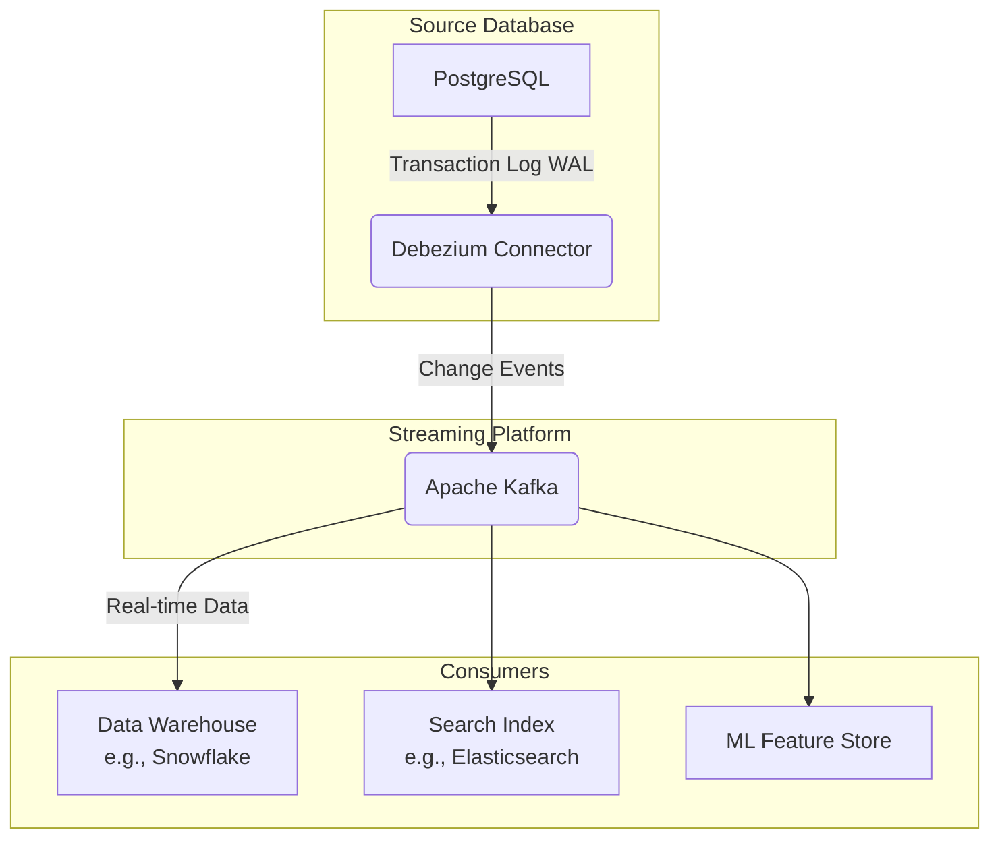

# 변경 데이터 캡처 (Change Data Capture, CDC)

## 1. 핵심 개념 (Core Concept)

변경 데이터 캡처(CDC)는 데이터베이스에서 발생한 변경(Insert, Update, Delete) 사항을 식별하고 추적하여, 다른 시스템으로 실시간에 가깝게 전파하는 기술임. 전체 데이터를 주기적으로 복제하는 배치(Batch) 방식과 달리, 변경된 내역만 증분(Incremental)으로 가져오기 때문에 원본 시스템의 부하를 최소화하면서 효율적이고 신속한 데이터 동기화를 가능하게 함.

---

## 2. 상세 설명 (Detailed Explanation)

### 2.1 CDC의 주요 구현 방식

| 방식 | 설명 | 장점 | 단점 |
| :--- | :--- | :--- | :--- |
| **로그 기반 (Log-based)** | 데이터베이스의 트랜잭션 로그(Transaction Log)를 직접 읽어 변경 내역을 캡처. | - 원본 DB 부하 거의 없음 - 변경 순서 보장 - 모든 변경(DML) 감지 | - 구현 복잡도 높음 - DB 내부 구조에 대한 이해 필요 |
| **트리거 기반 (Trigger-based)** | DB 테이블에 트리거(Trigger)를 생성하여, 데이터 변경 시 별도의 로그 테이블에 변경 내역을 기록. | - 구현이 비교적 용이 - 비즈니스 로직 추가 가능 | - 원본 DB에 부하 발생 - 트리거 관리 부담 |
| **쿼리 기반 (Query-based)** | 테이블의 `updated_at` 같은 타임스탬프 컬럼이나 버전 번호를 주기적으로 쿼리하여 변경된 행을 식별. | - 구현이 가장 간단함 | - 원본 DB에 주기적 부하 - 삭제(Delete) 감지 어려움 - 실시간성 떨어짐 |

2025년 현재, **로그 기반 CDC**가 원본 시스템에 미치는 영향을 최소화하고 모든 변경 내역을 정확하게 포착할 수 있어 현대적인 데이터 아키텍처의 표준으로 자리 잡고 있음.

### 2.2 CDC 아키텍처 예시 (Debezium + Kafka)

1.  **Debezium 커넥터**가 PostgreSQL 데이터베이스의 WAL(Write-Ahead Log)을 실시간으로 읽음.
2.  Debezium은 변경된 데이터를 표준화된 JSON 또는 Avro 형식의 **변경 이벤트(Change Event)**로 변환하여 **Apache Kafka** 토픽으로 전송.
3.  데이터 웨어하우스, 검색 엔진, ML 피처 스토어 등 다양한 **소비자(Consumer)** 시스템들이 Kafka 토픽을 구독하여 변경된 데이터를 실시간으로 받아 각자의 시스템에 반영.

---

## 3. 예시 (Example)

### 사용 사례

*   **실시간 데이터 웨어하우스(DWH) 동기화**: 운영 데이터베이스(OLTP)의 변경 내역을 거의 실시간으로 분석용 데이터 웨어하우스(OLAP)에 반영하여, 항상 최신 데이터 기반의 BI 리포트와 대시보드를 제공.
*   **마이크로서비스 데이터 동기화**: 마이크로서비스 아키텍처에서 각 서비스가 소유한 데이터베이스 간의 데이터 정합성을 유지하기 위해 사용. (예: '주문' 서비스의 DB 변경을 '배송' 서비스 DB에 전파)
*   **검색 엔진 인덱싱**: 데이터베이스의 상품 정보가 변경될 때마다 실시간으로 Elasticsearch와 같은 검색 엔진의 인덱스를 업데이트하여 최신 정보를 검색 결과에 노출.
*   **캐시 무효화(Cache Invalidation)**: 데이터베이스의 원본 데이터가 변경되면, 관련 캐시(e.g., Redis)를 찾아 자동으로 무효화하거나 업데이트하여 데이터 불일치를 방지.

---

## 4. 예상 면접 질문 (Potential Interview Questions)

*   **Q. CDC가 전통적인 배치(Batch) 데이터 전송 방식에 비해 갖는 장점은 무엇인가요?**
    *   **A.** 가장 큰 장점은 **실시간성**과 **효율성**입니다. 배치 방식은 정해진 시간에 전체 데이터를 복사하므로 데이터 지연이 발생하고 원본 시스템에 큰 부하를 줍니다. 반면, CDC는 변경된 데이터만 증분으로 가져오기 때문에 거의 실시간으로 데이터를 동기화할 수 있으며, 원본 데이터베이스에 주는 부하가 훨씬 적습니다. 이를 통해 항상 최신 데이터를 기반으로 한 분석과 의사결정이 가능해집니다.
*   **Q. 여러 CDC 구현 방식 중 로그 기반 CDC가 가장 선호되는 이유는 무엇인가요?**
    *   **A.** 로그 기반 CDC는 **원본 데이터베이스에 미치는 영향을 최소화**하면서도 **모든 변경 내역을 빠짐없이, 순서대로** 잡아낼 수 있기 때문입니다. 데이터베이스의 트랜잭션 로그는 데이터 변경에 대한 가장 정확한 기록이며, 이를 직접 읽기 때문에 애플리케이션이나 테이블 스키마를 변경할 필요가 없습니다. 트리거 방식처럼 추가적인 부하를 주거나, 쿼리 방식처럼 삭제(Delete) 연산을 놓칠 위험이 없어 가장 안정적이고 신뢰할 수 있는 방법으로 평가받습니다.
*   **Q. CDC를 사용하여 마이크로서비스 아키텍처의 데이터 일관성을 어떻게 유지할 수 있는지 설명해주세요.**
    *   **A.** 마이크로서비스 아키텍처에서는 각 서비스가 자체 데이터베이스를 소유하기 때문에 서비스 간 데이터 정합성을 맞추는 것이 중요합니다. 이때 CDC를 'Outbox Pattern'과 함께 사용할 수 있습니다. 예를 들어, '주문 서비스'가 주문을 생성하면 자신의 DB에 주문 정보를 저장하고, 동시에 외부에 발행할 이벤트(예: `order_created`)를 같은 DB 내의 'outbox' 테이블에 저장합니다. CDC 도구(Debezium 등)가 이 outbox 테이블의 변경을 감지하여 Kafka 같은 메시지 브로커로 이벤트를 발행하면, '배송 서비스'나 '재고 서비스'가 이 이벤트를 구독하여 자신의 DB를 업데이트하는 방식으로 최종적 일관성(Eventual Consistency)을 맞출 수 있습니다.

---

## 5. 더 읽어보기 (Further Reading)

*   [Debezium Official Documentation](https://debezium.io/documentation/reference/stable/)
*   [Change Data Capture (CDC): What It Is and How It Works (AWS Blog)](https://aws.amazon.com/blogs/database/change-data-capture-cdc-what-it-is-and-how-it-works/)
*   [The Outbox Pattern (Chris Richardson's Blog)](https://microservices.io/patterns/data/transactional-outbox.html)