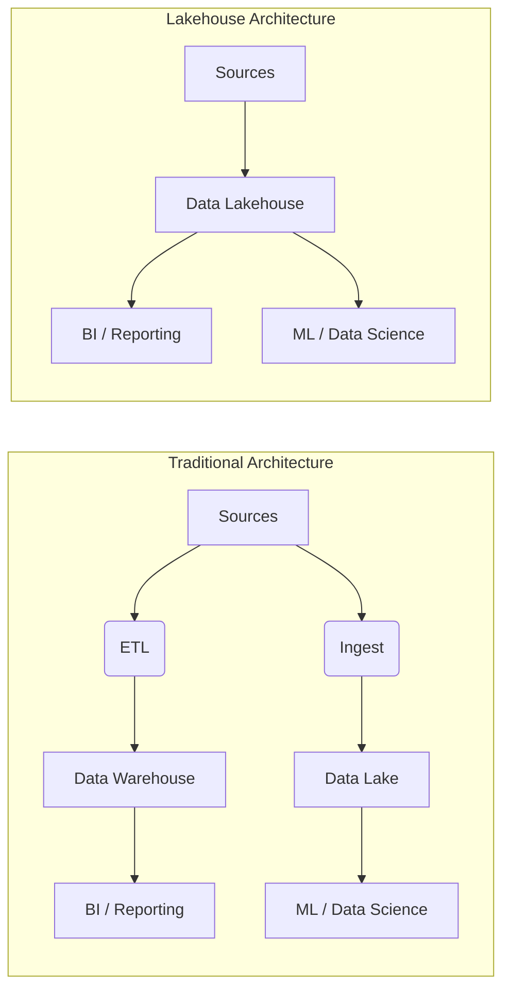

# 데이터 저장소의 진화: 웨어하우스, 레이크, 레이크하우스

## 1. 핵심 개념 (Core Concept)

데이터 저장 및 분석 아키텍처는 비즈니스 요구사항과 기술의 발전에 따라 진화해왔음. **데이터 웨어하우스**는 정형 데이터를 BI(비즈니스 인텔리전스) 분석에 활용하기 위해 등장했고, **데이터 레이크**는 모든 형태의 원시 데이터를 저장하여 ML(머신러닝)과 데이터 과학에 활용하기 위해 등장함. **데이터 레이크하우스**는 이 둘의 장점을 결합한 현대적인 아키텍처로, 단일 플랫폼에서 BI와 AI 워크로드를 모두 지원하는 것을 목표로 함.

---

## 2. 상세 설명 (Detailed Explanation)

### 2.1 데이터 웨어하우스 (Data Warehouse)

*   **목적**: 비즈니스 의사결정 지원 (BI, 리포팅).
*   **데이터**: 주로 정형 데이터(Structured Data). 사전에 정의된 스키마(Schema-on-Write)에 따라 잘 정제된 데이터를 저장.
*   **장점**: 데이터 품질과 일관성이 높고, SQL 쿼리 성능이 매우 빠름.
*   **단점**: 비정형 데이터 처리가 어렵고, 스키마 변경이 비유연하며, 스토리지 및 컴퓨팅 비용이 높음.

### 2.2 데이터 레이크 (Data Lake)

*   **목적**: 데이터 과학 및 머신러닝 모델 개발.
*   **데이터**: 정형, 반정형, 비정형 등 모든 형태의 원시 데이터(Raw Data)를 그대로 저장. 데이터를 사용할 때 스키마를 정의(Schema-on-Read).
*   **장점**: 유연성과 확장성이 높고, 저렴한 객체 스토리지(Object Storage)를 사용하여 비용 효율적임.
*   **단점**: 데이터 거버넌스 및 품질 관리가 없으면 데이터의 신뢰도가 떨어져 아무도 사용하지 않는 '데이터 늪(Data Swamp)'이 될 수 있음.

### 2.3 데이터 레이크하우스 (Data Lakehouse)

*   **목적**: 단일 플랫폼에서 BI와 AI 워크로드 모두 지원.
*   **핵심 아이디어**: 데이터 레이크의 저렴하고 유연한 스토리지 위에 데이터 웨어하우스의 핵심 기능(ACID 트랜잭션, 스키마 관리, 데이터 거버넌스)을 구현.
*   **장점**: 
    *   **통합 아키텍처**: 데이터 레이크와 웨어하우스를 별도로 유지할 필요가 없어 아키텍처가 단순해지고 데이터 중복이 사라짐.
    *   **비용 효율성**: 저렴한 객체 스토리지를 기반으로 하여 비용 효율적임.
    *   **다양한 워크로드 지원**: SQL 기반의 BI 쿼리부터 Python/R을 이용한 데이터 과학 및 ML까지 모두 지원.

---

## 3. 예시 (Example)

*   **데이터 웨어하우스**: 회사의 영업 실적, 재무 데이터 등 정형화된 데이터를 매일 밤 ETL 작업을 통해 적재하고, 경영진이 Tableau 같은 BI 툴을 통해 매출 대시보드를 조회하는 경우.
*   **데이터 레이크**: 사용자의 앱 클릭 로그, 웹사이트 이미지, 소셜 미디어 텍스트 등 다양한 형태의 데이터를 AWS S3에 그대로 쌓아두고, 데이터 과학자가 이 데이터를 탐색하여 사용자 이탈 예측 모델을 개발하는 경우.
*   **데이터 레이크하우스**: Databricks 플랫폼을 사용하여, 실시간으로 들어오는 IoT 센서 데이터(비정형)와 고객 관계 관리(CRM) 데이터(정형)를 Delta Lake에 함께 저장. 데이터 엔지니어는 SQL로 데이터 품질을 관리하고, 비즈니스 분석가는 BI 리포트를 만들며, 데이터 과학자는 동일한 데이터로 ML 모델을 학습시키는 경우.

---

## 4. 예상 면접 질문 (Potential Interview Questions)

*   **Q. 데이터 레이크가 '데이터 늪(Data Swamp)'이 되는 것을 방지하기 위한 방법은 무엇인가요?**
    *   **A.** 데이터 늪을 방지하기 위해서는 강력한 **데이터 거버넌스**가 필수적입니다. 구체적으로는 (1) **메타데이터 관리**: 데이터의 출처, 소유자, 스키마 정보 등을 담은 데이터 카탈로그를 구축하고, (2) **데이터 품질 관리**: 데이터 프로파일링 및 테스트를 통해 데이터의 정확성과 일관성을 지속적으로 검증하며, (3) **데이터 접근 제어**: 역할 기반으로 데이터에 대한 접근 권한을 명확히 관리해야 합니다. 데이터 레이크하우스 아키텍처는 이러한 거버넌스 기능들을 데이터 레이크에 적용하여 데이터 늪 문제를 해결하려는 시도라고 볼 수 있습니다.
*   **Q. 데이터 레이크하우스는 기존의 데이터 웨어하우스와 데이터 레이크를 완전히 대체할 수 있을까요?**
    *   **A.** 이론적으로는 대체 가능성을 목표로 하지만, 실제로는 워크로드의 특성에 따라 다릅니다. 데이터 레이크하우스는 BI와 AI 워크로드를 통합하는 데 매우 강력하지만, 수십 년간 발전해 온 데이터 웨어하우스의 초저지연 쿼리 성능이나 복잡한 BI 리포팅 기능을 완벽하게 따라잡지 못하는 경우도 있습니다. 따라서, 매우 높은 성능의 SQL 분석이 최우선인 조직은 여전히 데이터 웨어하우스를 핵심으로 사용할 수 있으며, 비정형 데이터 분석이 주인 조직은 데이터 레이크를 중심으로 아키텍처를 구성할 수 있습니다. 하지만 점차 많은 기업들이 두 시스템을 별도로 유지하는 복잡성을 줄이기 위해 레이크하우스 중심의 아키텍처로 이동하고 있습니다.
*   **Q. 스키마 온 라이트(Schema-on-Write)와 스키마 온 리드(Schema-on-Read)의 차이점과 각각의 장단점을 설명해주세요.**
    *   **A.** **스키마 온 라이트**는 데이터 웨어하우스 방식입니다. 데이터를 저장하기 전에 미리 엄격한 스키마(데이터 구조)를 정의하고, 모든 데이터는 이 스키마에 맞게 변환(ETL)된 후 저장됩니다. 장점은 데이터의 품질과 일관성이 높고 쿼리 성능이 빠르다는 것이고, 단점은 스키마 변경이 어렵고 비정형 데이터를 저장하기 어렵다는 것입니다. 반면, **스키마 온 리드**는 데이터 레이크 방식입니다. 일단 모든 원시 데이터를 그대로 저장하고, 데이터를 읽어서 분석하는 시점에 필요에 따라 스키마를 적용합니다. 장점은 유연성이 매우 높고 어떤 데이터든 빠르게 저장할 수 있다는 것이고, 단점은 데이터 품질을 보장하기 어렵고 분석 시점에 데이터 정제 부담이 크다는 것입니다.

---

## 5. 더 읽어보기 (Further Reading)

*   [What is a Data Lakehouse? (Databricks)](https://www.databricks.com/glossary/data-lakehouse)
*   [AWS: What is a Data Warehouse?](https://aws.amazon.com/data-warehouse/)
*   [Snowflake: Data Lake vs. Data Warehouse](https://www.snowflake.com/guides/data-lake-vs-data-warehouse)