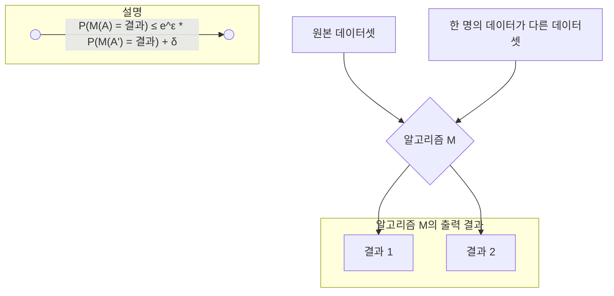

# 차분 프라이버시 (Differential Privacy)와 DP-SGD

## 1. 핵심 개념 (Core Concept)

\*\*차분 프라이버시(Differential Privacy, DP)\*\*는 데이터셋에 특정 개인의 정보가 포함되어 있는지 여부를 제3자가 추론할 수 없도록 만드는 강력한 수학적 개인정보 보호 프레임워크입니다. \*\*DP-SGD(Differentially Private Stochastic Gradient Descent)\*\*는 이러한 차분 프라이버시 원칙을 머신러닝 모델, 특히 딥러닝 모델의 학습 과정(SGD)에 적용한 알고리즘으로, 모델이 훈련 데이터의 민감한 정보를 과도하게 암기(memorization)하는 것을 방지하여 개인정보 유출 위험을 완화합니다.

______________________________________________________________________

## 2. 상세 설명 (Detailed Explanation)

### 2.1 차분 프라이버시 (Differential Privacy, DP)

DP의 핵심 아이디어는 **알고리즘 출력의 비식별성**입니다. 데이터셋에서 한 사람의 데이터를 추가하거나 제거해도 알고리즘의 출력 결과가 거의 변하지 않는다면, 그 출력 결과를 보고 특정 개인이 데이터셋에 있었는지, 어떤 정보를 가지고 있었는지 추론하기 매우 어려워집니다. DP는 이 "거의 변하지 않는" 정도를 수학적으로 엄격하게 정의하고 제어합니다.

이를 위해 DP는 원본 데이터에 기반한 계산 결과에 **의도적으로 노이즈(noise)를 주입**합니다. 이 노이즈는 개별 데이터의 영향을 가릴 만큼은 크지만, 전체 데이터의 통계적 유용성은 해치지 않을 만큼 작게 조절됩니다.

DP의 프라이버시 수준은 두 개의 파라미터, \*\*엡실론(ε)\*\*과 \*\*델타(δ)\*\*로 측정됩니다.

- **엡실론 (ε, Epsilon)**: \*\*프라이버시 손실 예산(Privacy Loss Budget)\*\*을 의미합니다. ε 값이 **작을수록(0에 가까울수록)** 개인정보 보호 수준이 **강력**해집니다. 이는 한 개인의 데이터가 결과에 미치는 영향이 매우 작다는 것을 의미합니다.
- **델타 (δ, Delta)**: 프라이버시 보장이 깨질(ε의 제약이 지켜지지 않을) **확률**을 나타냅니다. 보통 데이터셋 크기의 역수보다 작은, 무시할 수 있을 정도로 매우 작은 값으로 설정됩니다.



*위 다이어그램은 한 명의 데이터 유무에 따른 두 데이터셋(A, A')을 동일한 알고리즘(M)에 입력했을 때, 특정 결과가 나올 확률 분포가 ε과 δ에 의해 제한되어 거의 비슷하게 유지됨을 보여줍니다.*

### 2.2 DP-SGD (Differentially Private Stochastic Gradient Descent)

DP-SGD는 표준 SGD(확률적 경사 하강법) 알고리즘에 두 가지 핵심적인 수정을 가하여 차분 프라이버시를 보장합니다.

1. **그래디언트 클리핑 (Gradient Clipping)**:

   - SGD는 각 데이터 샘플에 대한 그래디언트(손실 함수의 기울기)를 계산하여 모델 파라미터를 업데이트합니다. 이때 특정 데이터 샘플의 그래디언트가 너무 크면 모델 업데이트에 과도한 영향을 미쳐 해당 샘플의 정보를 "암기"할 위험이 있습니다.
   - 그래디언트 클리핑은 각 샘플의 그래디언트 크기(L2 norm)가 사전에 정의된 임계값(clipping threshold, C)을 넘지 않도록 강제로 줄여줍니다. 이를 통해 단일 데이터 포인트가 모델 학습에 미치는 영향을 제한합니다.

1. **노이즈 추가 (Noise Addition)**:

   - 클리핑된 그래디언트를 미니배치 단위로 평균 낸 후, 여기에 정규분포(Gaussian)를 따르는 **랜덤 노이즈**를 추가합니다.
   - 이 노이즈는 각 데이터 샘플의 정확한 기여도를 모호하게 만들어, 외부 공격자가 모델의 파라미터 업데이트 값을 보고 특정 훈련 데이터를 역으로 추론하는 것을 방지합니다.

이 두 가지 과정을 통해, 최종적으로 학습된 모델 파라미터는 차분 프라이버시를 만족하게 되어 특정 개인의 정보가 모델에 과도하게 반영되는 것을 막을 수 있습니다.

______________________________________________________________________

## 3. 예시 (Example)

### 코드 예시 (Python - TensorFlow Privacy를 이용한 DP-SGD)

TensorFlow Privacy 라이브러리를 사용하면 기존의 Optimizer를 DP-SGD Optimizer로 쉽게 교체할 수 있습니다.

```python
import tensorflow as tf
from tensorflow_privacy.privacy.optimizers.dp_optimizer_keras import DPKerasSGDOptimizer

# DP-SGD를 위한 하이퍼파라미터
l2_norm_clip = 1.0  # 그래디언트 클리핑 임계값
noise_multiplier = 1.1 # 노이즈 강도
num_microbatches = 256 # 마이크로배치 크기 (클리핑을 위해)
learning_rate = 0.25

# 기존 SGD Optimizer 대신 DPKerasSGDOptimizer 사용
optimizer = DPKerasSGDOptimizer(
    l2_norm_clip=l2_norm_clip,
    noise_multiplier=noise_multiplier,
    num_microbatches=num_microbatches,
    learning_rate=learning_rate)

# 모델 컴파일 시 정의한 optimizer 사용
model.compile(optimizer=optimizer, loss=loss, metrics=['accuracy'])

# 이후 모델 학습 과정은 일반적인 방식과 동일
# model.fit(train_data, train_labels, ...)
```

### 사용 사례 (Use Case)

- **Google Gboard**: 구글은 사용자의 스마트폰 키보드 입력 데이터를 기반으로 단어 추천 모델을 개선하기 위해 연합 학습(Federated Learning)과 DP-SGD를 함께 사용합니다. 각 사용자의 기기(로컬)에서 모델을 학습시킬 때 DP-SGD를 적용하여, 서버로 전송되는 모델 업데이트 값에 특정 사용자의 민감한 타이핑 내용이 포함되지 않도록 보장합니다.
- **Apple의 사용자 데이터 분석**: Apple은 iOS 사용자의 이모티콘 사용 빈도, 검색어 제안 등 다양한 데이터를 수집하여 서비스를 개선할 때, 로컬 기기에서부터 차분 프라이버시를 적용하여 개인을 식별할 수 없는 형태로 데이터를 수집하고 분석합니다.

______________________________________________________________________

## 4. 예상 면접 질문 (Potential Interview Questions)

- **Q. 차분 프라이버시의 엡실론(ε) 값이 작을수록 좋다고 하는데, 무조건 작게만 설정하면 어떤 문제가 발생할 수 있나요?**

  - **A.** 엡실론(ε) 값이 작을수록 프라이버시 보호 수준은 높아지지만, 주입되는 노이즈의 양이 많아져 데이터의 유용성(utility)이 떨어지는 \*\*프라이버시-유용성 상충 관계(Privacy-Utility Trade-off)\*\*가 발생합니다. 노이즈가 너무 많으면 모델이 데이터의 실제 패턴을 학습하지 못해 예측 정확도가 크게 저하될 수 있습니다. 따라서, 프라이버시 보호 수준과 모델 성능 사이의 적절한 균형점을 찾는 것이 매우 중요합니다.

- **Q. DP-SGD에서 그래디언트 클리핑을 하는 이유는 무엇인가요?**

  - **A.** 그래디언트 클리핑은 **단일 데이터 포인트의 영향을 제한**하기 위함입니다. 특정 데이터의 그래디언트가 비정상적으로 클 경우, 모델이 해당 데이터에 과적합되어 민감한 정보를 암기할 수 있습니다. 클리핑은 모든 데이터의 그래디언트 크기를 일정 수준 이하로 맞춰줌으로써, 이후에 추가될 노이즈의 민감도(sensitivity)를 일정하게 유지하고, 모든 데이터가 모델 업데이트에 미치는 영향을 동등하게 만들어 프라이버시 보장을 가능하게 하는 핵심적인 단계입니다.

- **Q. 차분 프라이버시와 k-익명성(k-anonymity)과 같은 전통적인 비식별화 기술의 차이점은 무엇인가요?**

  - **A.** K-익명성은 데이터셋 자체를 수정하여 특정 개인을 최소 k-1명의 다른 사람과 구별할 수 없게 만드는 기술입니다. 이는 데이터 공개 전에 한 번 적용되는 정적인 방법이며, 다른 데이터와 결합될 경우 재식별될 수 있는 **연결 공격(Linkage Attack)에 취약**합니다. 반면, 차분 프라이버시는 데이터셋이 아닌 **알고리즘에 대한 수학적 보장**을 제공합니다. 어떤 외부 지식이 주어져도 특정 개인의 정보 유무를 높은 확률로 추론할 수 없도록 보장하므로, 연결 공격에 훨씬 더 강력한 방어력을 가집니다.

______________________________________________________________________

## 5. 더 읽어보기 (Further Reading)

- [The Algorithmic Foundations of Differential Privacy (Cynthia Dwork & Aaron Roth)](https://www.cis.upenn.edu/~aaroth/Papers/privacybook.pdf)
- [TensorFlow Privacy (Google)](https://www.tensorflow.org/responsible_ai/privacy)
- [Apple - A More Private Way to Use Your Data](https://www.apple.com/privacy/docs/A_More_Private_Way_to_Use_Your_Data.pdf)
- [What is Differential Privacy? (NIST)](https://www.nist.gov/blogs/cybersecurity-insights/what-differential-privacy)
