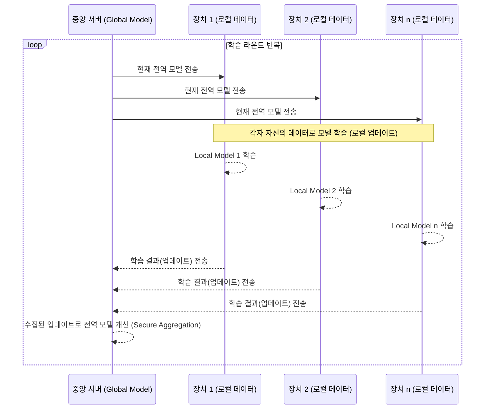

# 연합 학습 (Federated Learning)과 안전한 데이터 공유

## 1. 핵심 개념 (Core Concept)

**연합 학습(Federated Learning, FL)**은 개인정보나 민감 데이터를 중앙 서버로 전송하지 않고, 데이터가 생성된 로컬 장치(edge device)에서 모델을 학습시키는 분산형 머신러닝 패러다임입니다. 각 장치는 자신의 데이터로 모델을 학습시킨 후, 원본 데이터 대신 학습된 모델의 일부(예: 가중치 업데이트 값)만을 중앙 서버로 보내고, 서버는 이를 취합하여 전역 모델(Global Model)을 개선합니다. 이 과정을 통해 데이터 프라이버시를 강화하면서도 다수의 데이터를 활용한 모델 성능 향상을 꾀할 수 있습니다.

---

## 2. 상세 설명 (Detailed Explanation)

### 2.1 연합 학습의 작동 원리

연합 학습은 다음과 같은 순서로 진행됩니다. 이 과정은 여러 라운드에 걸쳐 반복됩니다.



1.  **초기화 (Initialization)**: 중앙 서버가 초기 전역 모델을 생성하고, 학습에 참여할 클라이언트(사용자 장치)들을 선택합니다.
2.  **전송 (Broadcast)**: 서버가 현재 버전의 전역 모델을 선택된 클라이언트들에게 전송합니다.
3.  **로컬 학습 (Local Training)**: 각 클라이언트는 전송받은 모델을 자신의 로컬 데이터로 학습시킵니다. 이 과정에서 데이터는 장치 외부로 나가지 않습니다.
4.  **업데이트 전송 (Update Communication)**: 각 클라이언트는 로컬 학습으로 인해 변경된 모델의 업데이트 정보(예: 그래디언트, 가중치)만을 중앙 서버로 전송합니다. 원본 데이터는 절대 전송되지 않습니다.
5.  **통합 (Aggregation)**: 중앙 서버는 다수의 클라이언트로부터 받은 업데이트들을 안전하게 통합(Secure Aggregation)하여 전역 모델을 개선합니다. 가장 간단한 방법은 업데이트들의 평균을 내는 것입니다 (Federated Averaging, FedAvg).

### 2.2 안전한 데이터 공유를 위한 추가 기술

연합 학습은 그 자체로 프라이버시를 강화하지만, 모델 업데이트 값(그래디언트)을 통해 원본 데이터를 추론하려는 **모델 역전 공격(Model Inversion Attack)** 등에 취약할 수 있습니다. 이를 보완하기 위해 다음과 같은 개인정보 보호 강화 기술(PETs, Privacy-Enhancing Technologies)이 함께 사용됩니다.

| 기술 | 설명 | 연합 학습에서의 역할 |
| :--- | :--- | :--- |
| **차분 프라이버시 (DP)** | 계산 결과에 노이즈를 추가하여 개인의 기여도를 숨김. | 클라이언트가 모델 업데이트 값을 서버로 보내기 전에 노이즈를 추가하여, 서버나 다른 공격자가 특정 클라이언트의 정보를 추론하는 것을 방지함. |
| **동형 암호 (HE)** | 데이터를 암호화된 상태에서 연산할 수 있게 함. | 클라이언트가 자신의 업데이트 값을 암호화하여 서버로 보내면, 서버는 암호화된 상태 그대로 통합(aggregation)을 수행함. 서버는 개별 업데이트 값을 전혀 볼 수 없음. |
| **보안 다자간 계산 (SMC)** | 여러 참여자가 자신의 입력을 공개하지 않고, 입력들에 대한 함수 값을 계산함. | 중앙 서버 없이 클라이언트들끼리 서로의 업데이트 값을 암호화하여 공유하고, 이를 통해 전역 모델을 업데이트하는 탈중앙화된 연합 학습에서 활용될 수 있음. |

### 2.3 최신 동향: FedLLM과 MLOps

*   **FedLLM (Federated Large Language Models)**: 최근에는 연합 학습을 거대 언어 모델(LLM) 학습에 적용하려는 연구가 활발합니다. 각기 다른 기관이나 개인이 보유한 방대한 양의 민감한 텍스트 데이터를 중앙화하지 않고 LLM을 파인튜닝하거나 사전학습하는 데 활용하여 데이터 병목 현상과 프라이버시 문제를 동시에 해결하려는 시도입니다.
*   **FLOps (MLOps for Federated Learning)**: 연합 학습 모델의 개발, 배포, 운영을 자동화하고 효율화하는 MLOps 플랫폼이 등장하고 있습니다. 이는 분산된 환경에서의 모델 버전 관리, 성능 모니터링, 재학습 파이프라인 구축 등 복잡한 과정을 체계적으로 관리하는 데 도움을 줍니다.

---

## 3. 예시 (Example)

### 코드 예시 (Python - TensorFlow Federated)

TensorFlow Federated(TFF)는 연합 학습 시뮬레이션을 위한 프레임워크를 제공합니다.

```python
import tensorflow as tf
import tensorflow_federated as tff

# 1. 데이터 준비 (각 클라이언트가 데이터를 가지고 있다고 가정)
source, _ = tff.simulation.datasets.emnist.load_data()
def client_data(n):
    return source.create_tf_dataset_for_client(source.client_ids[n])

train_data = [client_data(n) for n in range(3)] # 3명의 클라이언트 데이터 예시

# 2. 모델 정의 (일반적인 Keras 모델)
def create_keras_model():
    return tf.keras.models.Sequential([
        tf.keras.layers.Input(shape=(28, 28, 1)),
        tf.keras.layers.Conv2D(32, kernel_size=(3, 3), activation='relu'),
        tf.keras.layers.Flatten(),
        tf.keras.layers.Dense(10, activation='softmax')
    ])

# 3. TFF 계산을 위한 모델 래핑
def model_fn():
    keras_model = create_keras_model()
    return tff.learning.models.from_keras_model(
        keras_model,
        input_spec=train_data[0].element_spec,
        loss=tf.keras.losses.SparseCategoricalCrossentropy(),
        metrics=[tf.keras.metrics.SparseCategoricalAccuracy()])

# 4. Federated Averaging 프로세스 생성
trainer = tff.learning.algorithms.build_weighted_fed_avg(
    model_fn,
    client_optimizer_fn=lambda: tf.keras.optimizers.SGD(learning_rate=0.02))

# 5. 연합 학습 시뮬레이션 실행
state = trainer.initialize()
for round_num in range(1, 11):
    result = trainer.next(state, train_data)
    state = result.state
    metrics = result.metrics
    print(f"round {round_num}, metrics={metrics}")

```

### 사용 사례 (Use Case)

*   **스마트폰 키보드 단어 예측**: 사용자의 스마트폰(클라이언트)은 각자 자주 사용하는 단어나 문장 패턴을 학습하여 키보드 예측 모델을 로컬에서 개선합니다. 이후, 개인 식별 정보가 제거된 모델 업데이트 값만을 서버로 보내 전역 예측 모델의 성능을 높이는 데 기여합니다. (예: Google Gboard)
*   **의료 데이터 분석**: 여러 병원이 각자 보유한 환자 데이터를 외부로 유출하지 않으면서, 특정 질병 진단 AI 모델을 공동으로 개발할 수 있습니다. 각 병원은 자체 데이터로 모델을 학습시키고, 암호화된 모델 업데이트 값만을 공유하여 전체 모델의 정확도를 높입니다.

---

## 4. 예상 면접 질문 (Potential Interview Questions)

*   **Q. 연합 학습은 중앙 집중식 학습에 비해 어떤 장단점이 있나요?**
    *   **A.** **장점**은 단연 **개인정보 보호 강화**입니다. 민감한 원본 데이터를 이동시킬 필요가 없어 데이터 유출 및 프라이버시 침해 위험이 크게 줄어듭니다. 또한, 통신 비용을 절감하고 실시간에 가까운 엣지 컴퓨팅을 가능하게 합니다. **단점**으로는 **통신 병목 현상**이 있습니다. 모델 업데이트를 위해 서버와 클라이언트 간의 통신이 빈번하게 발생하며, 특히 참여하는 장치가 많을 경우 시스템이 복잡해지고 통신 비용이 증가할 수 있습니다. 또한, 각 클라이언트의 데이터가 불균일(Non-IID)할 경우 모델 성능이 저하될 수 있습니다.

*   **Q. 연합 학습 환경에서 Non-IID 데이터 문제가 무엇이며, 어떻게 완화할 수 있나요?**
    *   **A.** Non-IID(Non-Identically and Independently Distributed) 데이터는 각 클라이언트가 가진 데이터의 분포나 양이 서로 다른 상황을 의미합니다. 예를 들어, 어떤 사용자는 고양이 사진만, 다른 사용자는 강아지 사진만 가지고 있는 경우입니다. 이는 전역 모델이 특정 클라이언트의 데이터에 과적합되어 전체적인 성능이 불안정해지는 원인이 됩니다. 이를 완화하기 위해 **클라이언트 샘플링 전략을 정교화**하거나, **로컬 학습의 정도를 조절**하고, **서버 단에서 개인화(Personalization) 계층을 추가**하는 등의 방법이 연구되고 있습니다.

*   **Q. 연합 학습만으로 완벽한 개인정보 보호가 가능한가요? 아니라면 어떤 기술과 함께 사용해야 하나요?**
    *   **A.** 완벽하지 않습니다. 모델 업데이트 값(그래디언트)이 특정 공격 기법을 통해 원본 데이터를 일부 복원하는 데 사용될 수 있기 때문입니다. 따라서 더 강력한 프라이버시 보장을 위해 **차분 프라이버시(Differential Privacy)**를 함께 사용하는 것이 일반적입니다. 클라이언트가 업데이트 값을 서버로 보내기 전에 여기에 노이즈를 추가하여, 서버가 개별 업데이트의 기여도를 파악하기 어렵게 만듭니다. 또한, **동형 암호**나 **보안 다자간 계산(SMC)**과 같은 암호학적 기술을 결합하여 서버조차 개별 업데이트 내용을 볼 수 없도록 하는 방법도 있습니다.

---

## 5. 더 읽어보기 (Further Reading)

*   [Federated Learning: Collaborative Machine Learning without Centralized Training Data (Google AI Blog)](https://ai.googleblog.com/2017/04/federated-learning-collaborative.html)
*   [TensorFlow Federated (TFF)](https://www.tensorflow.org/federated)
*   [Advances and Open Problems in Federated Learning (Paper)](https://arxiv.org/abs/1912.04977)
*   [Flower: A Friendly Federated Learning Framework](https://flower.dev/)