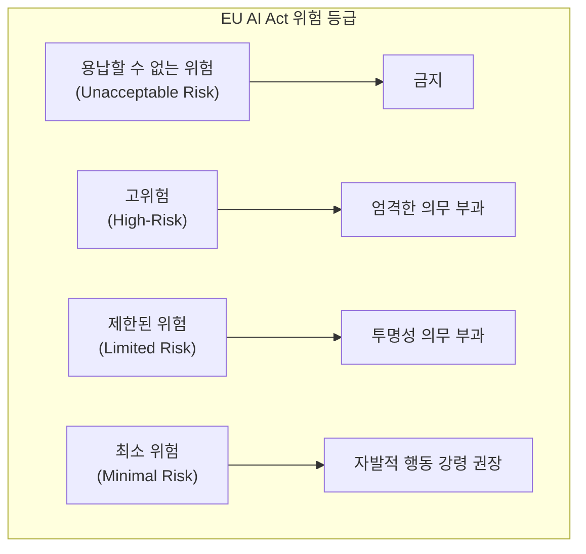

# AI 규제와 표준: EU AI Act와 ISO/IEC 42001

## 1. 핵심 개념 (Core Concept)

**EU AI Act**는 세계 최초의 포괄적인 AI 법안으로, AI 시스템을 위험 수준에 따라 분류하고 차등적으로 규제하여 시민의 기본권과 안전을 보장하는 것을 목표로 하는 **강제성 있는 법률**입니다. 반면, **ISO/IEC 42001**은 조직이 책임감 있는 AI 시스템을 개발, 제공, 사용하기 위한 경영 시스템(AIMS)을 구축하고 운영하는 방법에 대한 **자발적인 국제 표준**입니다. 이 둘은 법적 구속력 유무에서 차이가 있지만, 조직이 책임감 있는 AI 거버넌스를 구축하도록 돕는다는 공통된 목표를 공유하며 상호 보완적인 역할을 합니다.

---

## 2. 상세 설명 (Detailed Explanation)

### 2.1 EU AI Act: 위험 기반 접근 방식의 법률

2024년 8월 1일 발효된 EU AI Act는 AI 시스템이 초래할 수 있는 사회적 위험에 따라 규제 수준을 달리하는 **위험 기반 접근(Risk-Based Approach)**을 채택했습니다. 법안은 AI 시스템을 4가지 위험 등급으로 분류합니다.

| 위험 등급 | 설명 | 예시 | 규제 내용 |
| :--- | :--- | :--- | :--- |
| **용납 불가** | 인간의 안전, 생계, 권리에 명백한 위협이 되는 AI | 정부의 소셜 스코어링, 사람의 취약점을 이용하는 조작적 AI | **전면 금지** (2025년 2월 2일부 시행) |
| **고위험** | 시민의 안전이나 기본권에 중대한 영향을 미칠 수 있는 AI | 의료, 채용, 교육, 자율주행, 중요 인프라 제어 시스템 | 위험 관리 시스템 구축, 데이터 거버넌스, 기술 문서화, 인간 감독, 사이버 보안 등 **엄격한 의무 부과** |
| **제한된 위험** | 사용자가 AI와 상호작용하고 있음을 인지해야 하는 AI | 챗봇, 딥페이크, AI 생성 콘텐츠 | 사용자가 AI와 상호작용 중임을 알려야 하는 **투명성 의무** 부과 |
| **최소 위험** | 대부분의 일상적인 AI 애플리케이션 | 스팸 필터, 비디오 게임 | **별도 규제 없음** (자발적인 행동 강령 준수 권장) |

특히, 고위험 AI 시스템 제공자는 시장 출시 전과 시스템의 전체 수명 주기에 걸쳐 적합성 평가를 받아야 하며, 위반 시 전 세계 연간 매출의 최대 7%에 달하는 막대한 과징금이 부과될 수 있습니다.

### 2.2 ISO/IEC 42001: AI 경영 시스템(AIMS) 국제 표준

2023년 12월에 발표된 ISO/IEC 42001은 조직이 AI를 책임감 있게 관리하기 위한 **AI 경영 시스템(Artificial Intelligence Management System, AIMS)**을 수립, 구현, 유지 및 지속적으로 개선하기 위한 요구사항을 정의하는 국제 표준입니다.

이 표준은 법률이 아니므로 자발적으로 채택하지만, 조직이 체계적인 AI 거버넌스를 구축하는 데 실질적인 가이드를 제공합니다. 주요 특징은 다음과 같습니다.

*   **구조화된 거버넌스**: AI 관련 정책, 프로세스, 절차를 조직 전체에 걸쳐 체계적으로 수립하도록 돕습니다.
*   **위험 관리**: AI 시스템의 개발부터 폐기까지 전체 수명 주기에 걸쳐 잠재적 위험(편향, 보안, 안전 등)을 식별, 평가, 처리하는 프레임워크를 제공합니다.
*   **다른 표준과의 통합**: ISO/IEC 27001(정보보안), ISO 9001(품질경영) 등 기존 경영 시스템 표준과 쉽게 통합하여 운영할 수 있도록 설계되었습니다.

### 2.3 법률과 표준의 시너지

ISO/IEC 42001 인증을 받는 것이 EU AI Act 준수를 자동으로 보장하지는 않습니다. 하지만, 이 표준을 도입하고 AIMS를 구축하는 것은 EU AI Act의 복잡한 요구사항, 특히 **고위험 AI 시스템에 부과되는 의무들을 충족하는 데 매우 효과적인 방법**이 될 수 있습니다.

예를 들어, EU AI Act가 요구하는 `위험 관리 시스템 구축`, `기술 문서화`, `투명성 확보`, `인간 감독` 등의 의무는 ISO/IEC 42001의 AIMS 프레임워크를 통해 체계적으로 이행하고 문서화할 수 있습니다. 따라서 많은 기업들이 ISO/IEC 42001을 EU AI Act 준수를 위한 핵심적인 준비 도구로 활용하고 있습니다.

---

## 3. 예시 (Example)

### 사용 사례: AI 채용 솔루션 개발사

한 소프트웨어 회사가 이력서를 분석하여 직무 적합도를 평가하는 AI 채용 솔루션을 개발하여 EU 시장에 출시하려 합니다.

1.  **EU AI Act 적용**: 이 채용 솔루션은 개인의 고용 기회에 직접적인 영향을 미치므로 **고위험 AI 시스템**으로 분류됩니다.
2.  **준수 의무**: 회사는 솔루션 출시에 앞서 위험성 평가, 학습 데이터의 편향성 검토, 모델의 결정 과정에 대한 기술 문서화, 사용자가 AI의 평가 결과에 대해 이의를 제기하고 인간의 검토를 요청할 수 있는 절차 마련 등 EU AI Act의 모든 고위험 AI 의무사항을 준수해야 합니다.
3.  **ISO/IEC 42001 활용**: 회사는 이러한 복잡한 요구사항을 체계적으로 관리하기 위해 **ISO/IEC 42001 기반의 AIMS를 도입**하기로 결정합니다.
    *   AIMS 프레임워크에 따라 AI 개발 정책을 수립하고, 데이터 수집 및 관리 절차를 정의하며, 모델의 편향성 테스트 및 완화 조치를 문서화합니다.
    *   이러한 과정을 통해 EU AI Act가 요구하는 사항들을 조직의 경영 시스템 내에 자연스럽게 통합하고, 규제 당국에 준수 사실을 효과적으로 증명할 수 있는 기반을 마련합니다.

---

## 4. 예상 면접 질문 (Potential Interview Questions)

*   **Q. EU AI Act의 '위험 기반 접근 방식'이 무엇이며, 왜 중요한가요?**
    *   **A.** '위험 기반 접근 방식'은 AI 기술이 사회에 미치는 잠재적 위험의 수준에 따라 규제의 강도를 달리하는 접근법입니다. 모든 AI를 동일하게 규제하는 대신, 사회적 위험이 큰 분야(예: 의료, 채용)는 엄격하게, 위험이 적은 분야(예: 스팸 필터)는 최소한으로 규제합니다. 이는 혁신을 저해하지 않으면서도 시민의 안전과 기본권을 효과적으로 보호할 수 있는 균형 잡힌 규제 체계를 만들기 때문에 중요합니다.

*   **Q. 우리 회사가 개발하는 AI가 EU AI Act의 '고위험' 등급에 해당되는지 어떻게 판단할 수 있나요?**
    *   **A.** 먼저, 법안의 부속서(Annex)에 명시된 고위험 AI 시스템 목록을 확인해야 합니다. 여기에는 중요 인프라, 교육, 고용, 법 집행, 생체 인식 등 8개 핵심 분야가 포함됩니다. 만약 우리 AI가 이 목록에 해당한다면, 해당 시스템이 인간의 건강, 안전 또는 기본권에 중대한 위험을 초래하는지 여부를 평가하는 추가적인 심사를 거쳐 최종적으로 판단하게 됩니다.

*   **Q. ISO/IEC 42001 인증을 받으면 EU AI Act를 모두 준수하게 되는 것인가요?**
    *   **A.** 그렇지 않습니다. ISO/IEC 42001은 자발적인 경영 시스템 표준이고, EU AI Act는 강제성 있는 법률입니다. 표준 인증이 법률 준수를 보장하지는 않습니다. 하지만, ISO/IEC 42001은 EU AI Act, 특히 고위험 AI 시스템에 대한 요구사항을 이행하기 위한 매우 실용적이고 구조화된 프레임워크를 제공합니다. 따라서 이 표준을 도입하고 준수하는 것은 EU AI Act에 대비하는 효과적인 전략이라고 할 수 있습니다.

---

## 5. 더 읽어보기 (Further Reading)

*   [EU AI Act 공식 텍스트 (EUR-Lex)](https://eur-lex.europa.eu/legal-content/EN/TXT/?uri=CELEX:32024R1689)
*   [ISO/IEC 42001:2023 Standard](https://www.iso.org/standard/81230.html)
*   [The EU AI Act (Artificial Intelligence Act Website)](https://artificialintelligenceact.eu/)
*   [NIST AI Risk Management Framework](https://www.nist.gov/itl/ai-risk-management-framework)