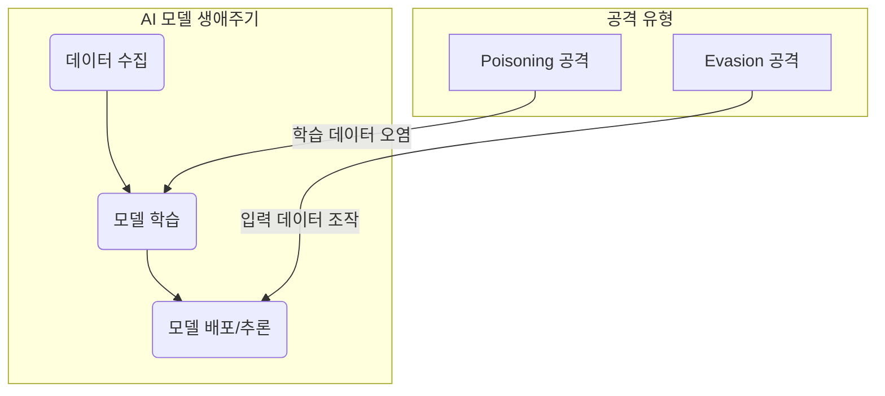

# 적대적 공격: Adversarial Example, Evasion, Poisoning

## 1. 핵심 개념 (Core Concept)

**적대적 공격(Adversarial Attack)**은 AI 모델의 취약점을 이용하여 의도적으로 오작동을 유발하는 모든 행위를 의미합니다. 이 중 **Adversarial Example**은 인간이 인지하기 어려운 미세한 노이즈를 데이터에 추가하여 모델의 예측을 속이는 공격이며, 이러한 예제를 사용해 추론 단계의 모델을 공격하는 것을 **Evasion(회피) 공격**이라고 합니다. 반면, **Poisoning(독성) 공격**은 모델의 학습(Training) 단계에 악의적인 데이터를 주입하여 모델 자체의 성능을 저하시키거나 특정 입력에 대한 오작동을 유도하는 백도어(Backdoor)를 심는 공격 기법입니다.

---

## 2. 상세 설명 (Detailed Explanation)

AI 모델, 특히 딥러닝 모델은 인간이 이해하는 방식과 다르게 데이터를 처리하기 때문에 예상치 못한 취약점을 가집니다. 적대적 공격은 이러한 취약점을 파고들어 AI 시스템의 신뢰성과 무결성을 위협합니다.

### 2.1 공격의 시점: 학습(Training) vs. 추론(Inference)

적대적 공격은 공격이 발생하는 시점에 따라 크게 두 가지로 분류할 수 있습니다.



### 2.2 Evasion 공격과 Adversarial Examples

**Evasion(회피) 공격**은 가장 일반적인 형태의 적대적 공격으로, 이미 학습이 완료되어 배포된 모델을 대상으로 합니다. 공격자는 모델의 파라미터를 변경할 수 없으므로, 입력 데이터를 조작하여 모델의 예측을 속입니다. 이때 사용되는 조작된 입력 데이터가 바로 **Adversarial Example(적대적 예제)**입니다.

*   **작동 원리**: 모델의 결정 경계(Decision Boundary) 근처에 있는 데이터에 계산된 노이즈(perturbation)를 추가하여, 모델이 데이터를 다른 클래스로 오분류하게 만듭니다. 이 노이즈는 사람의 눈에는 거의 보이지 않을 정도로 미세합니다.
*   **공격 목표**:
    *   **비목표 공격 (Non-targeted)**: 단순히 모델이 어떤 클래스든 오답을 내게 만드는 것이 목표입니다.
    *   **목표 공격 (Targeted)**: 모델이 특정 클래스로 오답을 내게 만드는 것이 목표입니다. (예: 판다 이미지를 '긴팔원숭이'로 오인하게 만들기)
*   **예시**: 자율주행차가 '정지' 표지판에 특정 스티커를 붙이자 '속도 제한' 표지판으로 오인하게 만들거나, 스팸 필터가 스팸 메일의 특정 단어를 교묘하게 바꾸어 정상 메일로 통과시키는 경우가 해당됩니다.

### 2.3 Poisoning 공격 (데이터 오염 공격)

**Poisoning(독성) 공격**은 모델의 **학습 단계**에 개입하는 훨씬 더 교묘하고 위험한 공격입니다. 공격자는 모델이 학습할 데이터셋에 악의적으로 조작된 데이터를 주입합니다.

*   **작동 원리**: 오염된 데이터를 학습한 모델은 결정 경계 자체가 왜곡되거나, 공격자가 의도한 특정 패턴(트리거)에 비정상적으로 반응하는 **백도어(Backdoor)**를 갖게 됩니다.
*   **공격 목표**:
    *   **성능 저하**: 모델의 전반적인 정확도를 떨어뜨려 신뢰성을 훼손합니다.
    *   **백도어 생성**: 평소에는 정상적으로 작동하다가, 특정 트리거(예: 이미지의 작은 워터마크, 텍스트의 특정 문구)가 포함된 입력이 들어오면 공격자가 원하는 대로 오작동하게 만듭니다.
*   **예시**: 얼굴 인식 모델의 학습 데이터에 특정 안경을 쓴 사람의 이미지를 '특정 연예인'으로 레이블링하여 주입합니다. 학습된 모델은 평소에는 잘 작동하지만, 누군가 그 특정 안경을 쓰기만 하면 그 사람을 해당 연예인으로 잘못 인식하게 됩니다.

### 2.4 비교 요약

| 구분 | Evasion (회피) 공격 | Poisoning (독성) 공격 |
| :--- | :--- | :--- |
| **공격 시점** | **추론 (Inference) 단계** | **학습 (Training) 단계** |
| **공격 대상** | 배포된 모델의 입력 데이터 | 모델의 학습 데이터셋 |
| **목표** | 모델의 단일 예측을 속임 | 모델 자체를 손상시키거나 백도어를 심음 |
| **영향** | 일시적 (해당 입력에만 영향) | **영구적** (모델이 재학습되기 전까지 지속) |
| **방어 난이도** | 상대적으로 낮음 | **매우 높음** (데이터 무결성 검증이 어려움) |

---

## 3. 예시 (Example)

### 코드 예시 (Python - `Adversarial-Robustness-Toolbox` 사용)

IBM에서 개발한 ART(Adversarial Robustness Toolbox)를 사용해 간단한 Evasion 공격(FGSM)을 생성하는 예시입니다.

```python
import tensorflow as tf
from art.estimators.classification import TensorFlowV2Classifier
from art.attacks.evasion import FastGradientMethod
import numpy as np

# 1. 간단한 모델 및 데이터 준비
(x_train, y_train), (x_test, y_test) = tf.keras.datasets.mnist.load_data()
x_train = x_train.astype(np.float32) / 255.0
x_test = x_test.astype(np.float32) / 255.0

model = tf.keras.Sequential([
    tf.keras.layers.Flatten(input_shape=(28, 28)),
    tf.keras.layers.Dense(128, activation="relu"),
    tf.keras.layers.Dense(10)
])
loss_object = tf.keras.losses.SparseCategoricalCrossentropy(from_logits=True)
optimizer = tf.keras.optimizers.Adam()
model.compile(optimizer=optimizer, loss=loss_object, metrics=["accuracy"])
model.fit(x_train, y_train, epochs=5)

# 2. ART 분류기 래핑
classifier = TensorFlowV2Classifier(
    model=model, 
    nb_classes=10, 
    input_shape=(28, 28), 
    loss_object=loss_object
)

# 3. FGSM 공격 객체 생성 및 적대적 예제 생성
attack = FastGradientMethod(estimator=classifier, eps=0.2)
x_test_adv = attack.generate(x=x_test)

# 4. 원본과 적대적 예제에 대한 예측 비교
predictions_clean = np.argmax(classifier.predict(x_test), axis=1)
predictions_adv = np.argmax(classifier.predict(x_test_adv), axis=1)

accuracy_clean = np.sum(predictions_clean == np.argmax(y_test, axis=1)) / len(y_test)
accuracy_adv = np.sum(predictions_adv == np.argmax(y_test, axis=1)) / len(y_test)

print(f"Accuracy on clean examples: {accuracy_clean * 100:.2f}%")
print(f"Accuracy on adversarial examples: {accuracy_adv * 100:.2f}%")
```
*실제 실행을 위해서는 `adversarial-robustness-toolbox` 라이브러리 설치가 필요합니다.*

---

## 4. 예상 면접 질문 (Potential Interview Questions)

*   **Q. Evasion 공격과 Poisoning 공격 중 어떤 것이 더 탐지하고 방어하기 어렵다고 생각하며, 그 이유는 무엇인가요?**
    *   **A.** **Poisoning 공격**이 훨씬 더 탐지하고 방어하기 어렵습니다. Evasion 공격은 이미 학습된 모델에 대한 입력값을 테스트하는 과정에서 탐지하거나, 적대적 훈련(Adversarial Training)을 통해 어느 정도 방어할 수 있습니다. 하지만 Poisoning 공격은 모델의 학습 데이터 자체에 교묘하게 숨어들어 모델의 근본적인 판단 기준을 왜곡시킵니다. 대규모 데이터셋에서 소수의 오염된 데이터를 식별하는 것은 매우 어렵고, 한 번 오염된 모델은 재학습 없이는 수정이 불가능하여 그 피해가 영구적일 수 있기 때문입니다.

*   **Q. 적대적 공격에 대한 방어 기법에는 어떤 것들이 있나요?**
    *   **A.** 대표적으로 **적대적 훈련(Adversarial Training)**이 있습니다. 이는 학습 과정에 의도적으로 생성한 적대적 예제를 포함시켜 모델이 이러한 종류의 공격에 강건해지도록 훈련시키는 방법입니다. 다른 방법으로는 **입력 정제(Input Sanitization)** 기법으로, 입력 데이터의 노이즈를 제거하거나 변환하여 적대적 교란을 무력화하는 방법이 있습니다. 또한, 여러 모델의 예측을 종합하여 판단하는 **앙상블(Ensemble) 기법**이나, 모델의 예측 불확실성을 감지하여 비정상적인 입력을 거부하는 방법도 사용됩니다.

*   **Q. 화이트박스 공격과 블랙박스 공격의 차이점은 무엇인가요?**
    *   **A.** **화이트박스(White-box) 공격**은 공격자가 모델의 아키텍처, 파라미터, 학습 데이터 등 모델의 내부 구조에 대한 모든 정보를 알고 있는 상황을 가정합니다. 이 경우, 모델의 그래디언트를 직접 계산하여 매우 효과적인 적대적 예제를 만들 수 있습니다 (예: FGSM, PGD). 반면, **블랙박스(Black-box) 공격**은 공격자가 모델의 내부를 전혀 모르고, 오직 입력에 대한 출력값만 확인할 수 있는 상황을 가정합니다. 이 경우, 수많은 쿼리를 통해 모델의 결정 경계를 추측하거나, 대체 모델(substitute model)을 학습시켜 적대적 예제를 생성한 후 원래 모델로 전이(transfer)시키는 방식으로 공격합니다. 당연히 화이트박스 공격이 훨씬 강력하지만, 현실에서는 블랙박스 공격 시나리오가 더 일반적입니다.

---

## 5. 더 읽어보기 (Further Reading)

*   [Adversarial Robustness Toolbox (ART) by IBM](https://github.com/Trusted-AI/adversarial-robustness-toolbox)
*   [CleverHans: An Adversarial Machine Learning Library](https://github.com/cleverhans-lab/cleverhans)
*   [Explaining and Harnessing Adversarial Examples (Goodfellow et al., 2014)](https://arxiv.org/abs/1412.6572)
*   [Poisoning Attacks against Machine Learning (Biggio et al., 2012)](https://arxiv.org/abs/1206.6389)