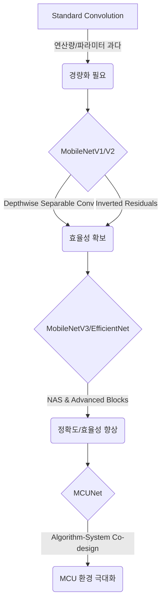

# MCU를 위한 경량 딥러닝 모델 아키텍처

## 1. 핵심 개념 (Core Concept)

**MCU(Microcontroller Unit) 대상 경량 모델**은 수백 KB 수준의 메모리와 수십 MHz의 클럭 속도를 가진 극도로 제약된 환경에서 동작하도록 설계된 딥러닝 모델 아키텍처를 의미합니다. 이는 단순히 큰 모델을 작게 만드는 것을 넘어, **알고리즘-시스템 공동 설계(Algorithm-System Co-design)** 관점에서 MCU의 하드웨어적 특성까지 고려하여 연산 효율성과 에너지 효율성을 극대화하는 데 초점을 맞춥니다. 대표적으로 MobileNet, EfficientNet-Lite, 그리고 MCU를 위해 특별히 설계된 MCUNet 등이 있습니다.

______________________________________________________________________

## 2. 상세 설명 (Detailed Explanation)

서버나 모바일 환경과 달리, MCU 환경에서는 모델의 크기, 연산량(FLOPs), 메모리 사용량, 그리고 에너지 소모가 모델 선택의 절대적인 기준이 됩니다. 이를 위해 다음과 같은 핵심 아이디어를 기반으로 한 경량 모델들이 개발되었습니다.

### 2.1 핵심 경량화 기법

경량 모델들은 주로 다음과 같은 기법들을 조합하여 효율성을 달성합니다.

- **Depthwise Separable Convolution**: 표준 컨볼루션 연산을 공간적(depthwise) 연산과 채널별(pointwise) 연산으로 분리하여, 파라미터 수와 연산량을 획기적으로 줄입니다. MobileNet 시리즈의 핵심 아이디어입니다.
- **Inverted Residuals and Linear Bottlenecks**: MobileNetV2에서 제안된 구조로, 저차원 공간에서 필터링을 수행하고 비선형 활성화 함수(ReLU)가 정보 손실을 유발하는 것을 막기 위해 마지막 pointwise convolution 후에는 활성화 함수를 사용하지 않습니다.
- **Neural Architecture Search (NAS)**: 주어진 하드웨어 제약(예: 지연 시간, 메모리) 하에서 최적의 성능을 내는 모델 아키텍처를 자동으로 탐색합니다. EfficientNet과 MCUNet이 이 기법을 활용했습니다.

### 2.2 대표적인 MCU 대상 경량 모델

| 모델                  | 주요 아키텍처 특징                                                                          | 장점                                                                                                      | 단점                                                             |
| :-------------------- | :------------------------------------------------------------------------------------------ | :-------------------------------------------------------------------------------------------------------- | :--------------------------------------------------------------- |
| **MobileNetV1/V2**    | Depthwise Separable Convolution, Inverted Residuals                                         | 경량 모델의 기본을 제시. 준수한 성능과 높은 효율성.                                                       | V3나 EfficientNet에 비해 정확도가 다소 낮음.                     |
| **MobileNetV3**       | V2 구조에 Squeeze-and-Excite 모듈과 h-swish 활성화 함수 추가. NAS를 통해 최적화.            | V2보다 더 높은 정확도와 낮은 지연 시간 달성.                                                              | 구조가 더 복잡해짐.                                              |
| **EfficientNet-Lite** | Compound Scaling(깊이, 너비, 해상도를 균형 있게 조절) 기법을 사용.                          | 매우 높은 정확도와 효율성. 확장성이 뛰어남.                                                               | MCU 환경에 최적화되지 않은 경우, 특정 연산이 비효율적일 수 있음. |
| **MCUNet**            | **알고리즘-시스템 공동 설계**. NAS를 통해 MCU의 메모리 및 연산 특성에 맞는 아키텍처를 탐색. | **MCU 환경에 극도로 최적화**되어, 기존 모델들보다 훨씬 적은 메모리로 ImageNet 수준의 분류 작업 수행 가능. | 특정 MCU 타겟에 고도로 전문화되어 범용성이 다소 떨어질 수 있음.  |

______________________________________________________________________

## 3. 예시 (Example)

### 사용 사례: 스마트 초인종의 사람 감지 기능

배터리로 동작하는 스마트 초인종에 사람이 접근했을 때만 카메라를 켜고 녹화를 시작하는 기능을 구현한다고 가정해봅시다.

- **문제**: 항상 카메라를 켜두면 배터리 소모가 극심하므로, 저전력 상태에서 사람의 존재를 감지할 방법이 필요합니다.
- **해결**: 저전력 MCU와 마이크로폰을 사용하여 항상 켜져 있는(always-on) 음성 감지 기능을 구현합니다. 이때, MCU에는 **MCUNet**이나 **MobileNetV3-Small**을 양자화하여 최적화한 모델을 배포합니다.
  1. 모델은 마이크로폰으로 들어오는 소리를 지속적으로 분석합니다.
  1. 사람의 목소리나 발소리와 같은 특정 키워드나 소리 패턴이 감지되면, 모델이 이를 인식하여 "wake word" 역할을 합니다.
  1. MCU는 주 프로세서와 카메라에 신호를 보내 전원을 켜고 녹화를 시작하도록 합니다.
- **효과**: 이 경량 모델 덕분에 초인종은 밀리와트(mW) 수준의 매우 낮은 전력으로 핵심적인 감지 기능을 수행할 수 있어, 한 번의 배터리 충전으로 수개월간 동작할 수 있게 됩니다.

______________________________________________________________________

## 4. 예상 면접 질문 (Potential Interview Questions)

- **Q. MobileNet의 핵심 아이디어인 Depthwise Separable Convolution이 어떻게 연산량을 줄이는지 설명해주세요.**

  - **A.** 표준 컨볼루션은 입력 채널과 출력 채널을 한 번에 엮어서 필터링을 수행합니다. 반면, Depthwise Separable Convolution은 이를 두 단계로 나눕니다. 첫째, **Depthwise Convolution**은 각 입력 채널에 대해 독립적으로 공간적 필터링을 수행합니다. 둘째, **Pointwise Convolution**(1x1 컨볼루션)은 Depthwise의 출력들을 선형 결합하여 새로운 채널을 만듭니다. 이처럼 연산을 분리함으로써, 표준 컨볼루션에 비해 파라미터 수와 곱셈-누산(MAC) 연산의 수를 8~9배 가까이 줄이면서도 유사한 성능을 유지할 수 있습니다.

- **Q. MCUNet이 기존의 경량 모델들과 차별화되는 가장 큰 특징은 무엇인가요?**

  - **A.** \*\*알고리즘-시스템 공동 설계(Algorithm-System Co-design)\*\*입니다. 기존 경량 모델들은 주로 모델 자체의 연산량(FLOPs)을 줄이는 데 집중했지만, MCUNet은 모델 아키텍처뿐만 아니라 MCU의 제한된 SRAM 크기, 플래시 메모리 대역폭, 그리고 경량 추론 엔진의 특성까지 동시에 고려합니다. Neural Architecture Search(NAS)를 사용하여 주어진 MCU 하드웨어 제약 조건 하에서 최적의 성능을 내는 아키텍처를 탐색함으로써, 단순히 FLOPs가 적은 모델이 아니라 실제로 MCU에서 가장 빠르고 효율적으로 동작하는 모델을 찾아낸다는 점에서 큰 차이가 있습니다.

- **Q. MCU 환경에서 모델을 배포할 때, 정확도 외에 가장 중요하게 고려해야 할 지표는 무엇인가요?**

  - **A.** \*\*메모리 사용량(Memory Footprint)\*\*과 \*\*에너지 효율성(Energy Efficiency)\*\*입니다. MCU는 수백 KB의 SRAM과 1~2MB의 플래시 메모리를 가지므로, 모델의 크기와 런타임 시 필요한 메모리가 이 제약을 반드시 만족해야 합니다. 또한, 많은 MCU 기반 장치들이 배터리로 동작하므로, 한 번의 추론에 소모되는 에너지(Joule per inference)가 매우 중요합니다. 이는 모델의 연산량뿐만 아니라, 데이터 이동량, 메모리 접근 패턴 등 복합적인 요소에 의해 결정되므로, 실제 하드웨어에서의 전력 측정이 필수적입니다.

______________________________________________________________________

## 5. 더 읽어보기 (Further Reading)

- [MCUNet: Tiny Deep Learning on IoT Devices (MIT Paper)](https://arxiv.org/abs/2007.10319)
- [MobileNets: Efficient Convolutional Neural Networks for Mobile Vision Applications (Google Paper)](https://arxiv.org/abs/1704.04861)
- [TensorFlow Lite for Microcontrollers](https://www.tensorflow.org/lite/microcontrollers)
- [Edge Impulse: Embedded ML Platform](https://www.edgeimpulse.com/)
