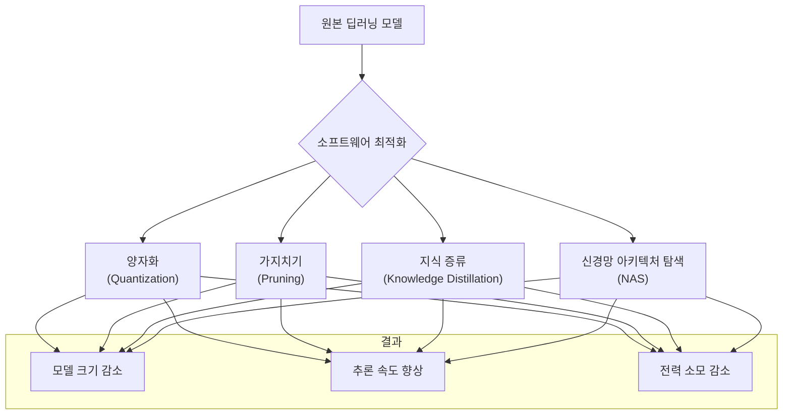

# TinyML의 핵심 과제: 전력 및 메모리 제약 극복

## 1. 핵심 개념 (Core Concept)

TinyML은 클라우드 연결 없이 마이크로컨트롤러(MCU)와 같은 저전력, 저비용 장치에서 머신러닝 모델을 실행하는 기술 분야입니다. 이러한 장치는 **수백 KB의 메모리**와 **밀리와트(mW) 수준의 전력**이라는 극심한 하드웨어 제약을 가지고 있습니다. 따라서, TinyML의 핵심 과제는 모델의 정확도를 최대한 유지하면서 **전력 소모와 메모리 사용량을 최소화**하는 최적화 기술을 적용하여, 주어진 하드웨어 제약 조건 내에서 모델이 효율적으로 동작하도록 만드는 것입니다.

______________________________________________________________________

## 2. 상세 설명 (Detailed Explanation)

전력과 메모리 제약을 극복하기 위한 TinyML 기술은 크게 **소프트웨어적 최적화**와 **하드웨어적 접근**으로 나눌 수 있습니다. 이 둘은 상호 보완적으로 작용하며, 최상의 결과를 위해 함께 고려되는 경우가 많습니다.

### 2.1 소프트웨어 기반 최적화 기법

모델의 구조와 파라미터를 수정하여 크기를 줄이고 연산 효율성을 높이는 기법들입니다.

| 기법                                   | 설명                                                                                                        | 장점                                                                      | 단점                                                            |
| :------------------------------------- | :---------------------------------------------------------------------------------------------------------- | :------------------------------------------------------------------------ | :-------------------------------------------------------------- |
| **양자화 (Quantization)**              | 모델의 가중치와 활성화 함수 값을 32비트 부동소수점에서 8비트 정수 등 낮은 정밀도로 변환.                    | **모델 크기 4배 감소**, 정수 연산으로 **추론 속도 향상**, 전력 소모 감소. | 정밀도 손실로 인한 약간의 **정확도 저하** 발생 가능.            |
| **가지치기 (Pruning)**                 | 모델의 성능에 거의 영향을 주지 않는 불필요한 연결(가중치)이나 뉴런을 제거하여 모델을 희소(sparse)하게 만듦. | 모델의 파라미터 수를 줄여 **크기와 연산량을 직접적으로 감소**시킴.        | 비정형(unstructured) 가지치기는 하드웨어 가속이 어려울 수 있음. |
| **지식 증류 (Knowledge Distillation)** | 크고 복잡한 "교사 모델"의 지식을 작고 효율적인 "학생 모델"이 학습하도록 함.                                 | 작은 모델로도 **교사 모델에 준하는 높은 정확도**를 달성할 수 있음.        | 교사 모델을 먼저 학습시켜야 하는 추가 비용 발생.                |
| **신경망 아키텍처 탐색 (NAS)**         | 주어진 하드웨어(MCU)의 제약 조건(지연 시간, 메모리)을 만족하는 최적의 모델 구조를 자동으로 탐색.            | **특정 하드웨어에 극도로 최적화된 모델**을 찾아낼 수 있음.                | 탐색 과정 자체에 많은 계산 자원이 필요함.                       |

### 2.2 하드웨어 기반 접근 및 시스템 레벨 최적화

소프트웨어 최적화만으로는 한계가 있으며, 하드웨어의 발전과 시스템 전체를 고려하는 접근이 중요합니다.

- **하드웨어 가속기 (Hardware Accelerators)**: 최신 MCU에는 NPU(Neural Processing Unit)나 DSP(Digital Signal Processor)와 같은 AI 가속기가 내장되는 추세입니다. 이러한 가속기는 행렬 곱셈과 같은 딥러닝 핵심 연산을 매우 낮은 전력으로 빠르게 처리하도록 설계되었습니다. (예: ARM Ethos, STM32N6)

- **인메모리 컴퓨팅 (In-Memory Computing)**: 데이터가 저장된 메모리 내에서 직접 연산을 수행하여, 프로세서와 메모리 간의 데이터 이동에 따른 병목 현상과 전력 소모를 최소화하는 차세대 기술입니다.

- **시스템 레벨 최적화**: 모델뿐만 아니라 시스템 전체의 동작을 최적화합니다.

  - **데이터 샘플링 속도 조절**: 센서 데이터의 샘플링 주파수를 낮추면 처리할 데이터 양이 줄어들어 연산량과 전력 소모를 크게 줄일 수 있습니다.
  - **동적 전력 관리**: 모델이 추론을 수행하지 않을 때는 MCU를 깊은 절전 모드(deep sleep mode)로 전환하고, 특정 이벤트(예: 소리, 움직임)가 발생했을 때만 깨어나서 동작하게 하여 평균 전력 소모를 극적으로 낮춥니다.

______________________________________________________________________

## 3. 예시 (Example)

### 사용 사례: 배터리로 동작하는 야생동물 카메라 트랩

숲 속에 설치되어 동물이 지나갈 때만 사진을 찍는 카메라를 개발한다고 가정합니다.

- **문제점**: 상시 동작하는 적외선 모션 센서는 나뭇잎의 움직임 등에도 반응하여 불필요한 사진을 너무 많이 찍고, 이는 배터리와 저장 공간의 낭비로 이어집니다.

- **TinyML 적용**: 저전력 MCU와 이미지 센서를 결합하고, 다음과 같은 최적화 전략을 적용합니다.

  1. **모델 선택 및 최적화**: 동물/사람/배경을 분류하는 MobileNetV3-Small 모델을 \*\*8비트 정수 양자화(Quantization)\*\*와 \*\*가지치기(Pruning)\*\*를 통해 수백 KB 크기로 최적화합니다.
  1. **시스템 레벨 최적화**: 평소에는 MCU와 이미지 센서가 초저전력 대기 모드로 있습니다. 모션 센서가 어떤 움직임이든 감지하면, 이미지 센서는 저해상도 흑백 이미지를 한 장 캡처합니다.
  1. **온디바이스 추론**: MCU는 캡처된 저해상도 이미지를 사용하여 최적화된 모델로 추론을 실행합니다. 추론 결과가 '동물' 또는 '사람'일 경우에만, 고해상도 컬러 사진을 촬영하고 저장합니다. '배경'(나뭇잎 등)으로 판단되면 즉시 다시 대기 모드로 돌아갑니다.

- **결과**: 불필요한 촬영을 90% 이상 줄여, 한 번의 배터리 교체로 수개월 이상 동작하는 효율적인 카메라 트랩을 만들 수 있습니다. 모든 판단이 디바이스 내에서 이루어지므로 인터넷 연결도 필요 없습니다.

______________________________________________________________________

## 4. 예상 면접 질문 (Potential Interview Questions)

- **Q. 모델 양자화(Quantization) 과정에서 정확도 손실을 최소화할 수 있는 방법은 무엇인가요?**

  - **A.** \*\*양자화 인식 훈련(Quantization-Aware Training, QAT)\*\*을 사용하는 것이 가장 효과적입니다. 이는 모델을 학습시키는 과정에서부터 양자화로 인한 정밀도 손실을 미리 시뮬레이션하고, 모델이 이러한 오차에 적응하도록 가중치를 업데이트하는 방식입니다. 학습 후에 양자화를 적용하는 \*\*학습 후 양자화(Post-Training Quantization, PTQ)\*\*보다 일반적으로 더 높은 정확도를 유지할 수 있습니다. 또한, PTQ를 사용하더라도 대표적인 보정용 데이터셋(calibration dataset)을 사용하여 양자화 범위를 더 정확하게 결정하면 정확도 손실을 줄일 수 있습니다.

- **Q. MCU에서 딥러닝 모델을 실행할 때, 연산량(FLOPs) 외에 성능에 큰 영향을 미치는 요소는 무엇인가요?**

  - **A.** \*\*메모리 접근 비용(Memory Access Cost)\*\*입니다. MCU 환경에서는 외부 DRAM 없이 수백 KB의 SRAM 내에서 모든 연산이 이루어져야 하는 경우가 많습니다. 모델의 가중치나 중간 결과(activations)를 SRAM으로 읽고 쓰는 과정에서 상당한 시간과 전력이 소모됩니다. 따라서, 단순히 FLOPs가 적은 모델보다, 메모리 접근을 최소화하고 데이터 재사용성을 높이는 구조를 가진 모델이 실제 MCU 환경에서는 더 높은 성능을 보일 수 있습니다. 이것이 MCUNet과 같은 시스템-알고리즘 공동 설계가 중요한 이유입니다.

- **Q. TinyML 애플리케이션의 전력 소모를 측정하고 최적화하기 위한 접근법을 설명해주세요.**

  - **A.** 먼저, 개발 보드와 전력 프로파일러(power profiler)를 사용하여 실제 하드웨어에서 모델 추론 시 소모되는 전류를 직접 측정해야 합니다. 이를 통해 전체 전력 소모 중 어떤 부분이(예: CPU 연산, 메모리 접근, 센서 동작) 가장 큰 비중을 차지하는지 분석합니다. 분석 결과를 바탕으로, 모델 최적화(양자화, 가지치기), 코드 최적화(루프 풀기, 효율적인 라이브러리 사용), 그리고 시스템 레벨 최적화(적절한 sleep 모드 활용, 센서 동작 주기 조절)를 종합적으로 적용하여 전력 소모를 단계적으로 줄여나가야 합니다.

______________________________________________________________________

## 5. 더 읽어보기 (Further Reading)

- [TinyML: Radical Energy-Efficiency for ML (Google AI Blog)](https://ai.googleblog.com/2023/03/tinyml-radical-energy-efficiency-for-ml.html)
- [The Six Pillars of TinyML System Design (Arm)](https://www.arm.com/resources/research/case-study/six-pillars-tinyml)
- [Energy-efficient deep learning (Nature Electronics Review)](https://www.nature.com/articles/s41928-019-0282-5)
- [TensorFlow Lite - Post-training quantization](https://www.tensorflow.org/lite/performance/post_training_quantization)
