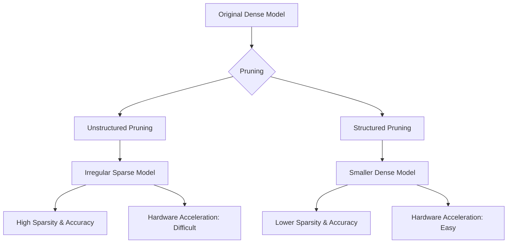

# 모델 경량화를 위한 가지치기: Structured vs. Unstructured Pruning

## 1. 핵심 개념 (Core Concept)

\*\*가지치기(Pruning)\*\*는 딥러닝 모델의 성능에 거의 영향을 주지 않는 불필요한 파라미터(가중치)를 제거하여, 모델을 더 작고 빠르게 만드는 핵심적인 경량화 기술입니다. 이는 크게 두 가지 방식으로 나뉩니다. \*\*비정형 가지치기(Unstructured Pruning)\*\*는 개별 가중치를 독립적으로 제거하여 모델을 불규칙한 희소(sparse) 행렬로 만드는 반면, \*\*정형 가지치기(Structured Pruning)\*\*는 필터, 채널, 레이어 등 구조적인 단위를 통째로 제거하여 모델의 전체적인 규칙성은 유지하면서 크기를 줄이는 방식입니다.

______________________________________________________________________

## 2. 상세 설명 (Detailed Explanation)

딥러닝 모델은 종종 과하게 파라미터화(over-parameterized)되어 있어, 많은 수의 가중치가 중복되거나 모델 성능에 거의 기여하지 않습니다. 가지치기는 이러한 중복성을 제거하여 모델을 압축하는 과정입니다.

### 2.1 비정형 가지치기 (Unstructured Pruning)

가장 고전적이고 유연한 방식으로, 개별 가중치의 중요도(일반적으로 크기의 절댓값)를 기준으로 임계값보다 낮은 가중치들을 0으로 만듭니다.

- **장점**:
  - **높은 압축률**: 모델의 구조에 제약 없이 중요하지 않은 가중치를 모두 제거할 수 있어, 동일한 정확도를 유지하면서 매우 높은 희소성(sparsity)을 달성할 수 있습니다.
- **단점**:
  - **하드웨어 비친화적**: 결과적으로 생성되는 가중치 행렬이 불규칙한 패턴의 희소 행렬이 됩니다. 이러한 구조는 일반적인 GPU나 CPU에서 계산 가속을 얻기 어렵습니다. 특별히 설계된 희소 행렬 연산 라이브러리나 하드웨어 가속기가 필요합니다.

### 2.2 정형 가지치기 (Structured Pruning)

개별 가중치가 아닌, 더 큰 구조적 단위를 제거합니다. 예를 들어, 컨볼루션 레이어에서는 특정 필터 전체를, 완전 연결 레이어에서는 특정 뉴런(노드) 전체를 제거하는 식입니다.

- **장점**:
  - **하드웨어 친화적**: 가지치기 후에도 모델의 전체적인 행렬 구조가 밀집(dense) 형태를 유지하므로, 표준 하드웨어(GPU, CPU, NPU)에서 별도의 처리 없이도 바로 추론 가속 효과를 볼 수 있습니다.
- **단점**:
  - **낮은 유연성 및 정확도 손실**: 중요하지 않은 가중치와 중요한 가중치가 섞여 있는 필터라도 통째로 제거해야 하므로, 비정형 가지치기에 비해 정확도 손실이 더 클 수 있습니다. 압축률 대비 정확도 하락의 폭이 더 가파릅니다.

### 2.3 비교 요약 및 최신 동향

| 구분                 | 비정형 가지치기 (Unstructured)         | 정형 가지치기 (Structured)                 |
| :------------------- | :------------------------------------- | :----------------------------------------- |
| **제거 단위**        | 개별 가중치 (Weights)                  | 필터, 채널, 뉴런 등 구조 단위 (Structures) |
| **결과 행렬**        | 희소 행렬 (Sparse Matrix)              | 더 작은 밀집 행렬 (Dense Matrix)           |
| **압축률 vs 정확도** | **우수** (높은 압축률에도 정확도 유지) | 상대적 열세 (정확도 손실이 더 클 수 있음)  |
| **하드웨어 가속**    | 어려움 (특수 하드웨어/라이브러리 필요) | **용이** (일반 하드웨어에서 바로 가속)     |



**최신 동향**: 최근 연구는 두 방식의 장점을 결합하려는 **하이브리드 및 반-정형(semi-structured) 가지치기**에 집중하고 있습니다. 예를 들어, N:M 희소성 패턴(N개의 연속된 가중치 블록에서 M개만 남기는 방식)은 하드웨어 가속을 지원하면서도 비정형 가지치기에 가까운 유연성을 제공합니다. 또한, LLM과 같이 거대한 모델에 대해서는 학습 후 재학습 없이 가지치기를 수행하는 **학습 후 가지치기(Post-Training Pruning, PTP)** 기법(예: SparseGPT)이 각광받고 있습니다.

______________________________________________________________________

## 3. 예시 (Example)

### 코드 예시 (Python - TensorFlow Pruning API)

TensorFlow Model Optimization Toolkit의 `prune_low_magnitude` API를 사용한 비정형 가지치기 예시입니다.

```python
import tensorflow as tf
import tensorflow_model_optimization as tfmot

# 1. 원본 모델 정의
model = tf.keras.Sequential([
    tf.keras.layers.InputLayer(input_shape=(28, 28, 1)),
    tf.keras.layers.Conv2D(32, 5, activation='relu'),
    tf.keras.layers.Flatten(),
    tf.keras.layers.Dense(10)
])

# 2. 가지치기 설정
pruning_params = {
    'pruning_schedule': tfmot.sparsity.keras.ConstantSparsity(
    target_sparsity=0.5, # 50%의 가중치를 제거
    begin_step=0,
    end_step=1000, # 1000 스텝에 걸쳐 점진적 제거
    frequency=100)
}

# 3. 모델에 가지치기 래퍼(wrapper) 적용
prune_low_magnitude = tfmot.sparsity.keras.prune_low_magnitude
pruned_model = prune_low_magnitude(model, **pruning_params)

# 4. 가지치기를 적용하여 모델 학습 (파인튜닝)
pruned_model.compile(optimizer='adam',
                  loss=tf.keras.losses.SparseCategoricalCrossentropy(from_logits=True),
                  metrics=['accuracy'])

# 학습 과정에서 가지치기가 진행됨
# 콜백(callback)을 추가하여 현재 희소성 수준을 모니터링할 수 있음
callbacks = [tfmot.sparsity.keras.UpdatePruningStep()]
pruned_model.fit(train_images, train_labels, epochs=2, callbacks=callbacks)

# 5. 최종적으로 가지치기가 적용된 모델로 변환
final_model = tfmot.sparsity.keras.strip_pruning(pruned_model)
```

______________________________________________________________________

## 4. 예상 면접 질문 (Potential Interview Questions)

- **Q. 실제 엣지 디바이스에 모델을 배포할 때, 비정형과 정형 가지치기 중 어떤 것을 선택하시겠습니까? 그 이유는 무엇인가요?**

  - **A.** 타겟 엣지 디바이스의 **하드웨어 특성**에 따라 결정할 것입니다. 만약 디바이스의 프로세서가 희소 행렬 연산을 위한 특별한 가속 기능(예: NVIDIA의 Sparse Tensor Cores)을 지원한다면, 높은 압축률과 정확도를 얻을 수 있는 **비정형 가지치기**를 고려할 것입니다. 하지만 대부분의 일반적인 MCU나 NPU는 밀집 행렬 연산에 최적화되어 있으므로, 이런 경우에는 **정형 가지치기**를 선택하여 하드웨어의 성능을 최대한 활용하고 즉각적인 추론 속도 향상을 얻는 것이 더 실용적인 선택입니다.

- **Q. 가지치기를 수행하면 모델의 정확도가 떨어질 수 있는데, 이를 어떻게 완화할 수 있나요?**

  - **A.** \*\*점진적 가지치기(Gradual Pruning)와 파인튜닝(Fine-tuning)\*\*을 통해 완화할 수 있습니다. 한 번에 많은 가중치를 제거하는 대신, 학습 과정 전반에 걸쳐 점진적으로 중요도가 낮은 가중치를 제거하고, 각 단계마다 남아있는 가중치를 재학습(파인튜닝)하여 성능 저하를 복구하는 방식입니다. 이는 모델이 가중치가 제거된 새로운 구조에 적응할 시간을 주어 최종적인 정확도 하락을 최소화합니다.

- **Q. 'Pruning at Initialization' (초기화 시점 가지치기)라는 개념이 최근 주목받는 이유는 무엇인가요?**

  - **A.** 전통적인 가지치기는 "학습 -> 가지치기 -> 재학습"의 과정을 거치므로, **초기 학습에 드는 막대한 비용**을 절감할 수 없다는 단점이 있습니다. 'Pruning at Initialization'은 모델을 본격적으로 학습하기 전, 즉 가중치가 초기화된 시점에서부터 최종적으로 살아남을 중요한 연결(subnetwork)을 미리 찾아내는 것을 목표로 합니다. 만약 이것이 가능하다면, 거대 모델을 처음부터 학습시키는 비용 자체를 없애고, 훨씬 작은 서브네트워크만 학습시키면 되므로 전체적인 모델 개발 및 최적화 과정의 효율성을 획기적으로 높일 수 있기 때문에 주목받고 있습니다.

______________________________________________________________________

## 5. 더 읽어보기 (Further Reading)

- [TensorFlow Model Optimization - Pruning](https://www.tensorflow.org/model_optimization/guide/pruning)
- [PyTorch - Pruning Tutorial](https://pytorch.org/tutorials/intermediate/pruning_tutorial.html)
- [The Lottery Ticket Hypothesis: Finding Sparse, Trainable Neural Networks (Paper)](https://arxiv.org/abs/1803.03635)
- [Pruning from Scratch (Paper)](https://arxiv.org/abs/1909.12579)
