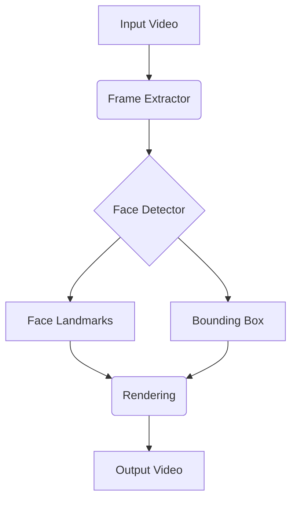

# MediaPipe와 Core ML Tools

## 1. 핵심 개념 (Core Concept)

**MediaPipe**는 Google에서 개발한 오픈소스 프레임워크로, 비디오, 오디오 등 시계열 데이터 처리를 위한 ML 파이프라인을 쉽게 구축하고 다양한 플랫폼에 배포할 수 있도록 지원함. 실시간성과 크로스플랫폼 지원에 중점을 둠.

**Core ML**은 Apple의 프레임워크로, iOS, macOS 등 Apple 생태계 앱에 머신러닝 모델을 통합하는 데 사용됨. **Core ML Tools** (`coremltools`)는 TensorFlow, PyTorch 등에서 학습된 모델을 Apple 하드웨어에 최적화된 `.mlmodel` 형식으로 변환하고 압축하는 파이썬 라이브러리임.

---

## 2. 상세 설명 (Detailed Explanation)

### 2.1 MediaPipe

MediaPipe는 복잡한 ML 파이프라인을 그래프(Graph) 구조로 정의하여 모듈화하고 재사용성을 높임. 각 노드(Calculator)는 특정 데이터 처리 작업을 수행하며, 스트림을 통해 데이터를 주고받음. 이를 통해 실시간 비전, 오디오 처리 애플리케이션을 효율적으로 개발할 수 있음.


*<center>그림 1: MediaPipe의 그래프 기반 파이프라인 예시</center>*

**주요 특징**:
*   **크로스플랫폼 지원**: Android, iOS, 데스크톱(Windows, macOS, Linux), 웹(JavaScript), IoT(Raspberry Pi) 등에서 동일한 코드로 실행 가능함.
*   **엔드투엔드 가속**: 플랫폼별 CPU, GPU, TPU(Tensor Processing Unit) 및 DSP(Digital Signal Processor) 가속을 지원하여 낮은 지연 시간(low-latency)을 보장함.
*   **즉시 사용 가능한 솔루션 (Ready-to-Use Solutions)**: 얼굴 인식, 손 추적, 자세 추정, 객체 탐지 등 Google에서 사전 학습 및 최적화한 모델들을 제공하여 몇 줄의 코드만으로 쉽게 통합할 수 있음.
*   **커스터마이징**: `MediaPipe Model Maker`를 사용하여 기존 모델을 새로운 데이터셋으로 재학습하거나 파인튜닝할 수 있음.

### 2.2 Core ML Tools

Core ML Tools는 Apple 생태계에서 on-device AI를 구현하기 위한 핵심 도구임. 개발자가 만든 모델을 Apple의 CPU, GPU, 그리고 특히 **Apple Neural Engine (ANE)**에서 최적의 성능으로 동작하도록 변환하고 압축하는 역할을 함. ANE는 ML 연산에 특화된 하드웨어로, 고성능과 저전력 추론을 가능하게 함.

**주요 특징**:
*   **모델 변환**: TensorFlow(1.x, 2.x), PyTorch 모델을 `.mlmodel` 형식으로 변환함. 변환 과정에서 모델의 연산(operation)들이 Core ML에서 지원하는 형태로 매핑됨.
*   **모델 최적화 및 압축**:
    *   **양자화 (Quantization)**: 가중치의 정밀도를 FP32에서 FP16, INT8 등으로 낮춰 모델 크기를 줄이고 추론 속도를 향상시킴.
    *   **가지치기 (Pruning)**: 중요도가 낮은 가중치를 0으로 만들어 모델을 희소(sparse)하게 만들어 압축률을 높임.
    *   **가중치 압축 (Weight Compression)**: LLM이나 Diffusion 모델과 같이 큰 모델의 가중치를 손실 없이 또는 손실을 최소화하며 압축하는 기술을 제공함.
*   **Xcode 통합**: 변환된 `.mlmodel` 파일을 Xcode 프로젝트에 추가하면, 모델을 쉽게 호출할 수 있는 Swift 또는 Objective-C 인터페이스가 자동으로 생성됨.

---

## 3. 예시 (Example)

### MediaPipe 손 인식 (Python)

```python
import mediapipe as mp
from mediapipe.tasks import python
from mediapipe.tasks.python import vision
import cv2

# Hand Landmarker 태스크 설정
base_options = python.BaseOptions(model_asset_path='hand_landmarker.task')
options = vision.HandLandmarkerOptions(base_options=base_options, num_hands=2)
detector = vision.HandLandmarker.create_from_options(options)

# 이미지 로드 및 처리
image = mp.Image.create_from_file("hand_image.jpg")
detection_result = detector.detect(image)

# 결과 처리 (랜드마크 그리기 등)
# ... (detection_result를 사용하여 이미지에 랜드마크를 시각화하는 코드)
```

### Core ML Tools 모델 변환 (Python)

```python
import coremltools as ct
import torch

# PyTorch 모델 정의 (예시)
class MyModel(torch.nn.Module):
    def __init__(self):
        super().__init__()
        self.linear = torch.nn.Linear(10, 1)
    def forward(self, x):
        return self.linear(x)

# 모델 인스턴스화 및 TorchScript로 변환
pytorch_model = MyModel()
pytorch_model.eval()
traced_model = torch.jit.trace(pytorch_model, torch.rand(1, 10))

# Core ML 모델로 변환
# inputs: 모델의 입력 형태를 명시
# convert_to: "mlprogram"은 최신 모델 아키텍처 지원
model = ct.convert(
    traced_model,
    inputs=[ct.TensorType(shape=(1, 10))],
    convert_to="mlprogram"
)

# 변환된 모델 저장
model.save("MyModel.mlpackage")
```

---

## 4. 예상 면접 질문 (Potential Interview Questions)

*   **Q. MediaPipe와 Core ML의 주요 차이점은 무엇인가요?**
    *   **A.** 가장 큰 차이는 **플랫폼 지원 범위**와 **주요 목적**에 있습니다. MediaPipe는 다양한 플랫폼에서 동작하는 것을 목표로 하는 **크로스플랫폼 프레임워크**인 반면, Core ML은 Apple 제품 생태계 내에서 최적의 성능을 내는 데 집중하는 **Apple 전용 프레임워크**입니다. MediaPipe는 실시간 미디어 처리 파이프라인 구축 자체에 강점이 있고, Core ML은 학습된 모델을 Apple 기기에 배포하기 위한 변환 및 최적화에 강점이 있습니다.

| 구분 | MediaPipe | Core ML Tools |
| :--- | :--- | :--- |
| **주요 목적** | 실시간 ML 파이프라인 구축 및 배포 | 모델 변환, 최적화, Apple 기기 통합 |
| **지원 플랫폼** | 크로스플랫폼 (Android, iOS, Web, Desktop 등) | Apple 생태계 (iOS, macOS, watchOS 등) |
| **핵심 기능** | 그래프 기반 파이프라인, 사전 빌드된 솔루션 | 모델 변환, 양자화, 가지치기, ANE 최적화 |
| **개발사** | Google | Apple |

*   **Q. On-device AI에서 모델 최적화가 중요한 이유는 무엇이며, Core ML Tools는 어떤 최적화 기법을 제공하나요?**
    *   **A.** On-device AI는 서버가 아닌 스마트폰, 웨어러블 기기 등 제한된 리소스(배터리, 메모리, 연산 능력)를 가진 환경에서 실행됩니다. 따라서 모델 최적화는 **1) 빠른 추론 속도**를 확보하고, **2) 메모리 사용량을 줄이며**, **3) 배터리 소모를 최소화**하기 위해 필수적입니다. Core ML Tools는 이를 위해 가중치 정밀도를 낮추는 **양자화(Quantization)**, 불필요한 가중치를 제거하는 **가지치기(Pruning)**, 모델 가중치를 압축하는 **가중치 압축(Weight Compression)** 등의 기법을 제공합니다.

*   **Q. MediaPipe의 '그래프(Graph)' 기반 아키텍처는 어떤 장점을 가지나요?**
    *   **A.** 그래프 기반 아키텍처는 데이터의 흐름과 처리 단계를 명확하게 시각화하고 관리할 수 있게 해줍니다. 각 처리 단계를 독립적인 '계산기(Calculator)' 모듈로 만들기 때문에 **모듈성**과 **재사용성**이 높아집니다. 이를 통해 복잡한 ML 파이프라인을 레고 블록처럼 조립하여 유연하게 구성할 수 있고, 신속한 프로토타이핑과 디버깅이 용이해집니다.

---

## 5. 더 읽어보기 (Further Reading)

*   [MediaPipe 공식 문서](https://developers.google.com/mediapipe)
*   [Apple Core ML 공식 문서](https://developer.apple.com/documentation/coreml)
*   [coremltools GitHub 리포지토리](https://github.com/apple/coremltools)